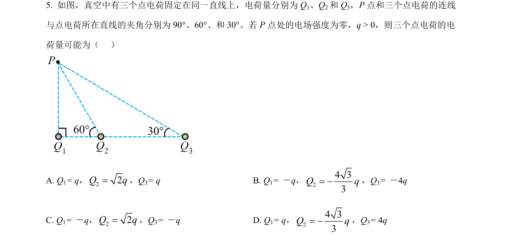
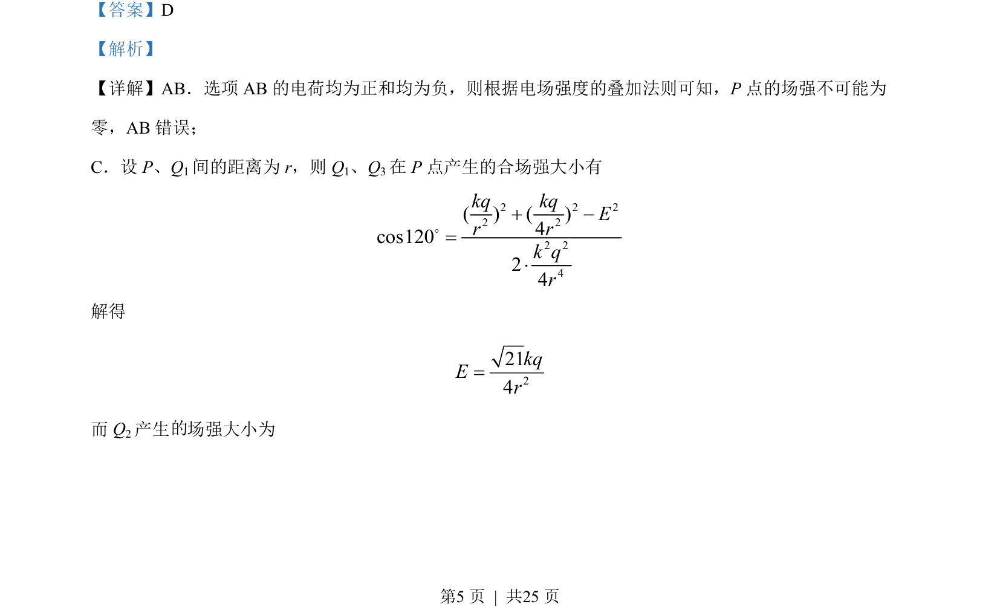
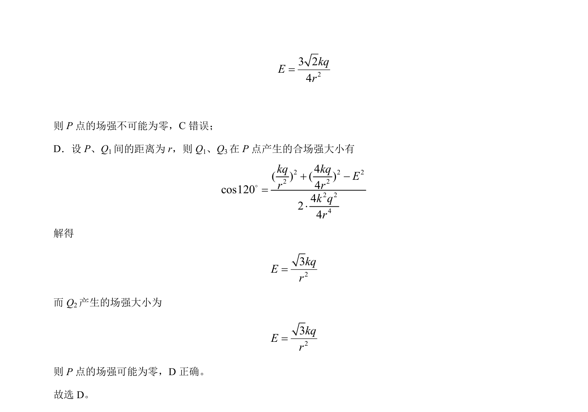

## 题面

## 摘要

本题通过点电荷电场叠加判断空间某点合场强是否可能为零。

## 关联考点

- [[864-点电荷电场强度|点电荷电场强度]]
- [[电场叠加原理]]
- [[126-定理|余弦定理]]

## 答案与解析

> 📄 原 PDF 第 5 页：`素材/真题/湖南/2008-2024·（湖南）物理高考真题/2023年高考物理试卷（湖南）（解析卷）.pdf`

<!-- 题干文本-start -->
## 题干文本
5. 如图，真空中有三个点电荷固定在同一直线上，电荷量分别为 Q1、Q2和 Q3，P点和三个点电荷的连线
与点电荷所在直线的夹角分别为 90°、60°、和 30°。若 P点处的电场强度为零，q > 0，则三个点电荷的电
荷量可能为（   ）
    
A. Q1= q，22Q q=，Q3= qB. Q 1= －q，24 33Q q= -，Q3= －4q
C. Q1= －q，22Q q=，Q3= －qD. Q 1= q，24 33Q q= -，Q3= 4q
<!-- 题干文本-end -->

<!-- 解析文本-start -->
## 解析文本
【答案】D
【解析】
【详解】AB．选项 AB 的电荷均为正和均为负，则根据电场强度的叠加法则可知，P点的场强不可能为
零，AB 错误；
C．设 P、Q1间的距离为 r，则 Q1、Q3在 P点产生的合场强大小有
2 2 22 22 24( ) ( )4cos12024kq kqEr rk qr+ -=×o
解得
2214kqEr=
而 Q2产生 场强大小为
的
<!-- 解析文本-end -->
