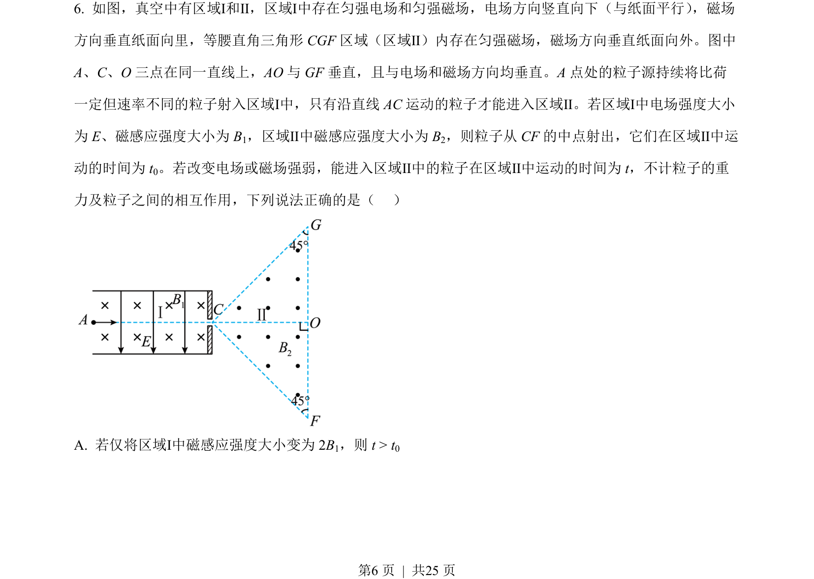
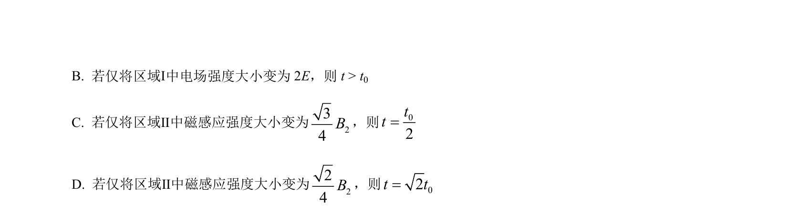
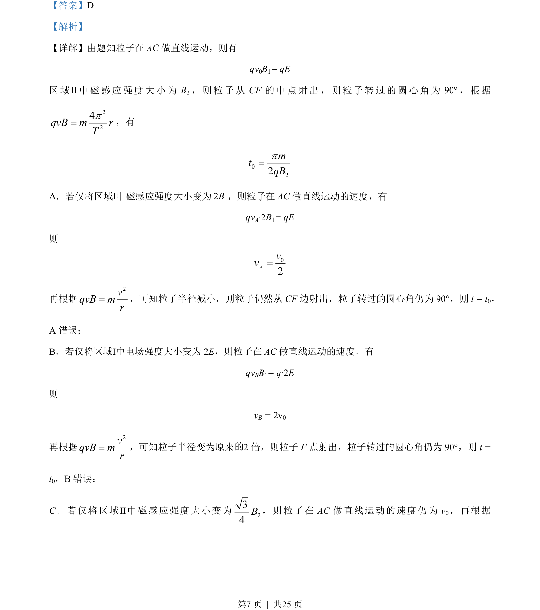
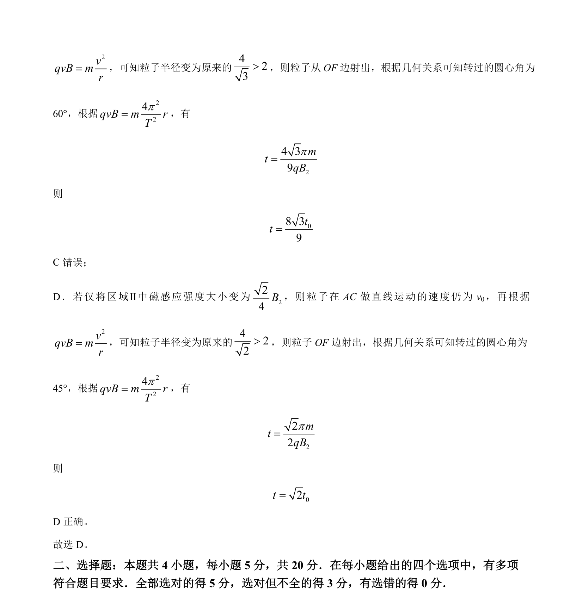

## 题面

## 摘要

本题考查带电粒子在电磁复合场中的运动，通过速度选择器和磁场偏转分析轨迹与时间变化。

## 关联考点

- [[844-带电粒子在复合场中的运动|带电粒子在复合场中的运动]]
- [[302-带电粒子复合场运动|速度选择器]]
- [[649-洛伦兹力提供向心力|洛伦兹力提供向心力]]
- [[带电粒子在磁场中的周期]]

## 答案与解析

> 📄 原 PDF 第 6 页：`素材/真题/湖南/2008-2024·（湖南）物理高考真题/2023年高考物理试卷（湖南）（解析卷）.pdf`
