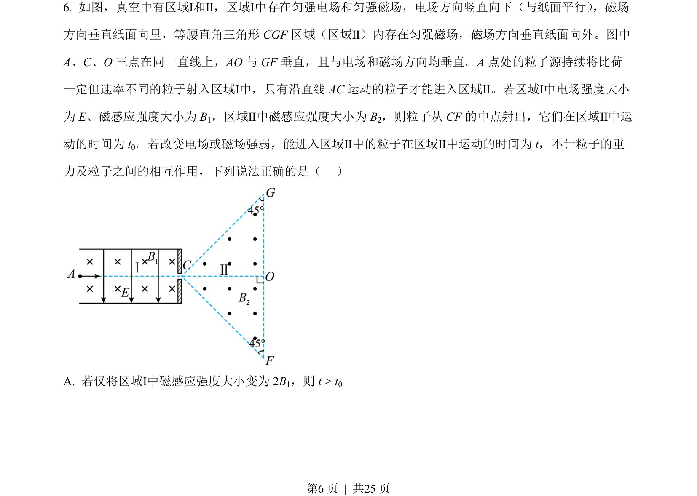
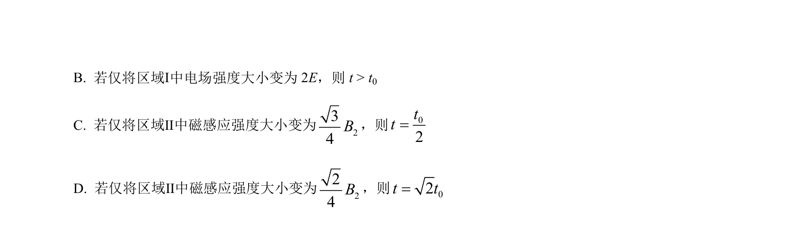
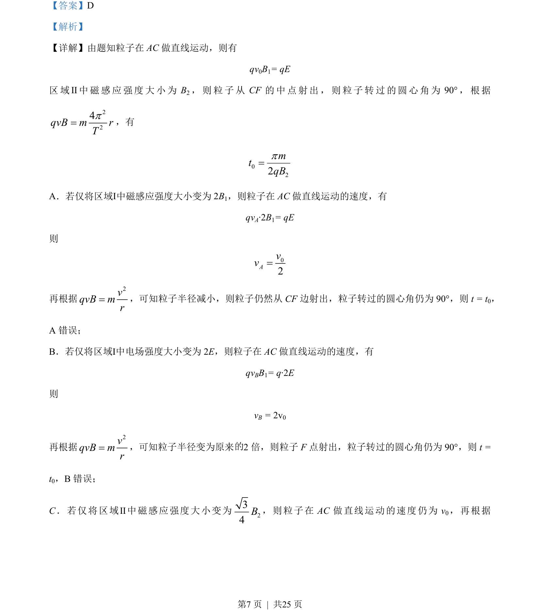
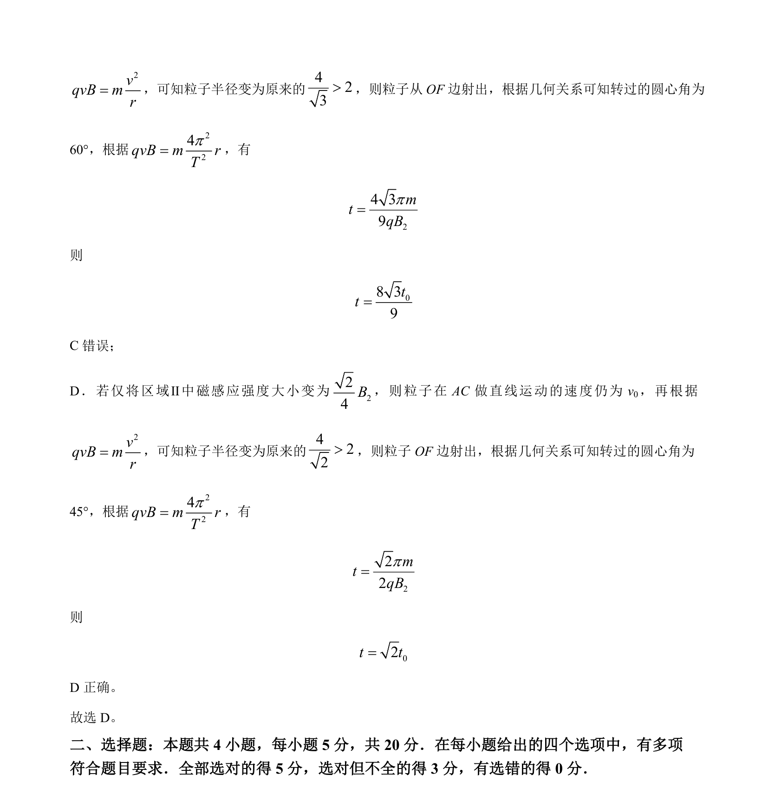

## 题面

## 摘要

本题考查带电粒子在电磁复合场中的运动，通过速度选择器和磁场偏转分析轨迹与时间变化。

## 关联考点

- [[844-带电粒子在复合场中的运动|带电粒子在复合场中的运动]]
- [[302-带电粒子复合场运动|速度选择器]]
- [[649-洛伦兹力提供向心力|洛伦兹力提供向心力]]
- [[带电粒子在磁场中的周期]]

## 答案与解析

> 📄 原 PDF 第 6 页：`素材/真题/湖南/2008-2024·（湖南）物理高考真题/2023年高考物理试卷（湖南）（解析卷）.pdf`

<!-- 题干文本-start -->
## 题干文本
6. 如图，真空中有区域Ⅰ和Ⅱ，区域Ⅰ中存在匀强电场和匀强磁场，电场方向竖直向下（与纸面平行） ，磁场
方向垂直纸面向里，等腰直角三角形 CGF 区域（区域Ⅱ）内存在匀强磁场，磁场方向垂直纸面向外。图中
A、C、O 三点在同一直线上，AO 与 GF 垂直，且与电场和磁场方向均垂直。A点处的粒子源持续将比荷
一定但速率不同的粒子射入区域Ⅰ中，只有沿直线 AC运动的粒子才能进入区域Ⅱ。若区域Ⅰ中电场强度大小
为 E、磁感应强度大小为 B1，区域Ⅱ中磁感应强度大小为 B2，则粒子从 CF的中点射出，它们在区域Ⅱ中运
动的时间为 t0。若改变电场或磁场强弱，能进入区域Ⅱ中的粒子在区域Ⅱ中运动的时间为 t，不计粒子的重
力及粒子之间的相互作用，下列说法正确的是（   ）
  
A. 若仅将区域Ⅰ中磁感应强度大小变为 2B1，则 t > t0
<!-- 题干文本-end -->

<!-- 解析文本-start -->
## 解析文本

<!-- 解析文本-end -->
