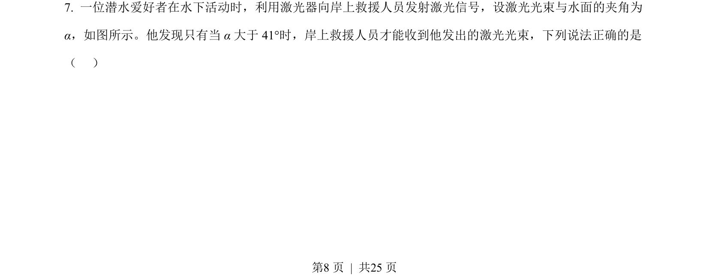
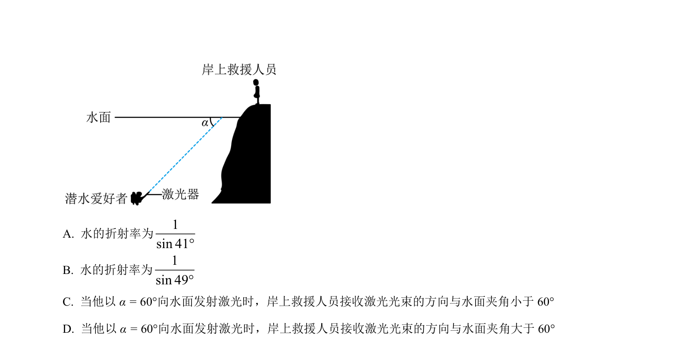
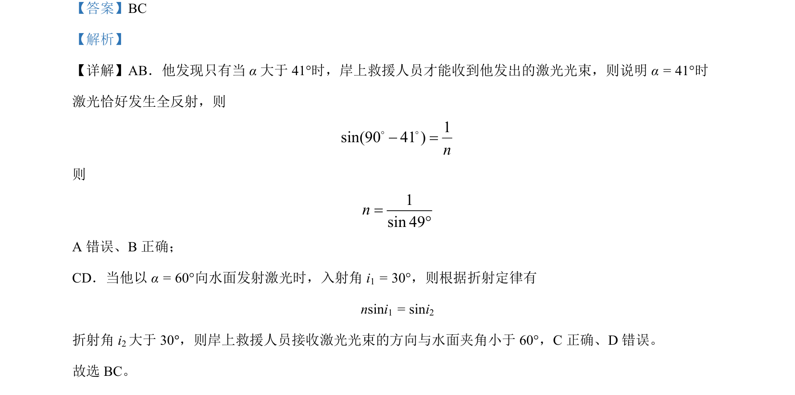

## 题面

## 摘要

本题利用全反射临界角求折射率，并应用折射定律计算光路，判断光束方向。

## 关联考点

- [[343-全反射|全反射]]
- [[336-临界角|临界角]]
- [[026-折射定律|折射定律]]
- [[360-折射率|折射率]]

## 答案与解析

> 📄 原 PDF 第 8 页：`素材/真题/湖南/2008-2024·（湖南）物理高考真题/2023年高考物理试卷（湖南）（解析卷）.pdf`
