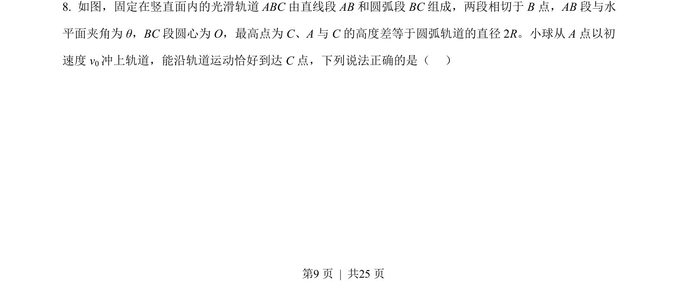
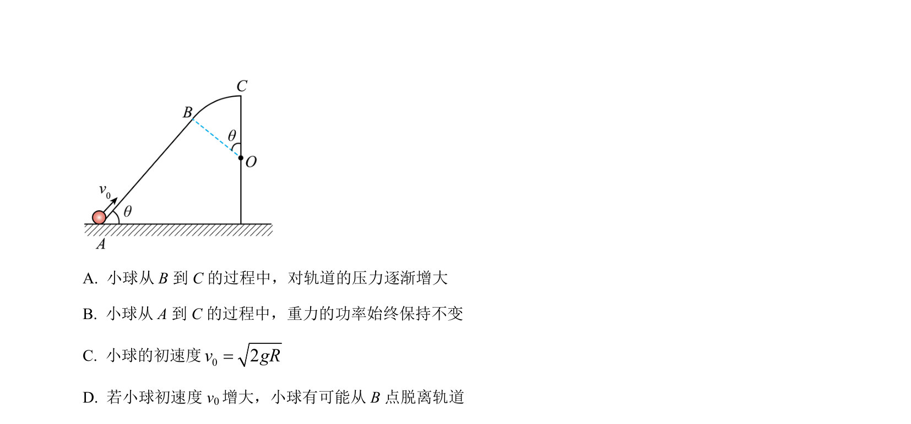
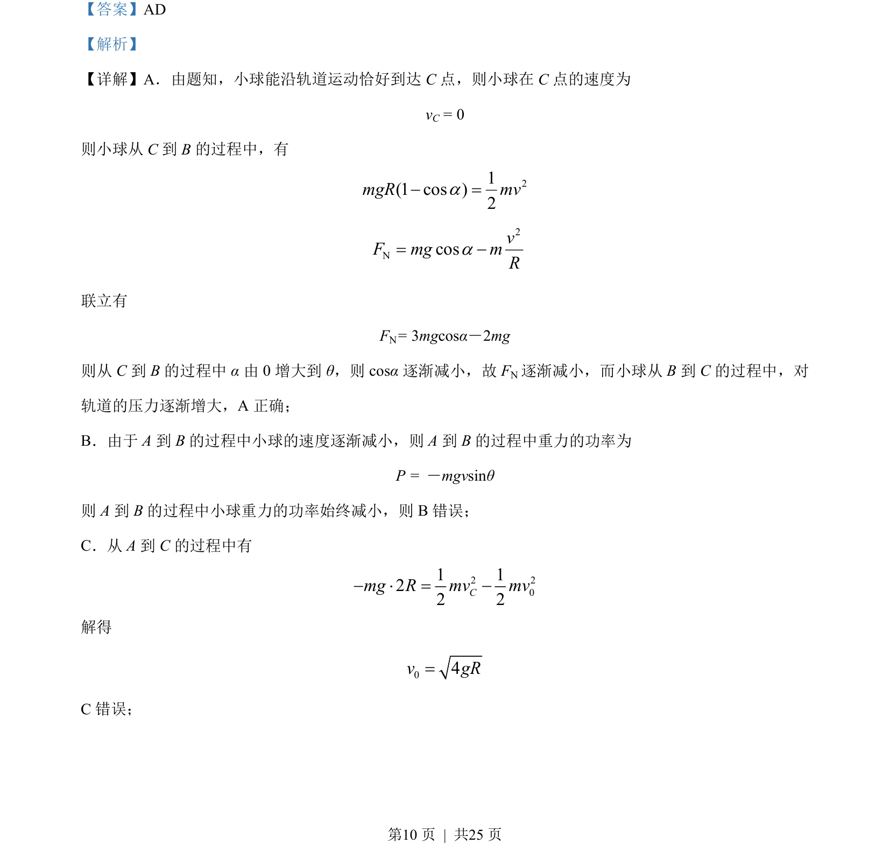
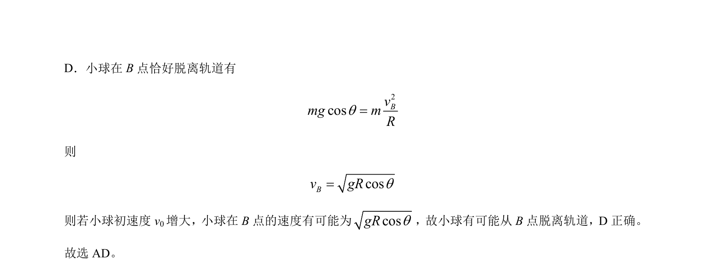

## 题面

## 摘要

小球在竖直平面内轨道运动，分析压力变化、功率变化、动能定理及脱离轨道的临界条件。

## 关联考点

- [[258-圆周运动|圆周运动]]
- [[256-向心力|向心力]]
- [[251-动能定理|动能定理]]
- [[506-临界条件|临界条件]]

## 答案与解析

> 📄 原 PDF 第 9 页：`素材/真题/湖南/2008-2024·（湖南）物理高考真题/2023年高考物理试卷（湖南）（解析卷）.pdf`
