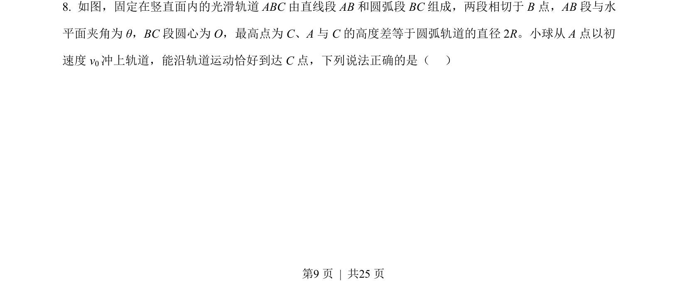
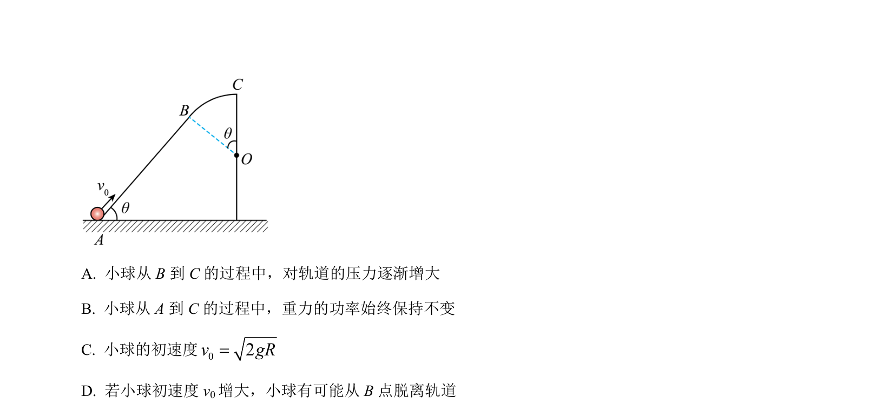
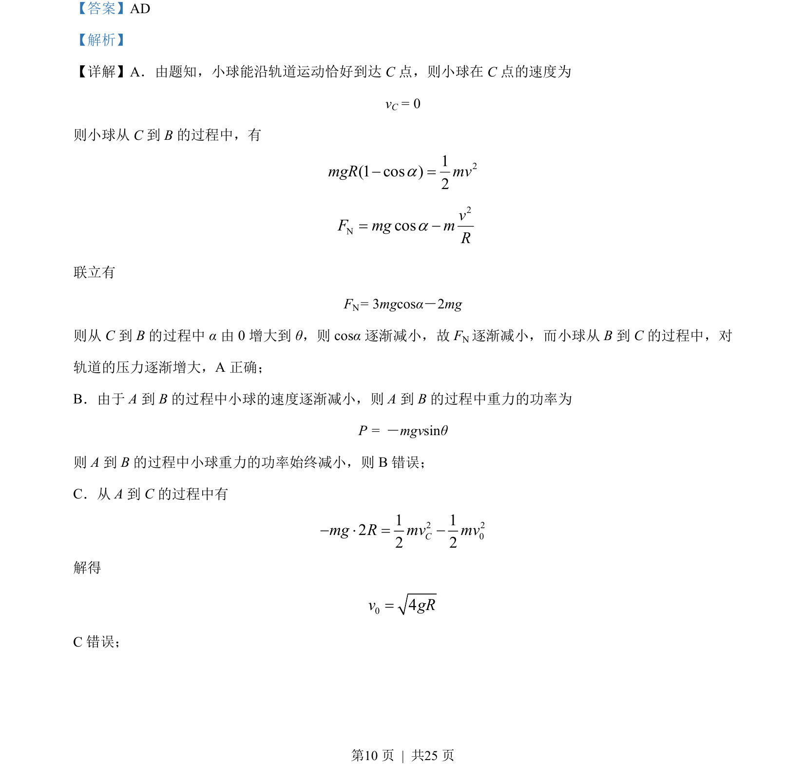
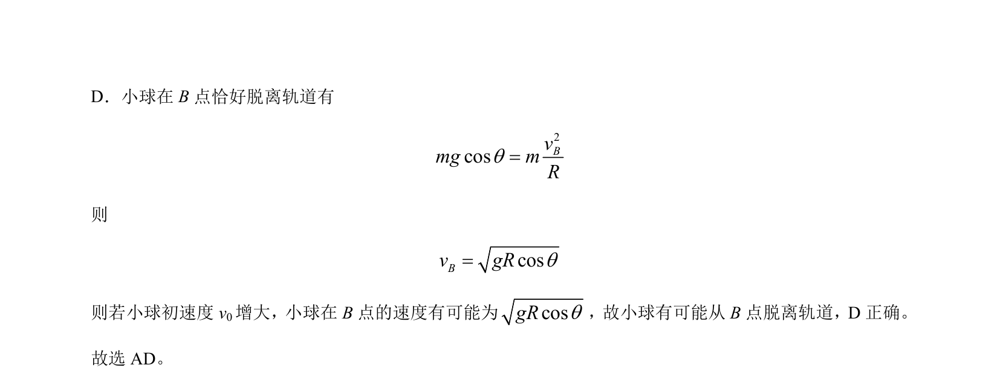

## 题面

## 摘要

小球在竖直平面内轨道运动，分析压力变化、功率变化、动能定理及脱离轨道的临界条件。

## 关联考点

- [[258-圆周运动|圆周运动]]
- [[256-向心力|向心力]]
- [[251-动能定理|动能定理]]
- [[506-临界条件|临界条件]]

## 答案与解析

> 📄 原 PDF 第 9 页：`素材/真题/湖南/2008-2024·（湖南）物理高考真题/2023年高考物理试卷（湖南）（解析卷）.pdf`

<!-- 题干文本-start -->
## 题干文本
8. 如图，固定在竖直面内的光滑轨道 ABC由直线段 AB和圆弧段 BC组成，两段相切于 B点，AB段与水
平面夹角为 θ，BC段圆心为 O，最高点为 C、A与 C的高度差等于圆弧轨道的直径 2R。小球从 A点以初
速度 v0冲上轨道，能沿轨道运动恰好到达 C点，下列说法正确的是（   ）
<!-- 题干文本-end -->

<!-- 解析文本-start -->
## 解析文本

<!-- 解析文本-end -->
