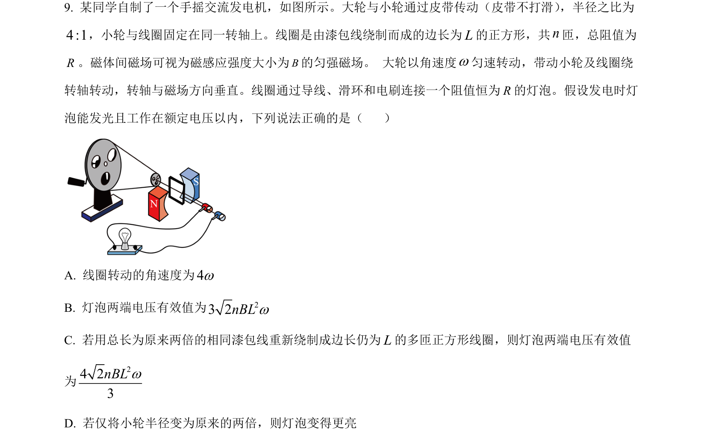
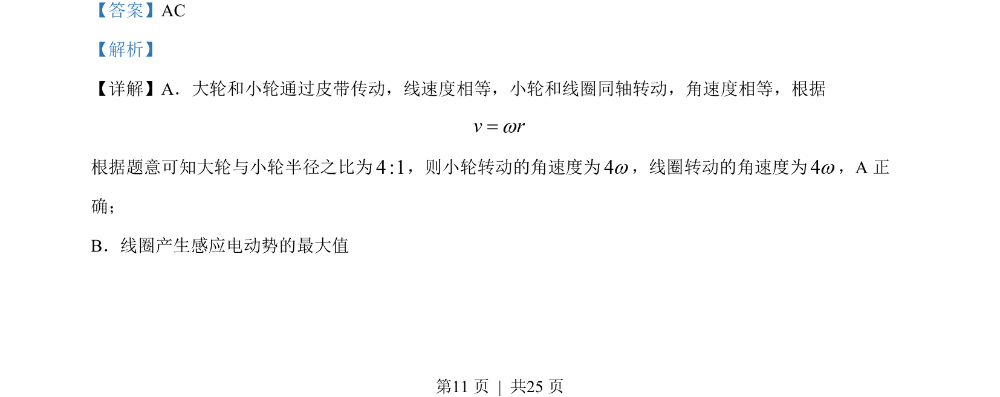
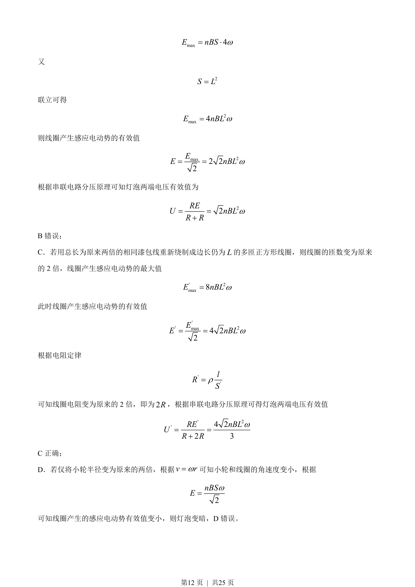

## 题面

## 摘要

考查皮带传动与线圈转动发电的电磁感应问题，涉及角速度换算、感应电动势有效值计算及电阻定律的影响。

## 关联考点

- [[线速度与角速度关系]]
- [[395-法拉第电磁感应定律|法拉第电磁感应定律]]
- [[正弦交流电有效值]]
- [[318-电阻定律|电阻定律]]

## 答案与解析

> 📄 原 PDF 第 11 页：`素材/真题/湖南/2008-2024·（湖南）物理高考真题/2023年高考物理试卷（湖南）（解析卷）.pdf`
