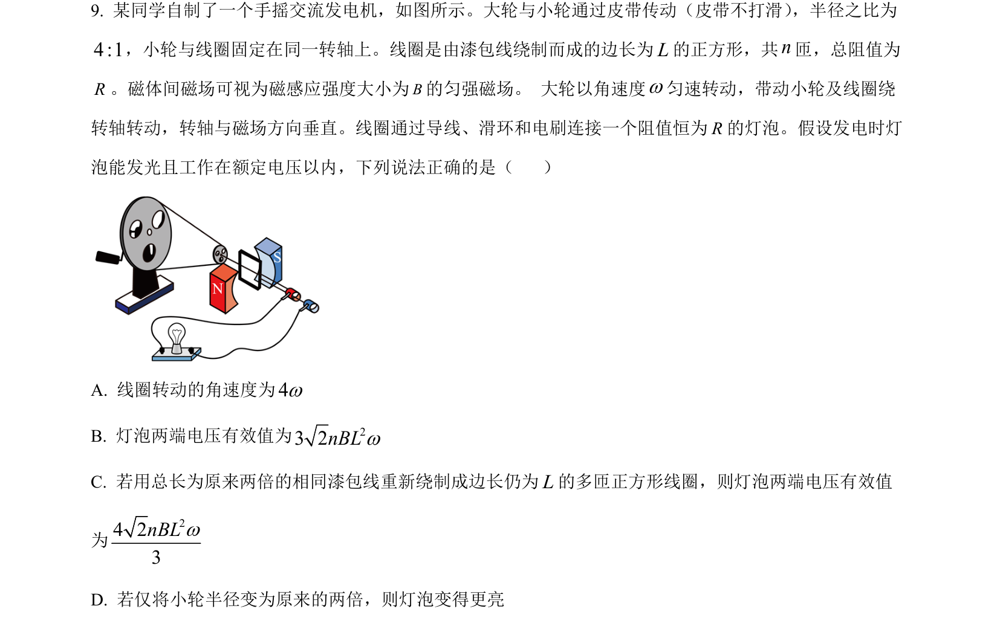
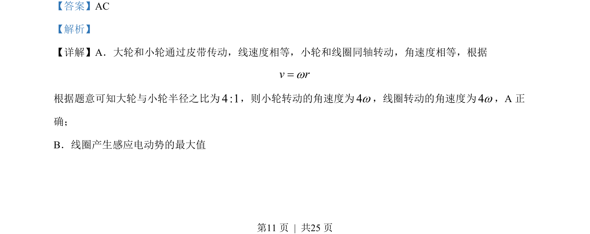
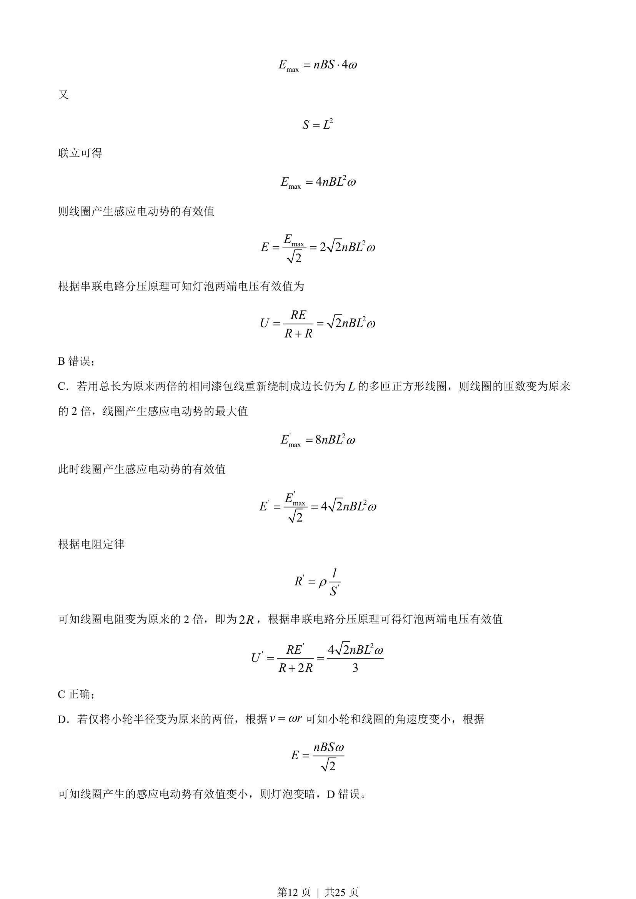

## 题面

## 摘要

考查皮带传动与线圈转动发电的电磁感应问题，涉及角速度换算、感应电动势有效值计算及电阻定律的影响。

## 关联考点

- [[线速度与角速度关系]]
- [[395-法拉第电磁感应定律|法拉第电磁感应定律]]
- [[正弦交流电有效值]]
- [[318-电阻定律|电阻定律]]

## 答案与解析

> 📄 原 PDF 第 11 页：`素材/真题/湖南/2008-2024·（湖南）物理高考真题/2023年高考物理试卷（湖南）（解析卷）.pdf`

<!-- 题干文本-start -->
## 题干文本
9. 某同学自制了一个手摇交流发电机，如图所示。大轮与小轮通过皮带传动（皮带不打滑） ，半径之比为
4 :1，小轮与线圈固定在同一转轴上。线圈是由漆包线绕制而成的边长为L的正方形，共n匝，总阻值为
R。磁体间磁场可视为磁感应强度大小为B的匀强磁场。 大轮以角速度w匀速转动，带动小轮及线圈绕
转轴转动，转轴与磁场方向垂直。线圈通过导线、滑环和电刷连接一个阻值恒为R的灯泡。假设发电时灯
泡能发光且工作在额定电压以内，下列说法正确的是（    ）
  
A. 线圈转动的角速度为4w
B. 灯泡两端电压有效值为 23 2nBLw
C. 若用总长为原来两倍的相同漆包线重新绕制成边长仍为L的多匝正方形线圈，则灯泡两端电压有效值
为
24 23nBLw
D. 若仅将小轮半径变为原来的两倍，则灯泡变得更亮
<!-- 题干文本-end -->

<!-- 解析文本-start -->
## 解析文本
【答案】AC
【解析】
【详解】A．大轮和小轮通过皮带传动，线速度相等，小轮和线圈同轴转动，角速度相等，根据
v rw=
根据题意可知大轮与小轮半径之比为4 :1，则小轮转动的角速度为4w，线圈转动的角速度为4w，A 正
确；
B．线圈产生感应电动势的最大值
<!-- 解析文本-end -->
