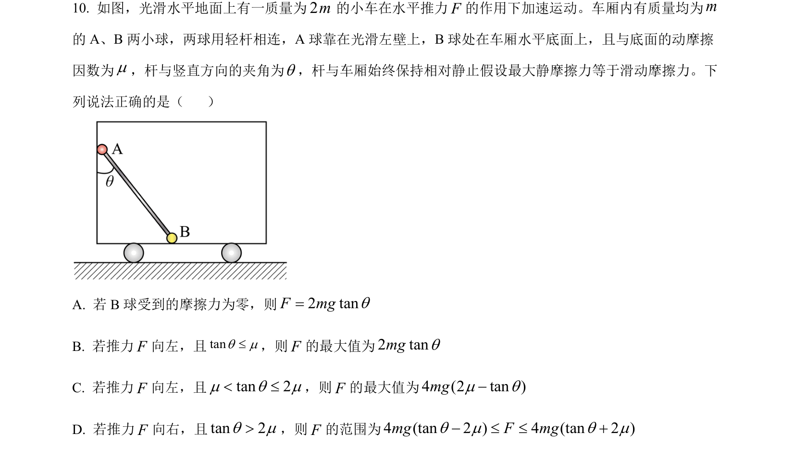
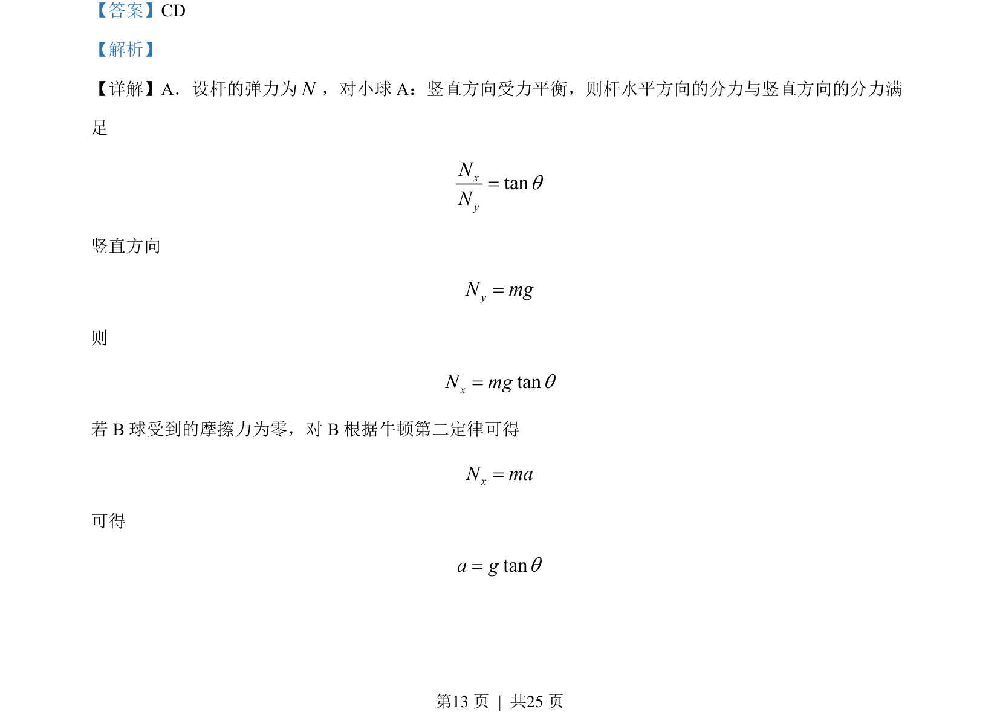
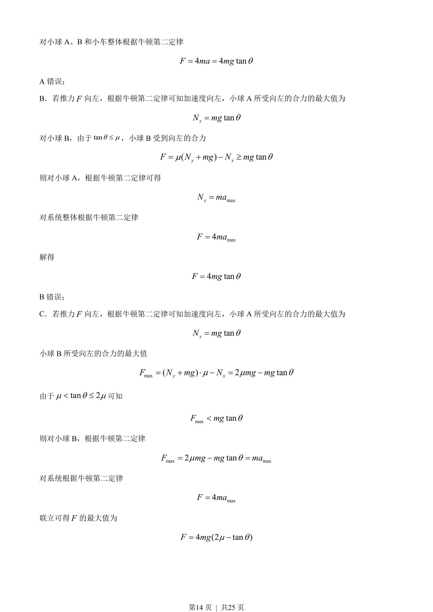
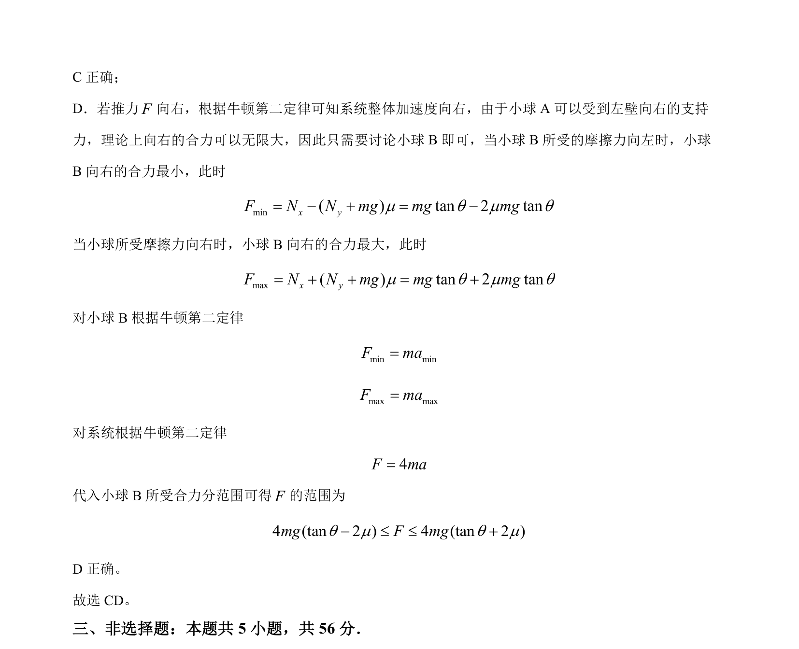

## 题面

## 摘要

考查连接体问题，用整体法与隔离法分析小球和车厢受力，求解推力与加速度的临界范围。

## 关联考点

- [[474-整体法与隔离法|整体法与隔离法]]
- [[229-牛顿第二定律|牛顿第二定律]]
- [[081-摩擦力|摩擦力]]
- [[859-临界问题|临界问题]]

## 答案与解析

> 📄 原 PDF 第 13 页：`素材/真题/湖南/2008-2024·（湖南）物理高考真题/2023年高考物理试卷（湖南）（解析卷）.pdf`
