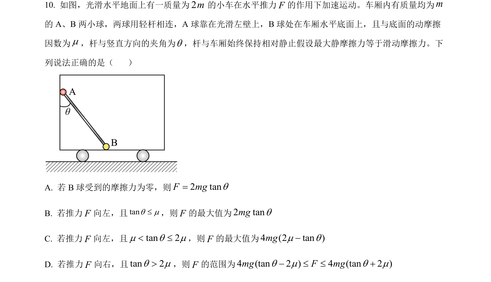
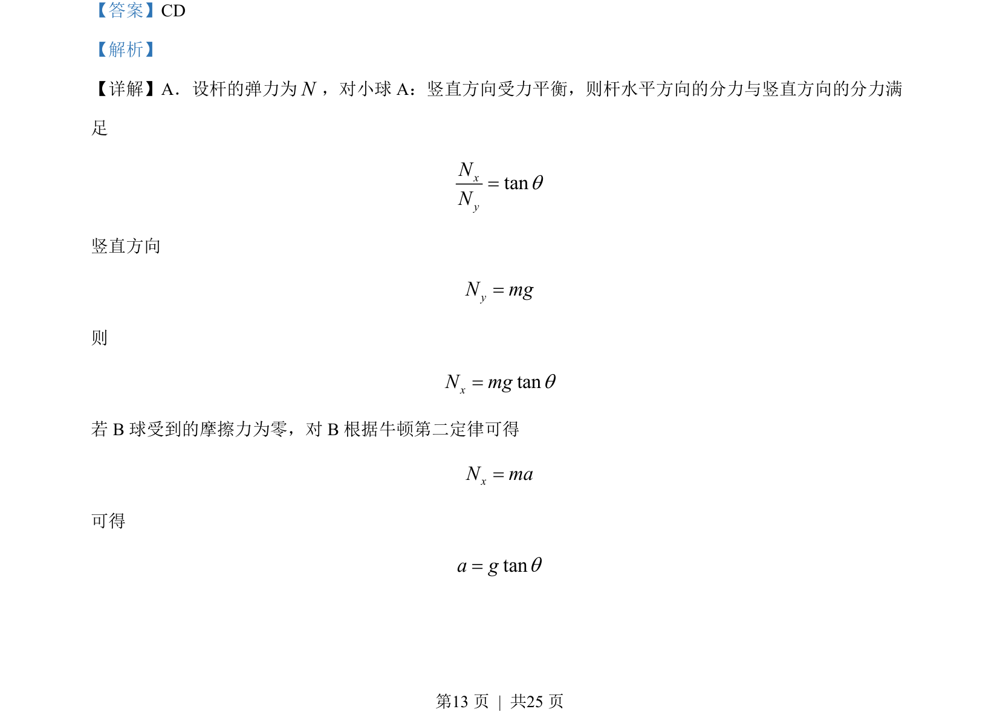
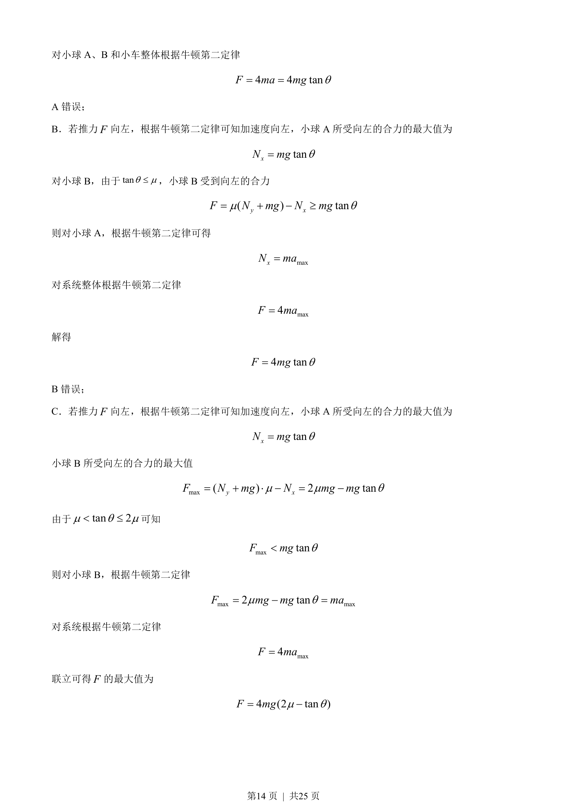
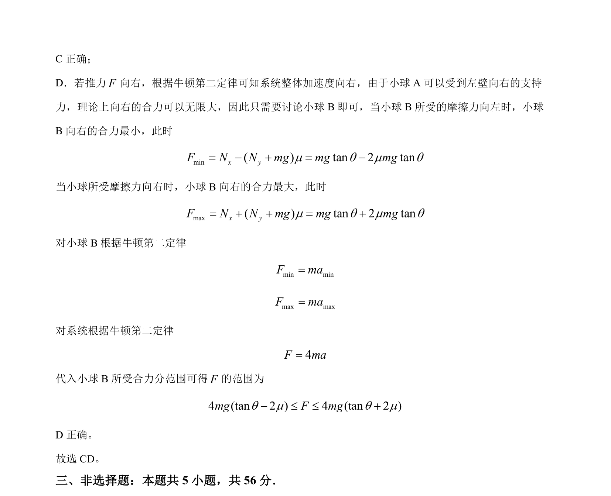

## 题面

## 摘要

考查连接体问题，用整体法与隔离法分析小球和车厢受力，求解推力与加速度的临界范围。

## 关联考点

- [[474-整体法与隔离法|整体法与隔离法]]
- [[229-牛顿第二定律|牛顿第二定律]]
- [[081-摩擦力|摩擦力]]
- [[859-临界问题|临界问题]]

## 答案与解析

> 📄 原 PDF 第 13 页：`素材/真题/湖南/2008-2024·（湖南）物理高考真题/2023年高考物理试卷（湖南）（解析卷）.pdf`

<!-- 题干文本-start -->
## 题干文本
10. 如图，光滑水平地面上有一质量为2m的小车在水平推力F的作用下加速运动。车厢内有质量均为m
的 A、B两小球，两球用轻杆相连，A 球靠在光滑左壁上，B球处在车厢水平底面上，且与底面的动摩擦
因数为，杆与竖直方向的夹角为q，杆与车厢始终保持相对静止假设最大静摩擦力等于滑动摩擦力。下
列说法正确的是（    ）
  
A. 若 B球受到的摩擦力为零，则2 tanF mgq=
B. 若推力F向左，且tanq £，则F的最大值为2 tanmgq
C. 若推力F向左，且tan 2 q < £，则F的最大值为4 (2 tan )mg q-
D. 若推力F向右，且tan 2q >，则F的范围为4 (tan 2 ) 4 (tan 2 )mg F mgq  q - £ £ +
<!-- 题干文本-end -->

<!-- 解析文本-start -->
## 解析文本
【答案】CD
【解析】
【详解】A．设杆的弹力为N，对小球 A：竖直方向受力平衡，则杆水平方向的分力与竖直方向的分力满
足
tanxyNNq=
竖直方向
yN mg=
则
tanxN mgq=
若 B球受到的摩擦力为零，对 B根据牛顿第二定律可得
xN ma=
可得
tana gq=
<!-- 解析文本-end -->
