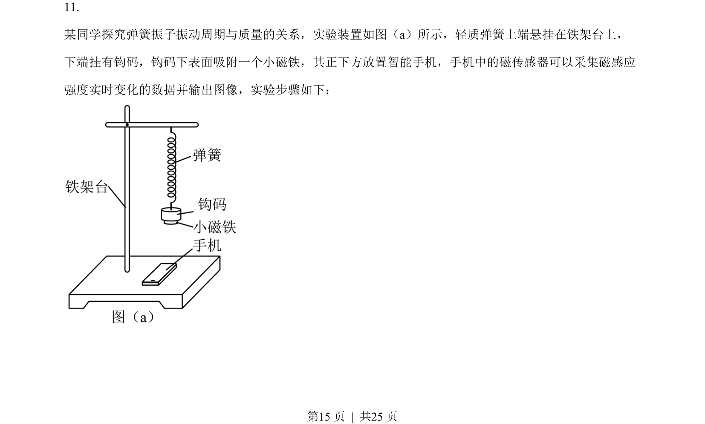
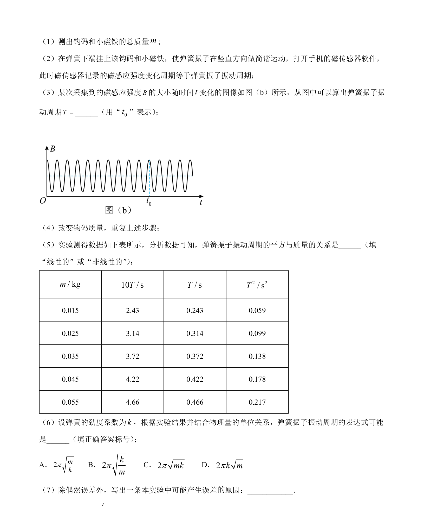
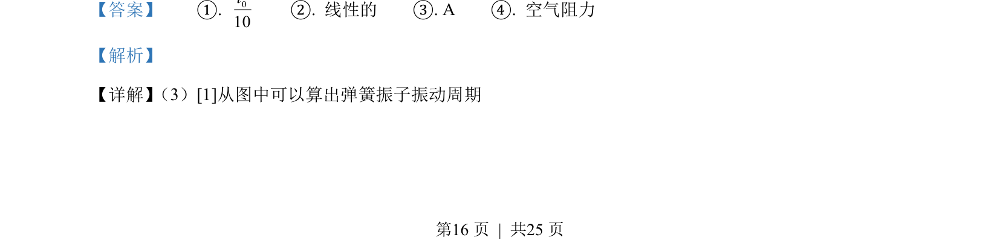
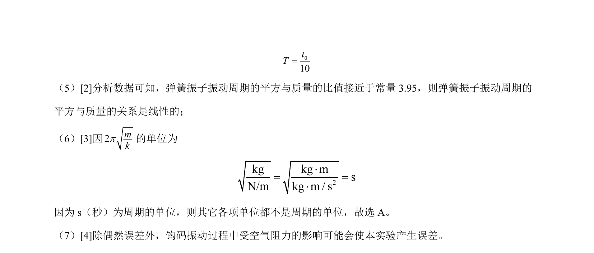

## 题面

## 摘要

本题探究弹簧振子周期与质量的关系，并涉及单位制分析和空气阻力误差。

## 关联考点

- [[373-简谐运动|简谐运动]]
- [[261-周期|周期]]
- [[830-单位制|单位制]]
- [[724-误差分析|实验误差]]

## 答案与解析

> 📄 原 PDF 第 15 页：`素材/真题/湖南/2008-2024·（湖南）物理高考真题/2023年高考物理试卷（湖南）（解析卷）.pdf`
