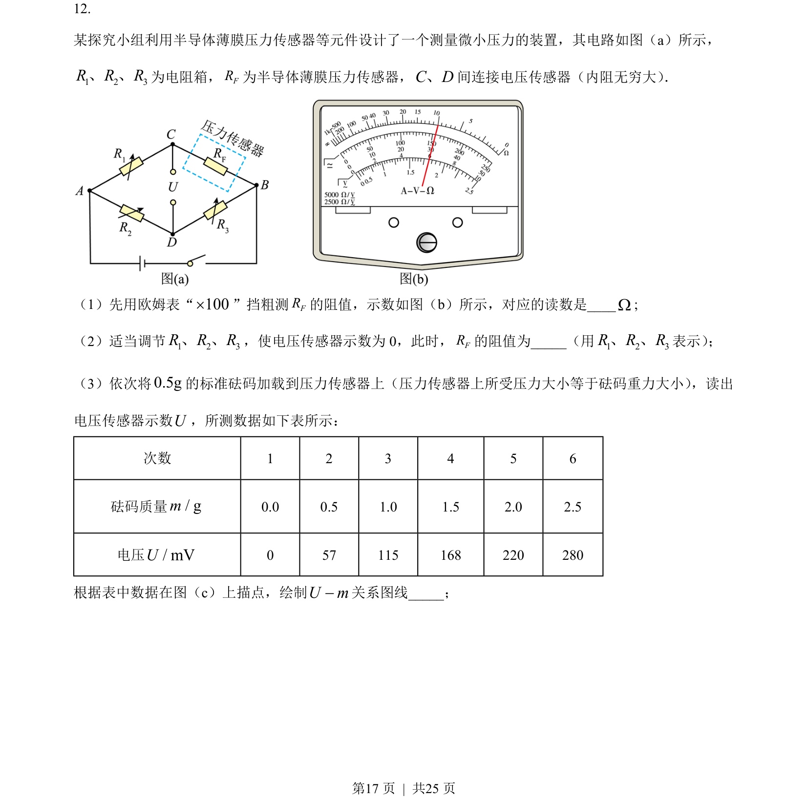
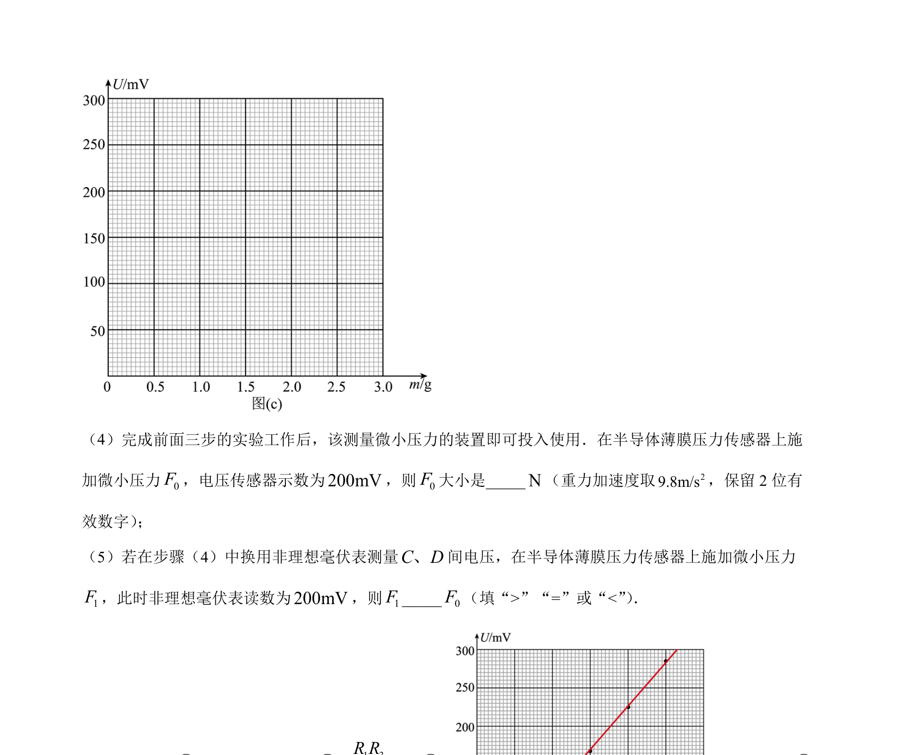
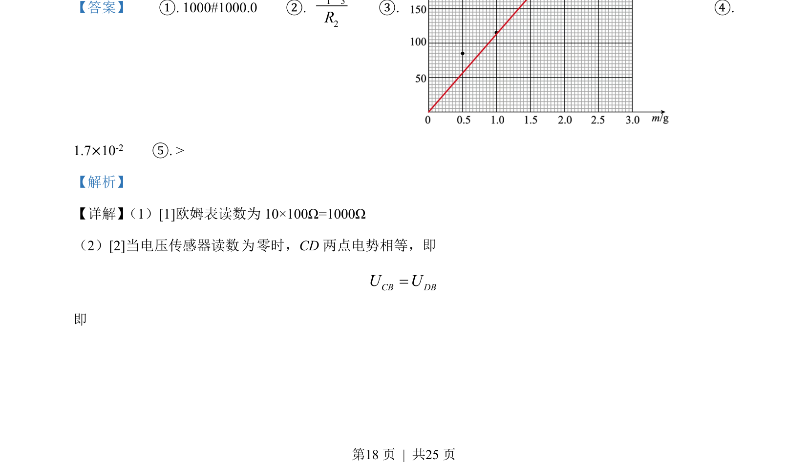
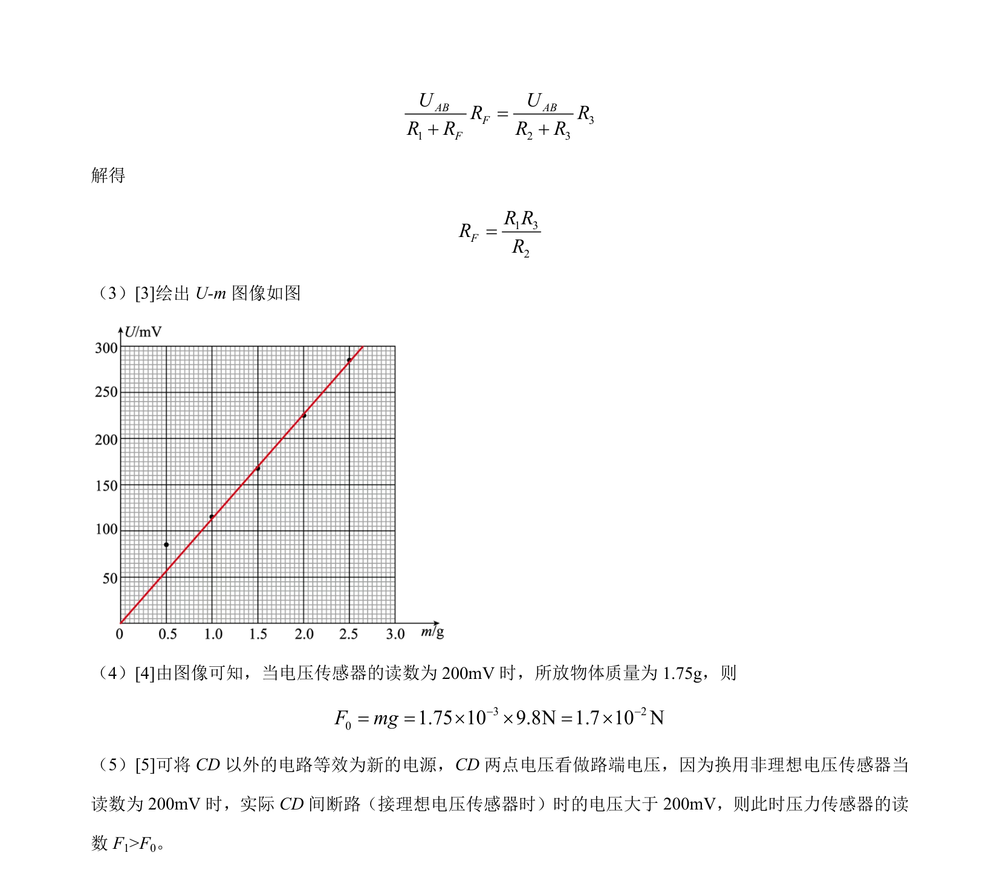

## 题面

## 摘要

该题通过欧姆表读数、电桥平衡测力敏电阻、绘制U-m图像并分析非理想电压传感器引起的系统误差。

## 关联考点

- [[欧姆表读数]]
- [[电桥平衡]]
- [[860-传感器应用|传感器应用]]
- [[等效电源]]

## 答案与解析

> 📄 原 PDF 第 17 页：`素材/真题/湖南/2008-2024·（湖南）物理高考真题/2023年高考物理试卷（湖南）（解析卷）.pdf`
