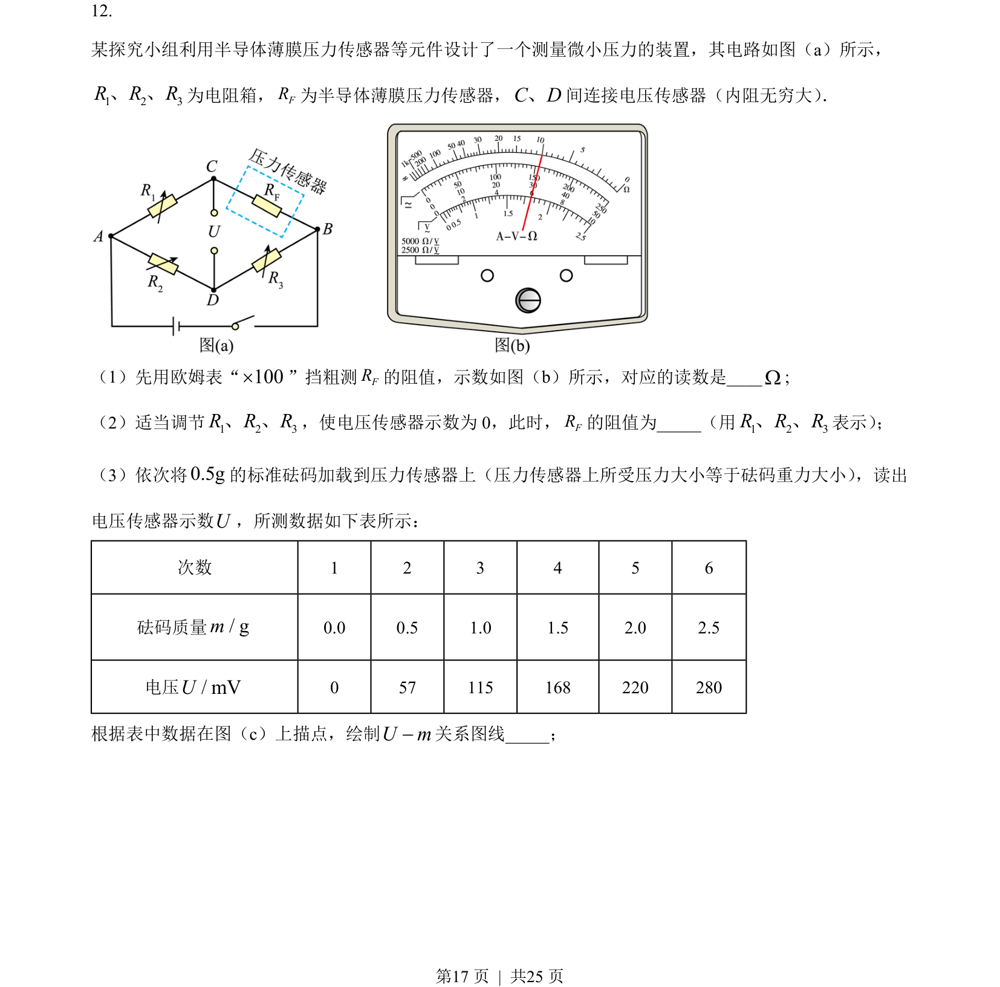
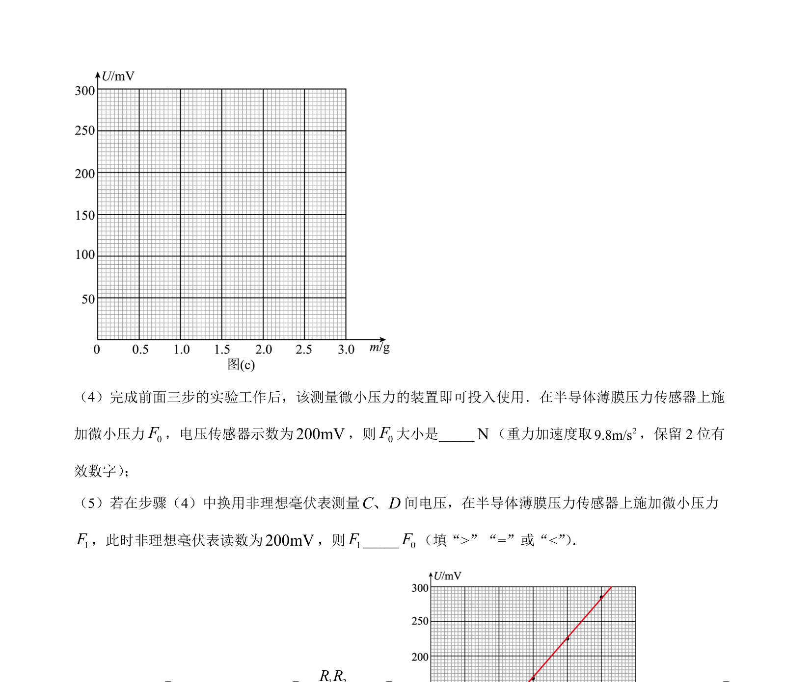
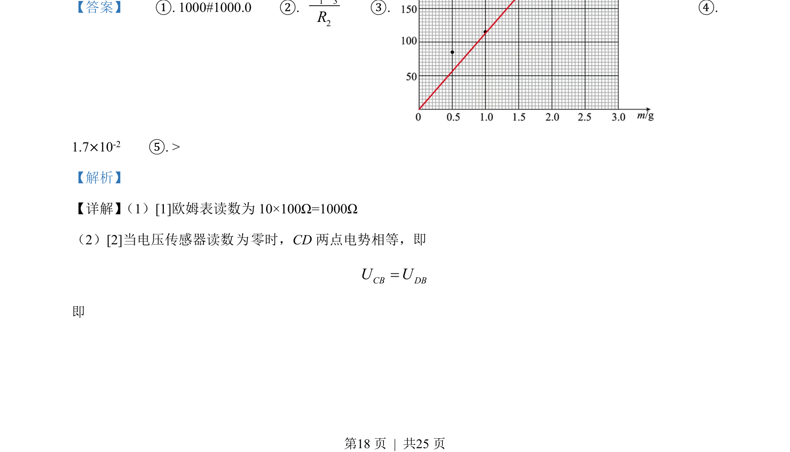
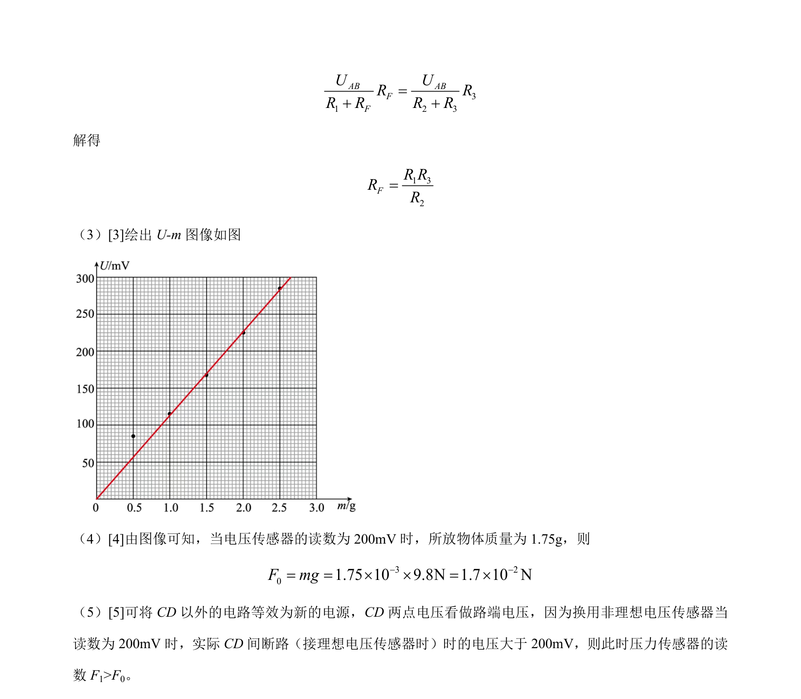

## 题面

## 摘要

该题通过欧姆表读数、电桥平衡测力敏电阻、绘制U-m图像并分析非理想电压传感器引起的系统误差。

## 关联考点

- [[欧姆表读数]]
- [[电桥平衡]]
- [[860-传感器应用|传感器应用]]
- [[等效电源]]

## 答案与解析

> 📄 原 PDF 第 17 页：`素材/真题/湖南/2008-2024·（湖南）物理高考真题/2023年高考物理试卷（湖南）（解析卷）.pdf`

<!-- 题干文本-start -->
## 题干文本
12. 
某探究小组利用半导体薄膜压力传感器等元件设计了一个测量微小压力的装置，其电路如图（a）所示，
123RRR、、为电阻箱，FR为半导体薄膜压力传感器，C D、间连接电压传感器（内阻无穷大） ．
  
（1）先用欧姆表“100´”挡粗测FR的阻值，示数如图（b）所示，对应的读数是____W;
（2）适当调节123RRR、、，使电压传感器示数为 0，此时，FR的阻值为_____（用123RRR、、表示） ；
（3）依次将0.5g的标准砝码加载到压力传感器上（压力传感器上所受压力大小等于砝码重力大小） ，读出
电压传感器示数U，所测数据如下表所示：
次数 1 2 3 4 5 6
砝码质量/ gm0.0 0.5 1.0 1.5 2.0 2.5
电压/ mVU0 57 115 168 220 280
根据表中数据在图（c）上描点，绘制U m-关系图线_____；
<!-- 题干文本-end -->

<!-- 解析文本-start -->
## 解析文本

<!-- 解析文本-end -->
