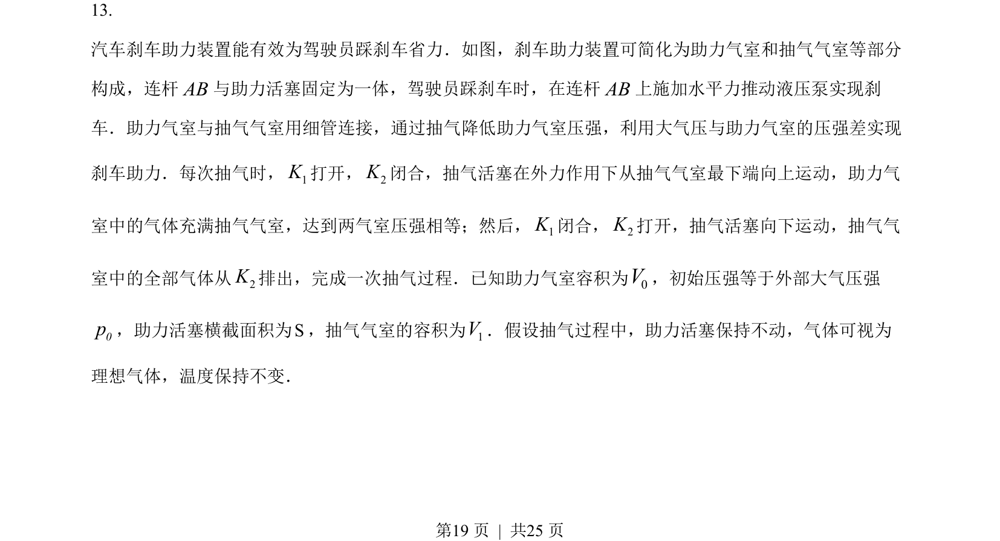
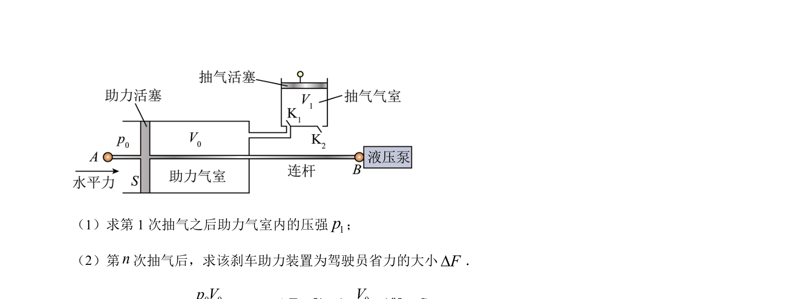
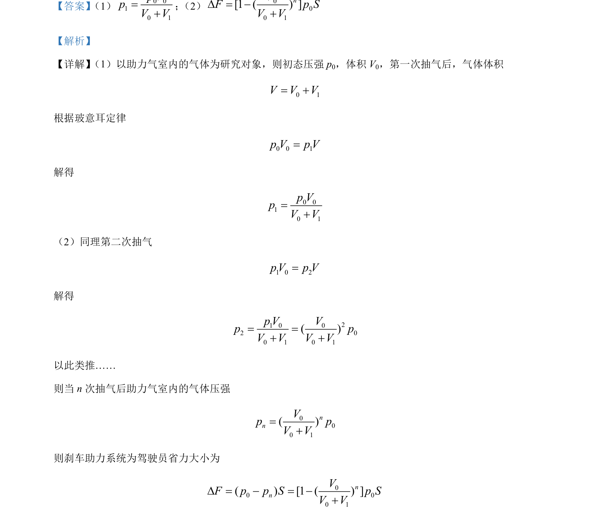

## 题面

## 摘要

利用玻意耳定律求解多次抽气过程中气室压强的变化，并据此计算省力大小。

## 关联考点

- [[444-玻意耳定律|玻意耳定律]]
- [[444-玻意耳定律|等温变化]]
- [[变质量问题]]
- [[550-压强计算|压强计算]]

## 答案与解析

> 📄 原 PDF 第 19 页：`素材/真题/湖南/2008-2024·（湖南）物理高考真题/2023年高考物理试卷（湖南）（解析卷）.pdf`
