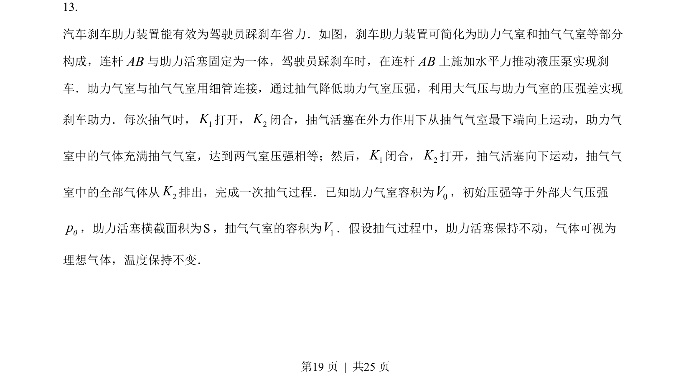
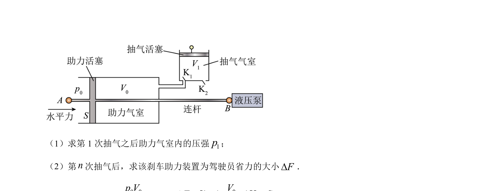
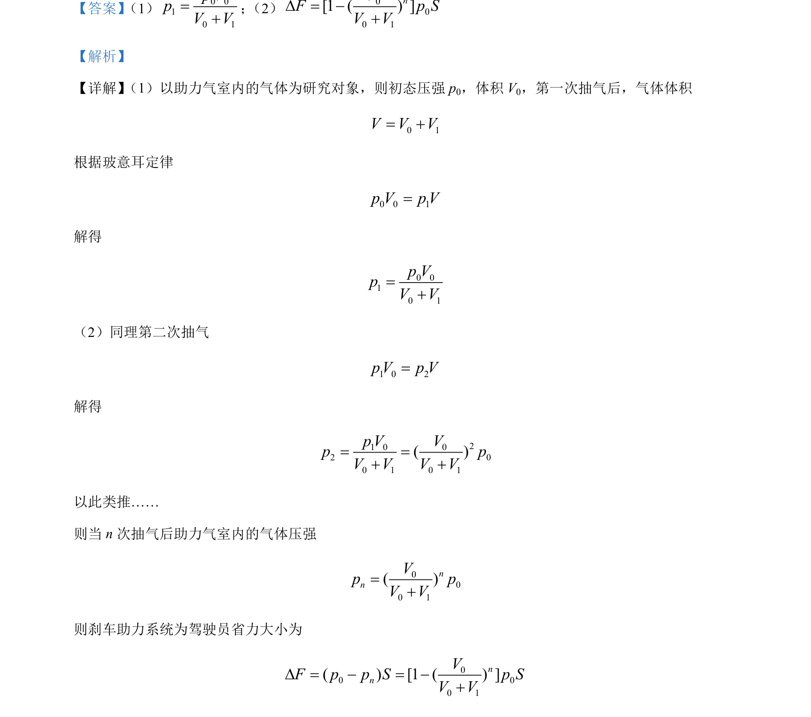

## 题面

## 摘要

利用玻意耳定律求解多次抽气过程中气室压强的变化，并据此计算省力大小。

## 关联考点

- [[444-玻意耳定律|玻意耳定律]]
- [[444-玻意耳定律|等温变化]]
- [[变质量问题]]
- [[550-压强计算|压强计算]]

## 答案与解析

> 📄 原 PDF 第 19 页：`素材/真题/湖南/2008-2024·（湖南）物理高考真题/2023年高考物理试卷（湖南）（解析卷）.pdf`

<!-- 题干文本-start -->
## 题干文本
13. 
汽车刹车助力装置能有效为驾驶员踩刹车省力．如图，刹车助力装置可简化为助力气室和抽气气室等部分
构成，连杆AB与助力活塞固定为一体，驾驶员踩刹车时，在连杆AB上施加水平力推动液压泵实现刹
车．助力气室与抽气气室用细管连接，通过抽气降低助力气室压强，利用大气压与助力气室的压强差实现
刹车助力．每次抽气时，1K打开，2K闭合，抽气活塞在外力作用下从抽气气室最下端向上运动，助力气
室中的气体充满抽气气室，达到两气室压强相等；然后，1K闭合，2K打开，抽气活塞向下运动，抽气气
室中的全部气体从2K排出，完成一次抽气过程．已知助力气室容积为0V，初始压强等于外部大气压强
0p，助力活塞横截面积为S，抽气气室的容积为1V．假设抽气过程中，助力活塞保持不动，气体可视为
理想气体，温度保持不变．
<!-- 题干文本-end -->

<!-- 解析文本-start -->
## 解析文本

<!-- 解析文本-end -->
