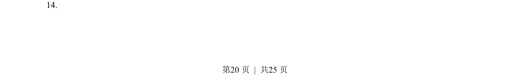
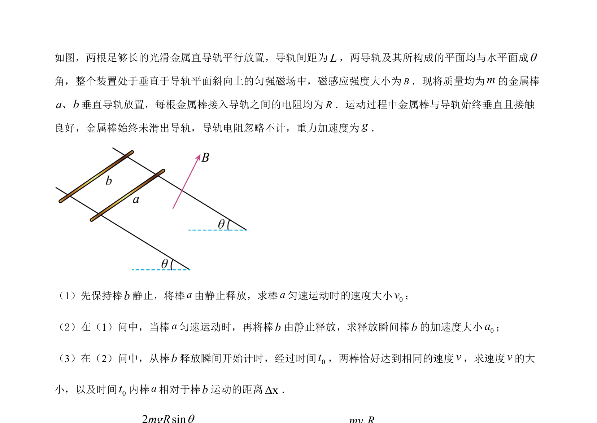
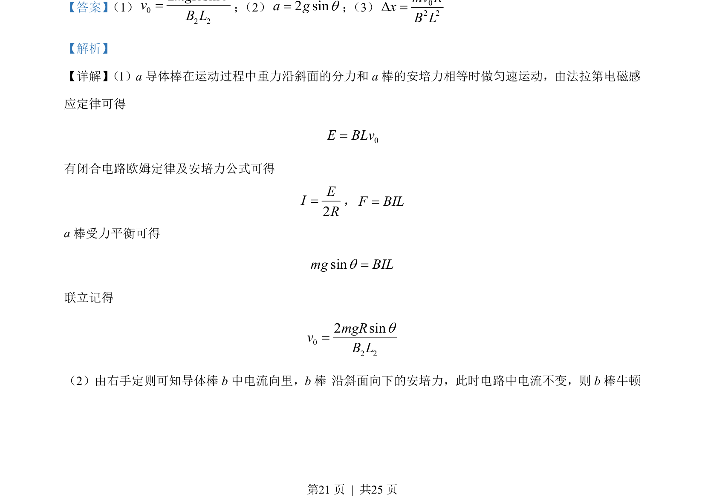
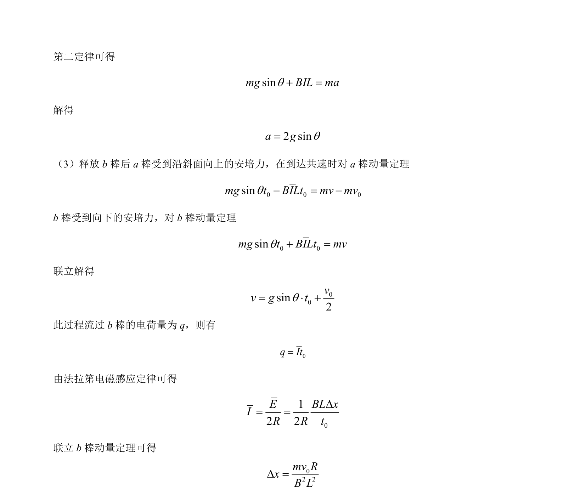

## 题面

## 摘要

本题通过双导体棒在斜面上的电磁感应与力学综合问题，考查了法拉第定律、安培力、动量定理及电路分析。

## 关联考点

- [[395-法拉第电磁感应定律|法拉第电磁感应定律]]
- [[188-磁场对通电导体的作用|安培力]]
- [[349-动量定理|动量定理]]
- [[332-闭合电路欧姆定律|闭合电路欧姆定律]]

## 答案与解析

> 📄 原 PDF 第 20 页：`素材/真题/湖南/2008-2024·（湖南）物理高考真题/2023年高考物理试卷（湖南）（解析卷）.pdf`
