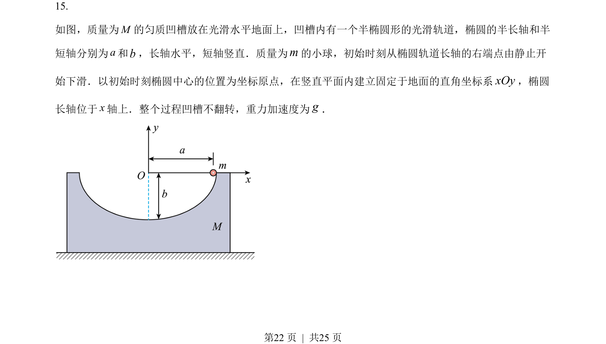
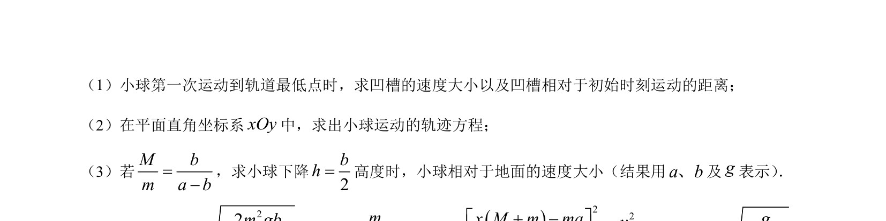
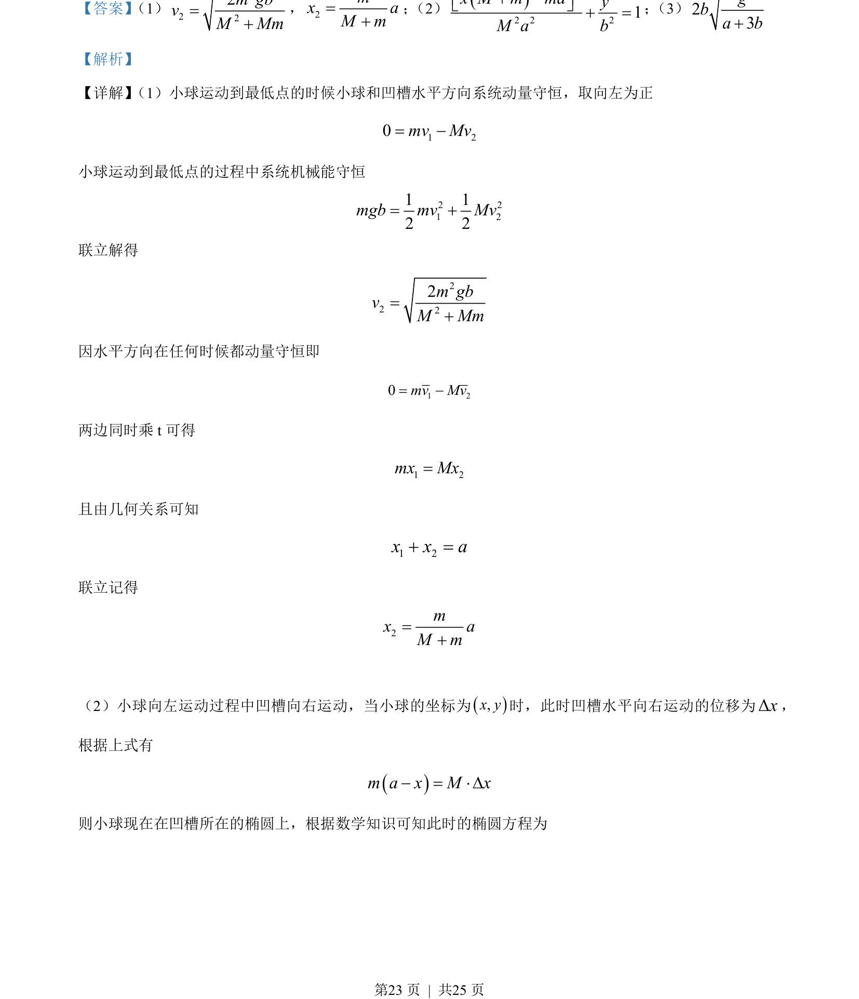
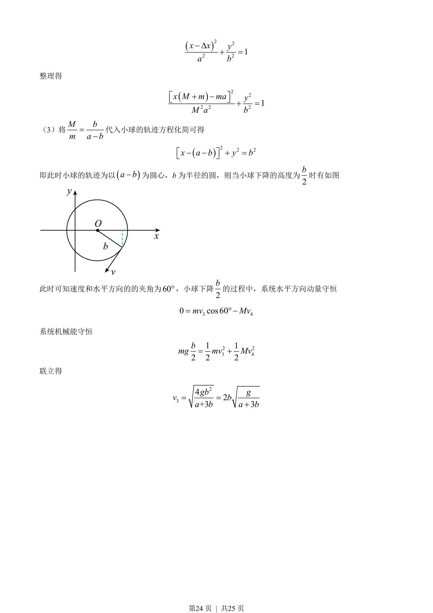

## 题面

## 摘要

小球与凹槽系统水平动量守恒，结合机械能守恒和椭圆轨迹求轨迹方程及下降高度的速度。

## 关联考点

- [[347-动量守恒定律|动量守恒定律]]
- [[085-机械能守恒-初中|机械能守恒定律]]
- [[940-椭圆方程|椭圆方程]]
- [[280-相对运动|相对运动]]

## 答案与解析

> 📄 原 PDF 第 22 页：`素材/真题/湖南/2008-2024·（湖南）物理高考真题/2023年高考物理试卷（湖南）（解析卷）.pdf`
