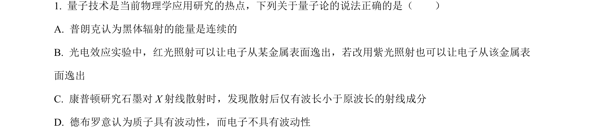
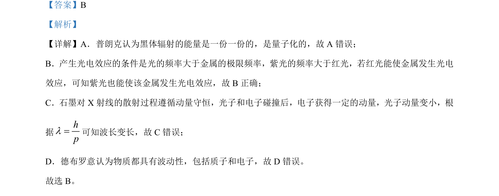

## 题面

## 摘要

本题考查对量子化、光电效应、康普顿散射及物质波等近代物理概念的理解。

## 关联考点

- [[量子化]]
- [[417-光电效应|光电效应]]
- [[康普顿散射]]
- [[物质波]]

## 答案与解析

> 📄 原 PDF 第 1 页：`素材/真题/湖南/2008-2024·（湖南）物理高考真题/2024年高考物理试卷（湖南）（解析卷）.pdf`

<!-- 题干文本-start -->
## 题干文本
1. 量子技术是当前物理学应用研究的热点，下列关于量子论的说法正确的是（　　）
A. 普朗克认为黑体辐射的能量是连续的
B. 光电效应实验中，红光照射可以让电子从某金属表面逸出，若改用紫光照射也可以让电子从该金属表
面逸出
C. 康普顿研究石墨对 X射线散射时，发现散射后仅有波长小于原波长的射线成分
D. 德布罗意认为质子具有波动性，而电子不具有波动性
<!-- 题干文本-end -->

<!-- 解析文本-start -->
## 解析文本
【答案】B
【解析】
【详解】A．普朗克认为黑体辐射的能量是一份一份的，是量子化的，故 A 错误；
B．产生光电效应的条件是光的频率大于金属的极限频率，紫光的频率大于红光，若红光能使金属发生光电
效应，可知紫光也能使该金属发生光电效应，故 B正确；
C．石墨对 X 射线的散射过程遵循动量守恒，光子和电子碰撞后，电子获得一定的动量，光子动量变小，根
据
hpl=可知波长变长，故 C错误；
D．德布罗意认为物质都具有波动性，包括质子和电子，故 D 错误。
故选 B。
<!-- 解析文本-end -->
