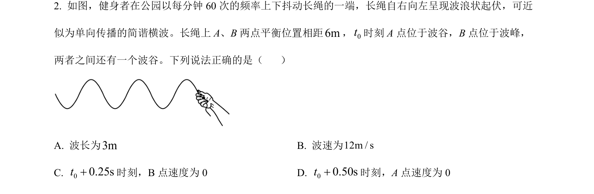
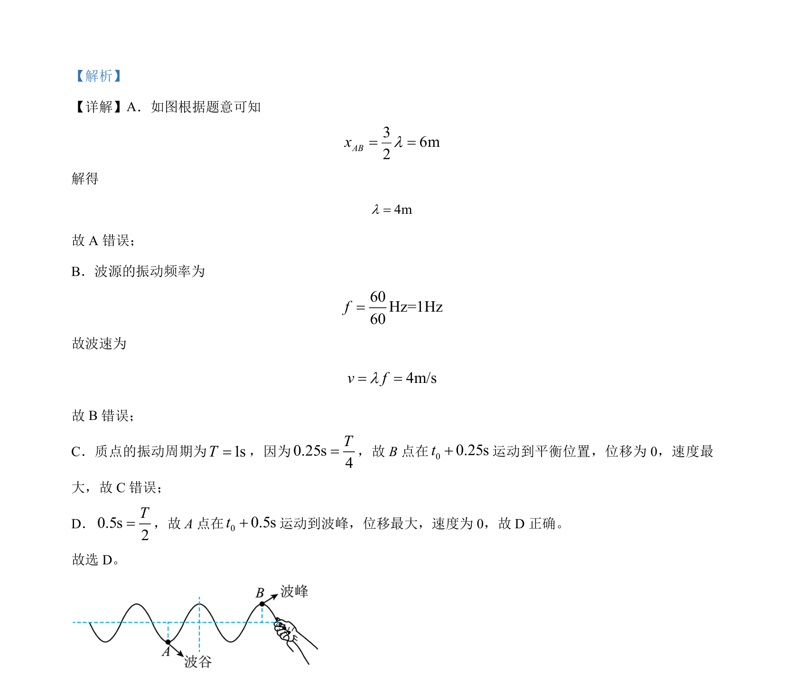

## 题面

## 摘要

一道机械波题目，由波形图求解波长、波速，并判断质点振动位移与速度变化。

## 关联考点

- [[362-机械波|机械波]]
- [[波长波速频率关系]]
- [[763-质点振动|质点振动]]
- [[位移与速度]]

## 答案与解析

> 📄 原 PDF 第 1 页：`素材/真题/湖南/2008-2024·（湖南）物理高考真题/2024年高考物理试卷（湖南）（解析卷）.pdf`
