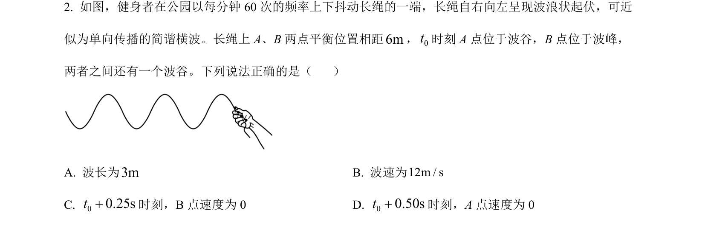
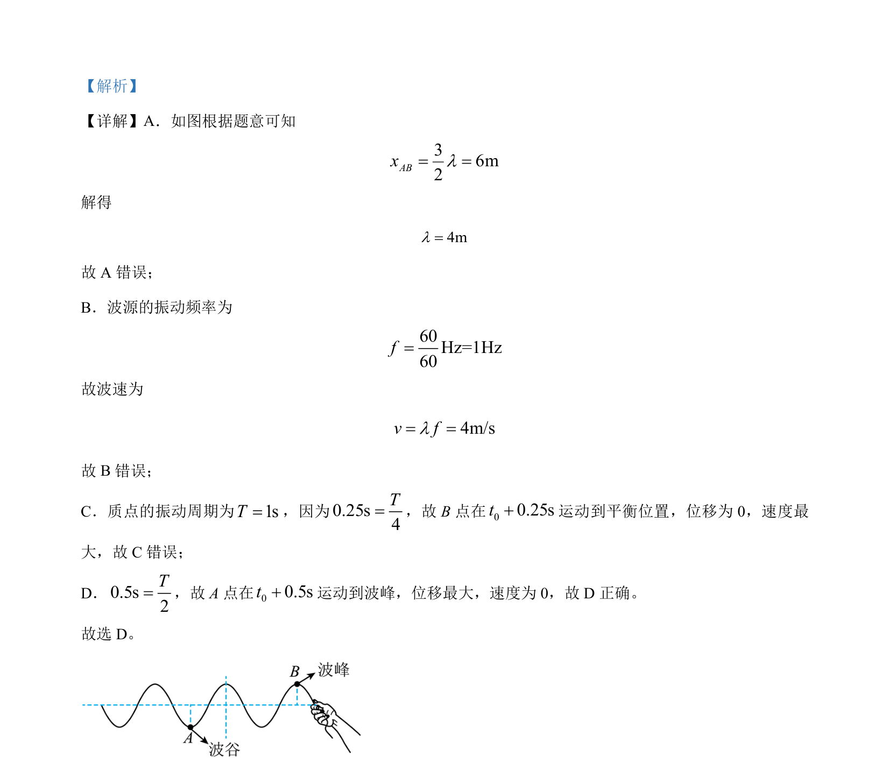

## 题面

## 摘要

一道机械波题目，由波形图求解波长、波速，并判断质点振动位移与速度变化。

## 关联考点

- [[362-机械波|机械波]]
- [[波长波速频率关系]]
- [[763-质点振动|质点振动]]
- [[位移与速度]]

## 答案与解析

> 📄 原 PDF 第 1 页：`素材/真题/湖南/2008-2024·（湖南）物理高考真题/2024年高考物理试卷（湖南）（解析卷）.pdf`

<!-- 题干文本-start -->
## 题干文本
2. 如图，健身者在公园以每分钟 60 次的频率上下抖动长绳的一端，长绳自右向左呈现波浪状起伏，可近
似为单向传播的简谐横波。长绳上 A、B两点平衡位置相距6m，0t时刻 A点位于波谷，B点位于波峰，
两者之间还有一个波谷。下列说法正确的是（    ）
A. 波长为3mB. 波速为12m / s
C. 00.25st+时刻，B点速度为 0 D. 00.50st+时刻，A点速度为 0
<!-- 题干文本-end -->

<!-- 解析文本-start -->
## 解析文本
【答案】D
<!-- 解析文本-end -->
