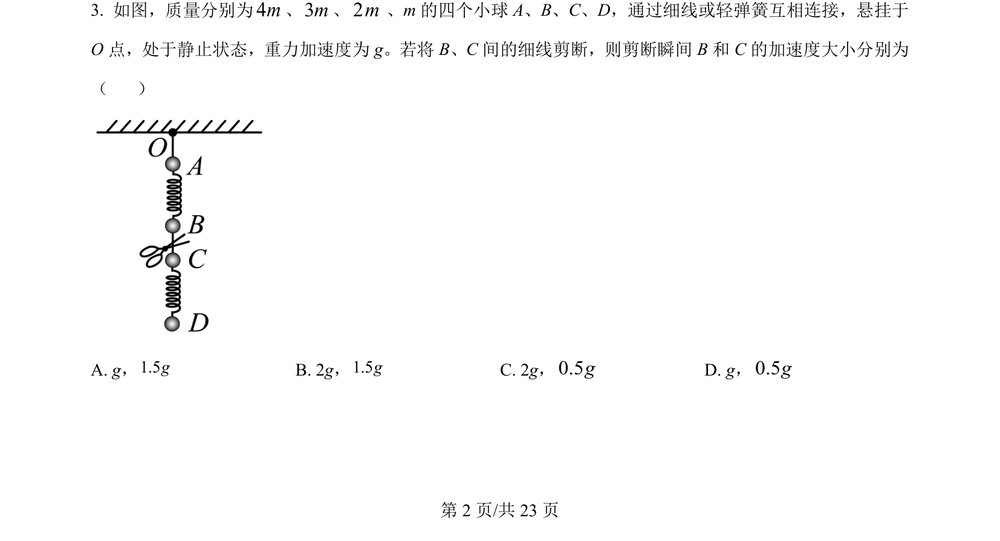
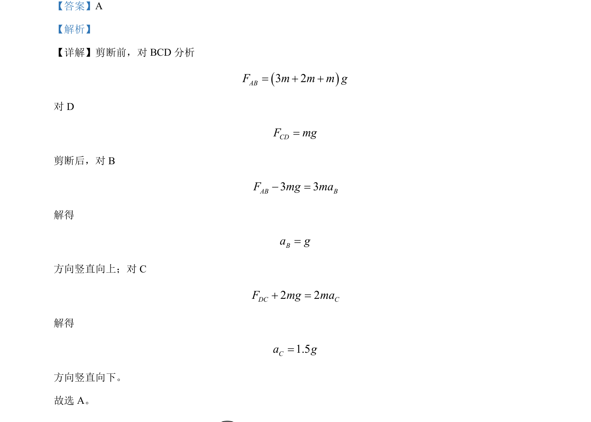

## 题面

## 摘要

剪断绳子前后，运用整体法与隔离法分析物体受力，求解瞬时加速度。

## 关联考点

- [[474-整体法与隔离法|整体法与隔离法]]
- [[229-牛顿第二定律|牛顿第二定律]]
- [[瞬时性问题]]

## 答案与解析

> 📄 原 PDF 第 2 页：`素材/真题/湖南/2008-2024·（湖南）物理高考真题/2024年高考物理试卷（湖南）（解析卷）.pdf`
