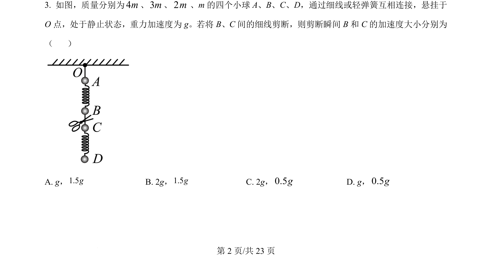
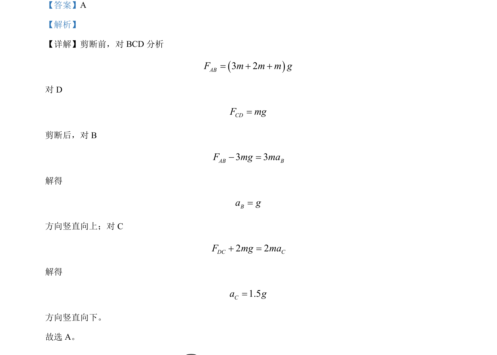

## 题面

## 摘要

剪断绳子前后，运用整体法与隔离法分析物体受力，求解瞬时加速度。

## 关联考点

- [[474-整体法与隔离法|整体法与隔离法]]
- [[229-牛顿第二定律|牛顿第二定律]]
- [[瞬时性问题]]

## 答案与解析

> 📄 原 PDF 第 2 页：`素材/真题/湖南/2008-2024·（湖南）物理高考真题/2024年高考物理试卷（湖南）（解析卷）.pdf`

<!-- 题干文本-start -->
## 题干文本
3. 如图，质量分别为4m、3m、2m、m 的四个小球 A、B、C、D，通过细线或轻弹簧互相连接，悬挂于
O 点，处于静止状态，重力加速度为g。若将 B、C间的细线剪断，则剪断瞬间 B和 C的加速度大小分别为
（    ）
A. g，1.5gB. 2g，1.5gC. 2g，0.5gD. g，0.5g
<!-- 题干文本-end -->

<!-- 解析文本-start -->
## 解析文本

<!-- 解析文本-end -->
