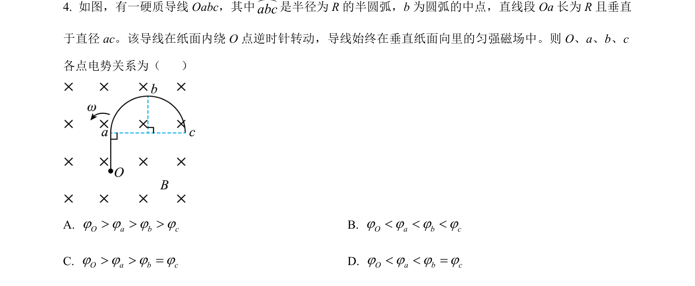
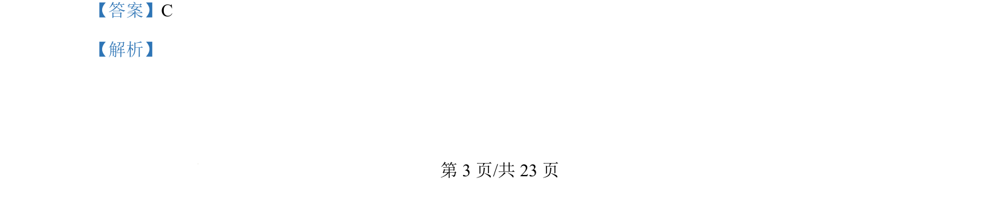
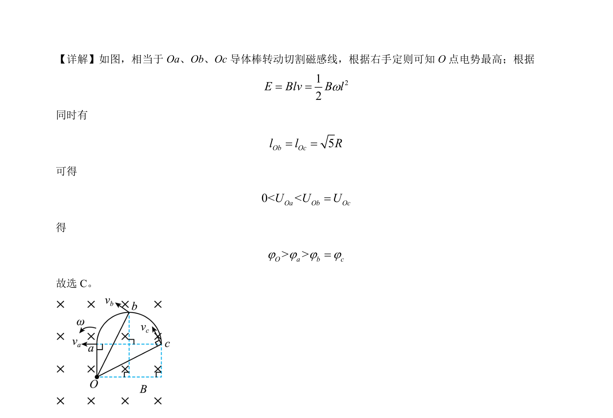

## 题面

## 摘要

导体棒转动切割磁感线，比较各点电势高低。

## 关联考点

- [[导体转动切割磁感线]]
- [[135-安培定则|右手定则]]
- [[电势比较]]

## 答案与解析

> 📄 原 PDF 第 3 页：`素材/真题/湖南/2008-2024·（湖南）物理高考真题/2024年高考物理试卷（湖南）（解析卷）.pdf`

<!-- 题干文本-start -->
## 题干文本
4. 如图，有一硬质导线 Oabc，其中abc是半径为 R 的半圆弧，b 为圆弧的中点，直线段 Oa 长为 R 且垂直
于直径 ac。该导线在纸面内绕 O 点逆时针转动，导线始终在垂直纸面向里的匀强磁场中。则 O、a、b、c
各点电势关系为（    ）
A. O a b cj j j j> > >B. O a b cj j j j< < <
C. O a b cj j j j> > =D. O a b cj j j j< < =
<!-- 题干文本-end -->

<!-- 解析文本-start -->
## 解析文本
【答案】C
【解析】
<!-- 解析文本-end -->
