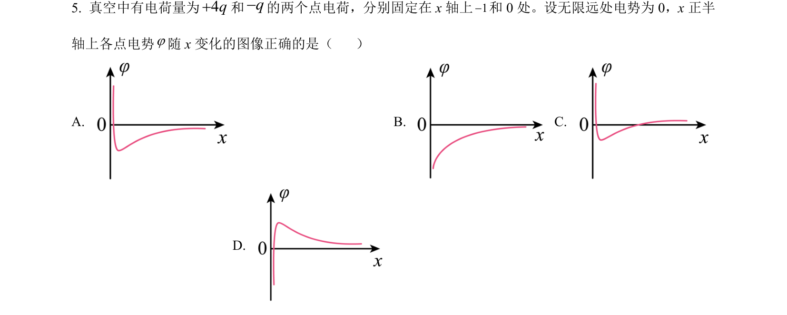
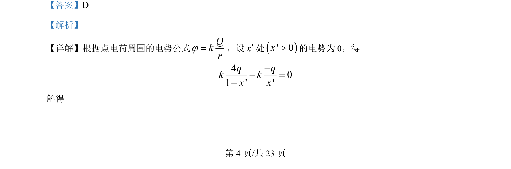
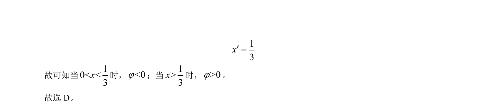

## 题面

## 摘要

根据点电荷电势公式求解两电荷连线上电势为零的位置，并判断不同区域电势的正负。

## 关联考点

- [[863-点电荷电势|点电荷电势]]
- [[668-电势叠加|电势叠加]]
- [[电势零点]]

## 答案与解析

> 📄 原 PDF 第 4 页：`素材/真题/湖南/2008-2024·（湖南）物理高考真题/2024年高考物理试卷（湖南）（解析卷）.pdf`
