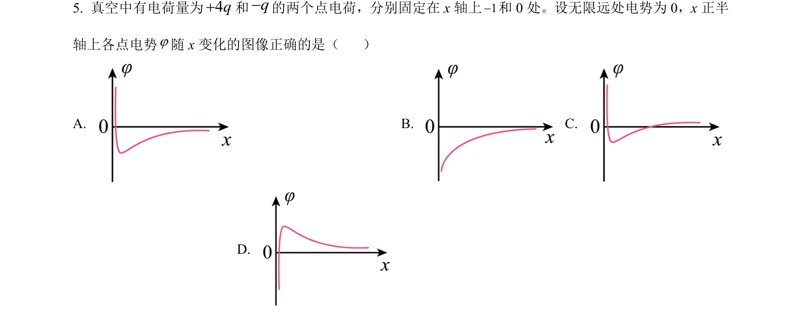
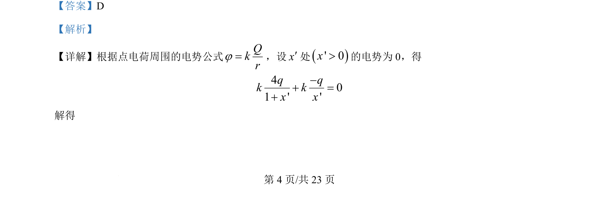
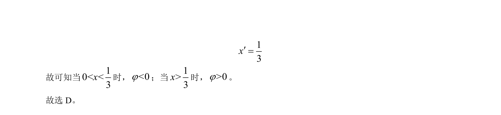

## 题面

## 摘要

根据点电荷电势公式求解两电荷连线上电势为零的位置，并判断不同区域电势的正负。

## 关联考点

- [[863-点电荷电势|点电荷电势]]
- [[668-电势叠加|电势叠加]]
- [[电势零点]]

## 答案与解析

> 📄 原 PDF 第 4 页：`素材/真题/湖南/2008-2024·（湖南）物理高考真题/2024年高考物理试卷（湖南）（解析卷）.pdf`

<!-- 题干文本-start -->
## 题干文本
5. 真空中有电荷量为4q+和q-的两个点电荷，分别固定在 x轴上1-和 0 处。设无限远处电势为 0，x正半
轴上各点电势j随 x变化的图像正确的是（    ）
A. B. C. 
D.
<!-- 题干文本-end -->

<!-- 解析文本-start -->
## 解析文本
【答案】D
【解析】
【详解】根据点电荷周围的电势公式j=Qkr
，设x¢处()' 0x>的电势为 0，得
401 ' 'q qk kx x-+ =+
解得
<!-- 解析文本-end -->
