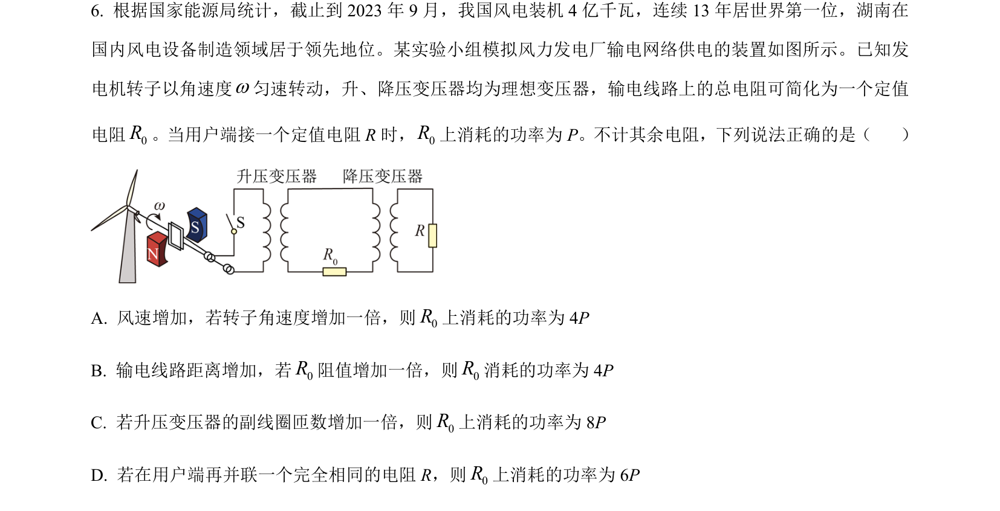
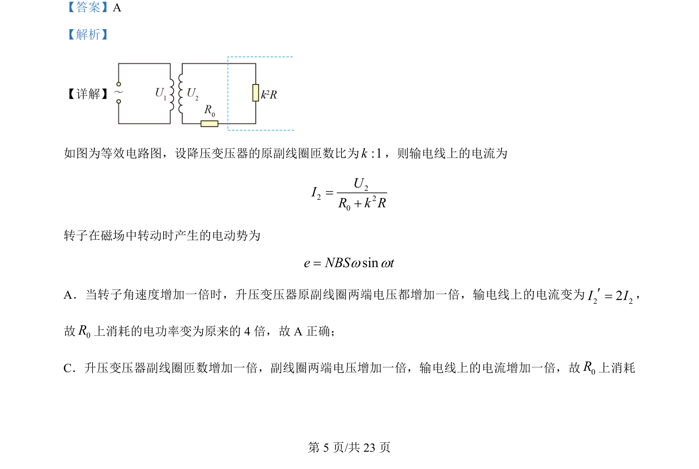
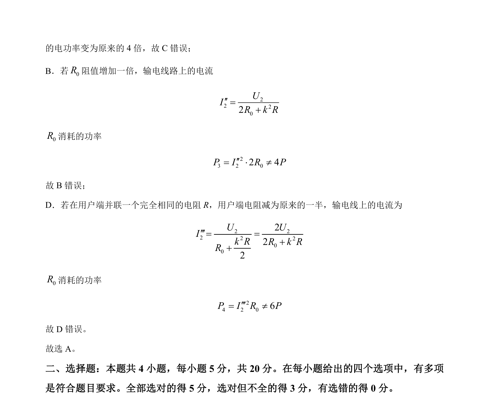

## 题面

## 摘要

该题考查远距离输电的动态分析，通过改变转子角速度、变压器匝数比、线路电阻和负载来讨论输电损耗功率的变化。

## 关联考点

- [[414-远距离输电|远距离输电]]
- [[381-变压器|变压器]]
- [[159-电功率|电功率]]
- [[124-交流电与直流电|交流电]]

## 答案与解析

> 📄 原 PDF 第 5 页：`素材/真题/湖南/2008-2024·（湖南）物理高考真题/2024年高考物理试卷（湖南）（解析卷）.pdf`
