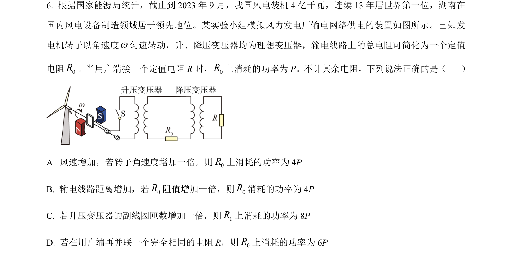
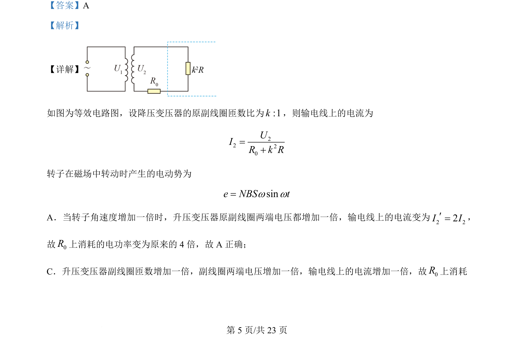
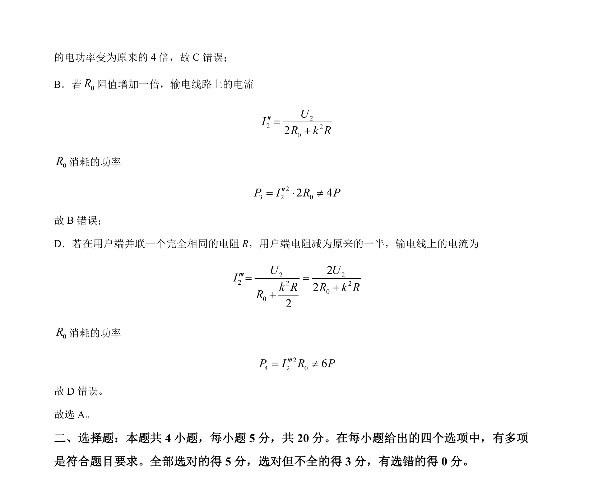

## 题面

## 摘要

该题考查远距离输电的动态分析，通过改变转子角速度、变压器匝数比、线路电阻和负载来讨论输电损耗功率的变化。

## 关联考点

- [[414-远距离输电|远距离输电]]
- [[381-变压器|变压器]]
- [[159-电功率|电功率]]
- [[124-交流电与直流电|交流电]]

## 答案与解析

> 📄 原 PDF 第 5 页：`素材/真题/湖南/2008-2024·（湖南）物理高考真题/2024年高考物理试卷（湖南）（解析卷）.pdf`

<!-- 题干文本-start -->
## 题干文本
6. 根据国家能源局统计，截止到 2023 年 9 月，我国风电装机 4 亿千瓦，连续 13 年居世界第一位，湖南在
国内风电设备制造领域居于领先地位。某实验小组模拟风力发电厂输电网络供电的装置如图所示。已知发
电机转子以角速度w匀速转动，升、降压变压器均为理想变压器，输电线路上的总电阻可简化为一个定值
电阻0R。当用户端接一个定值电阻 R时，0R上消耗的功率为 P。不计其余电阻，下列说法正确的是（    ）
A. 风速增加，若转子角速度增加一倍，则0R上消耗的功率为 4P
B. 输电线路距离增加，若0R阻值增加一倍，则0R消耗的功率为 4P
C. 若升压变压器的副线圈匝数增加一倍，则0R上消耗的功率为 8P
D. 若在用户端再并联一个完全相同的电阻 R，则0R上消耗的功率为 6P
<!-- 题干文本-end -->

<!-- 解析文本-start -->
## 解析文本
【答案】A
【解析】
【详解】
如图为等效电路图，设降压变压器的原副线圈匝数比为:1k，则输电线上的电流为
2220UIR k R=+
转子在磁场中转动时产生的电动势为
sine NBS tw w=
A．当转子角速度增加一倍时，升压变压器原副线圈两端电压都增加一倍，输电线上的电流变为2 22I I¢=，
故0R上消耗的电功率变为原来的 4 倍，故 A 正确；
C．升压变压器副线圈匝数增加一倍，副线圈两端电压增加一倍，输电线上的电流增加一倍，故0R上消耗
<!-- 解析文本-end -->
