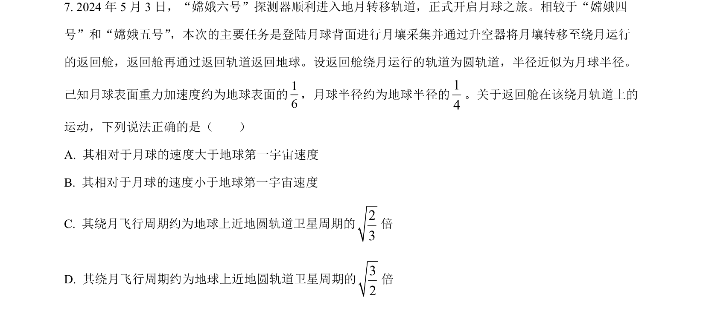
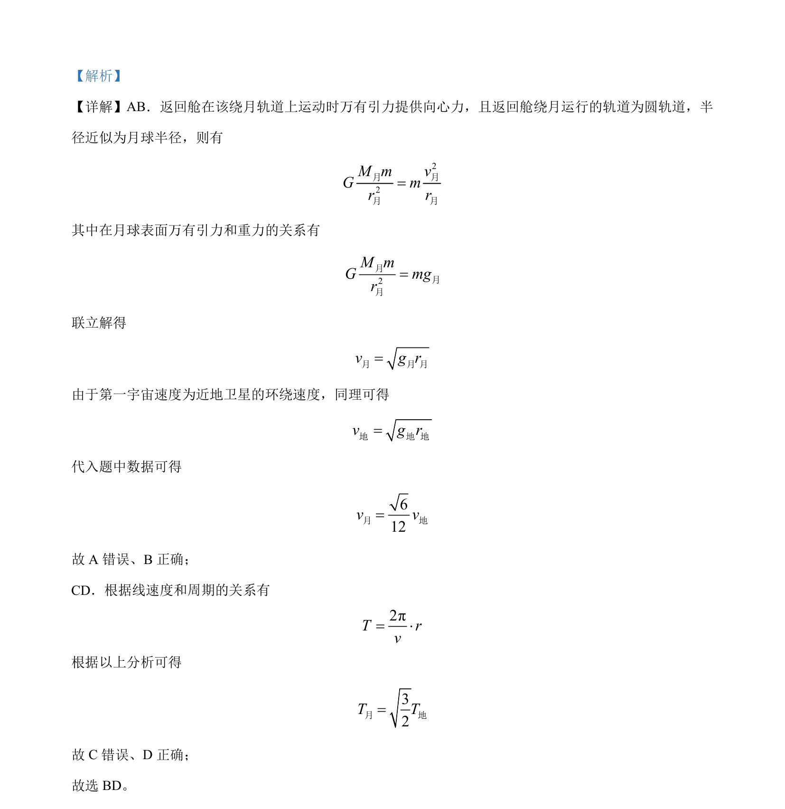

## 题面

## 摘要

返回舱绕月运行，结合万有引力提供向心力及月球表面重力关系，计算环绕速度和周期。

## 关联考点

- [[万有引力提供向心力]]
- [[281-第一宇宙速度|第一宇宙速度]]
- [[重力与万有引力关系]]
- [[线速度与周期关系]]

## 答案与解析

> 📄 原 PDF 第 6 页：`素材/真题/湖南/2008-2024·（湖南）物理高考真题/2024年高考物理试卷（湖南）（解析卷）.pdf`
