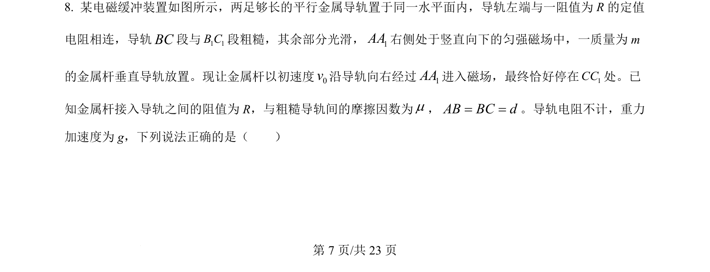
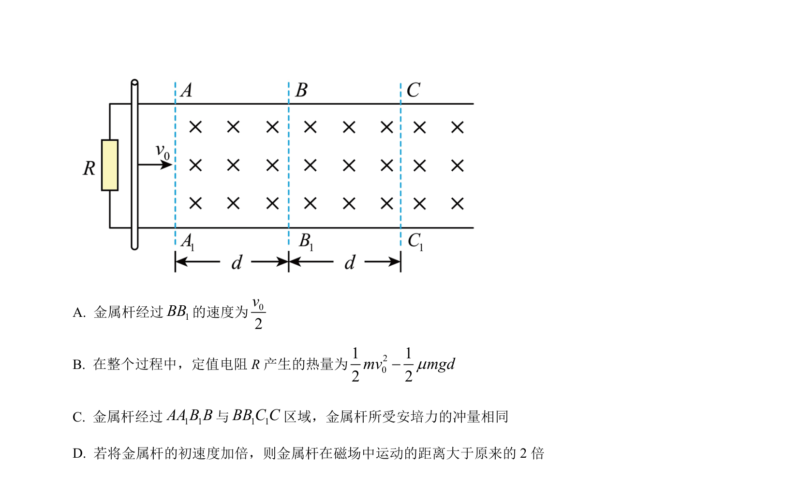
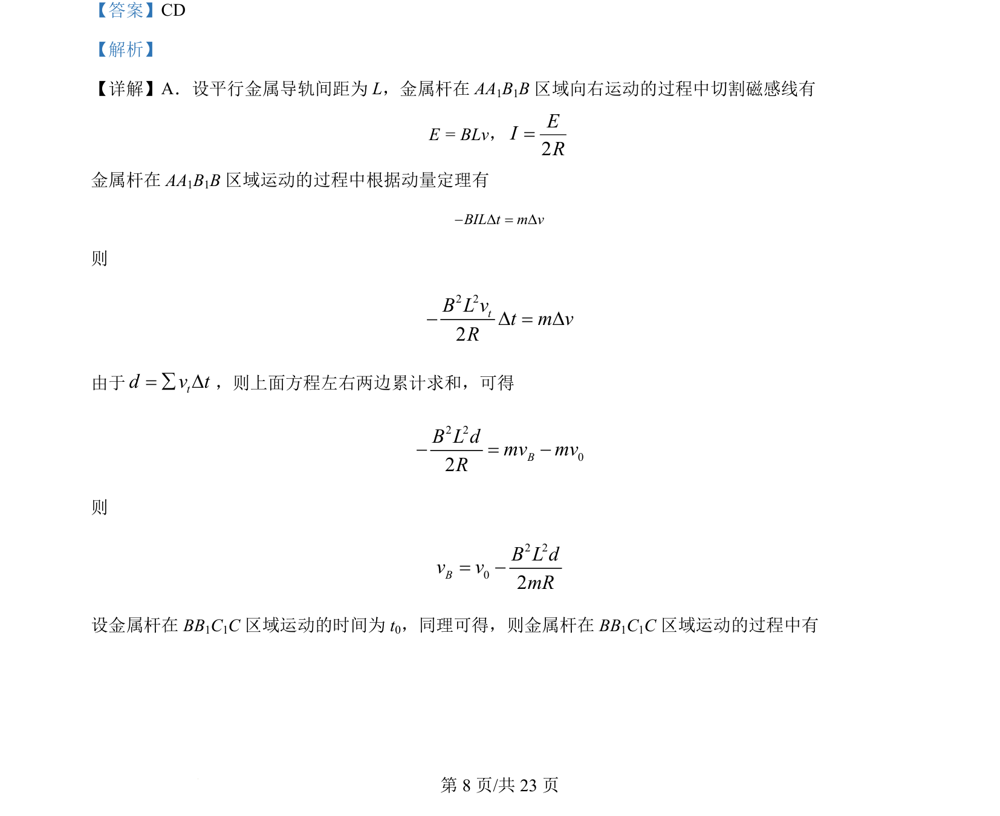
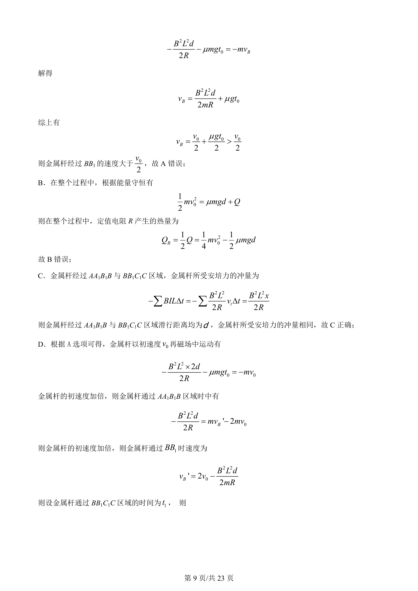
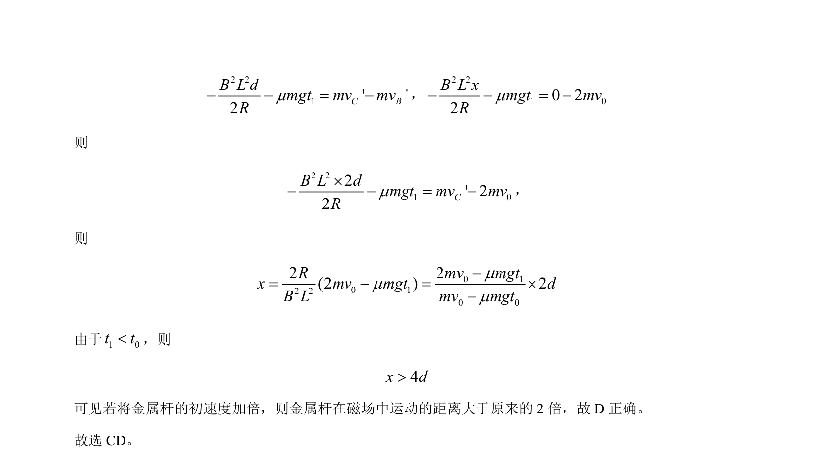

## 题面

## 摘要

金属杆在磁场中切割磁感线，综合动量定理与能量守恒分析速度、热量、冲量及距离关系。

## 关联考点

- [[175-电磁感应|电磁感应]]
- [[349-动量定理|动量定理]]
- [[197-能量守恒定律|能量守恒]]
- [[安培力冲量]]

## 答案与解析

> 📄 原 PDF 第 7 页：`素材/真题/湖南/2008-2024·（湖南）物理高考真题/2024年高考物理试卷（湖南）（解析卷）.pdf`
