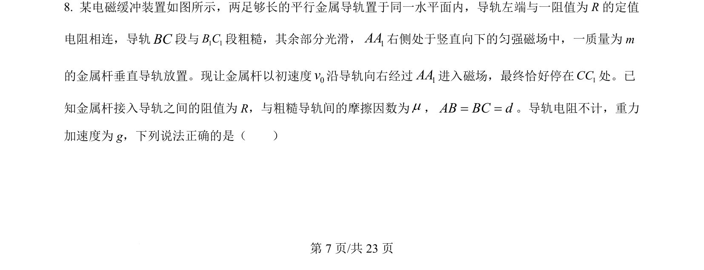
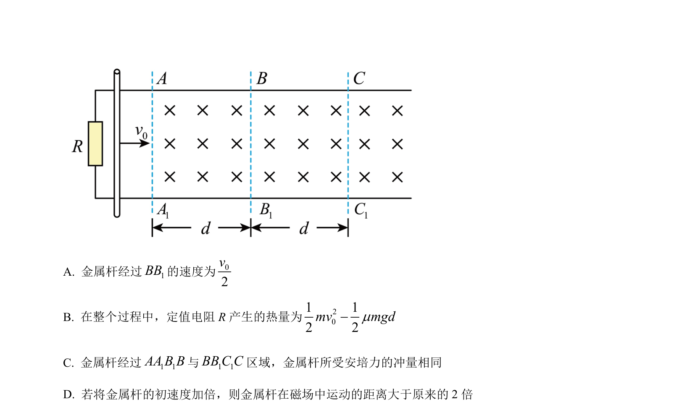
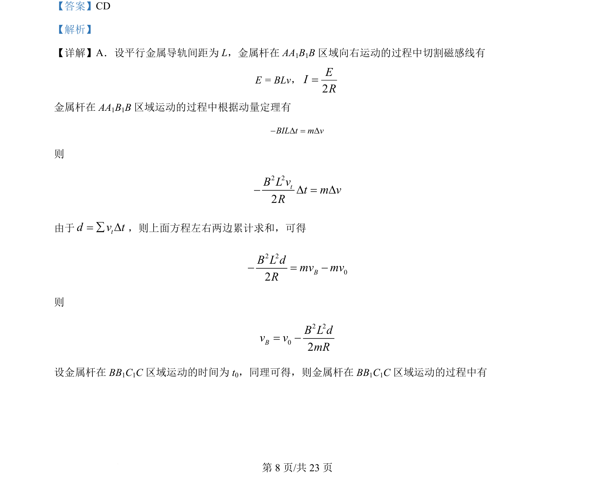
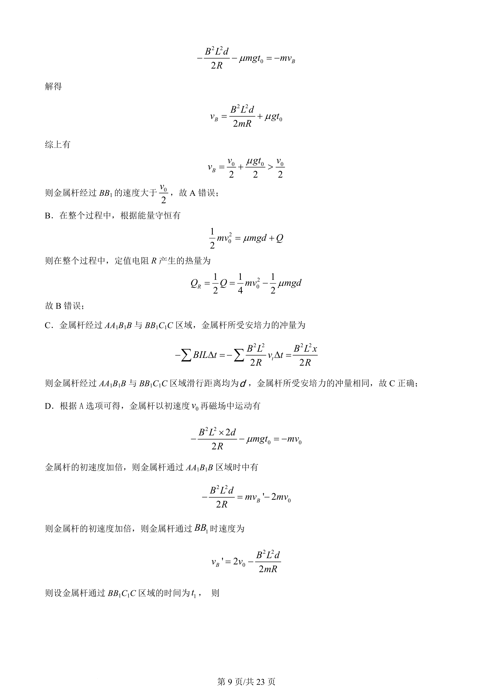
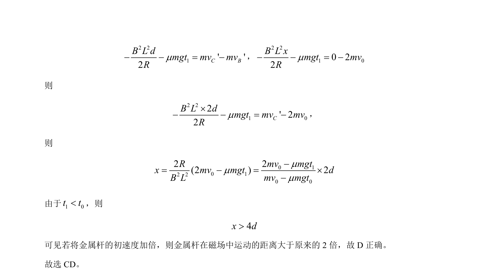

## 题面

## 摘要

金属杆在磁场中切割磁感线，综合动量定理与能量守恒分析速度、热量、冲量及距离关系。

## 关联考点

- [[175-电磁感应|电磁感应]]
- [[349-动量定理|动量定理]]
- [[197-能量守恒定律|能量守恒]]
- [[安培力冲量]]

## 答案与解析

> 📄 原 PDF 第 7 页：`素材/真题/湖南/2008-2024·（湖南）物理高考真题/2024年高考物理试卷（湖南）（解析卷）.pdf`

<!-- 题干文本-start -->
## 题干文本
8. 某电磁缓冲装置如图所示，两足够长的平行金属导轨置于同一水平面内，导轨左端与一阻值为 R的定值
电阻相连，导轨BC段与1 1B C段粗糙，其余部分光滑，1AA右侧处于竖直向下的匀强磁场中，一质量为 m
的金属杆垂直导轨放置。现让金属杆以初速度0v沿导轨向右经过1AA进入磁场，最终恰好停在1CC处。已
知金属杆接入导轨之间的阻值为 R，与粗糙导轨间的摩擦因数为μ，AB BC d= =。导轨电阻不计，重力
加速度为 g，下列说法正确的是（　　）
<!-- 题干文本-end -->

<!-- 解析文本-start -->
## 解析文本

<!-- 解析文本-end -->
