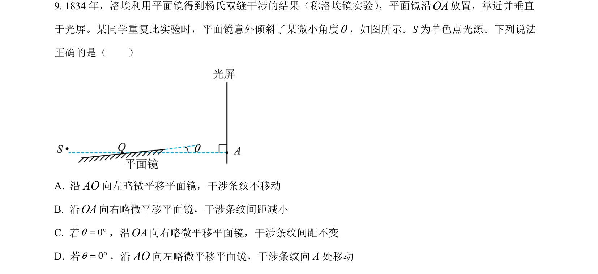
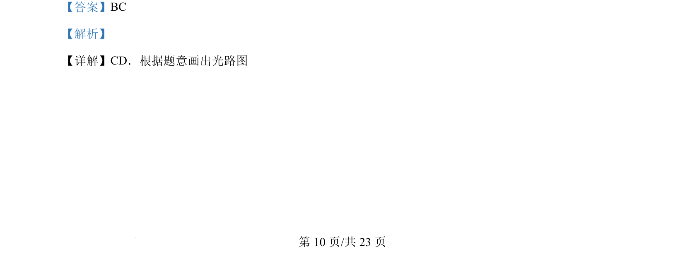
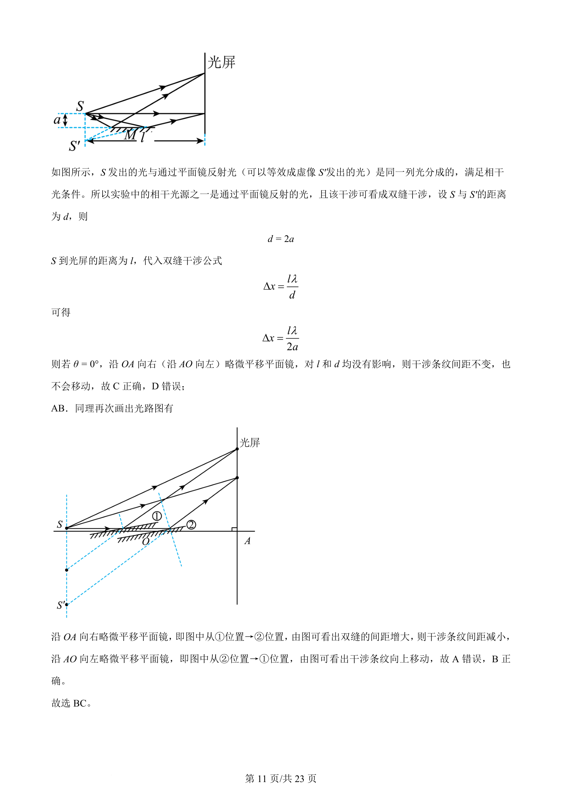

## 题面

## 摘要

该题通过平面镜反射光等效为虚像光源，分析干涉条纹间距及移动与平面镜平移的位置关系。

## 关联考点

- [[340-光的干涉|光的干涉]]
- [[等效双缝]]
- [[766-条纹间距公式|条纹间距公式]]
- [[光路分析]]

## 答案与解析

> 📄 原 PDF 第 10 页：`素材/真题/湖南/2008-2024·（湖南）物理高考真题/2024年高考物理试卷（湖南）（解析卷）.pdf`
