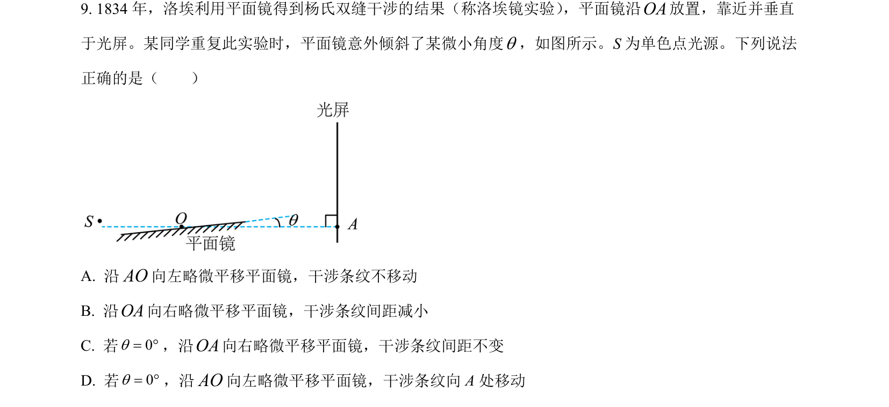
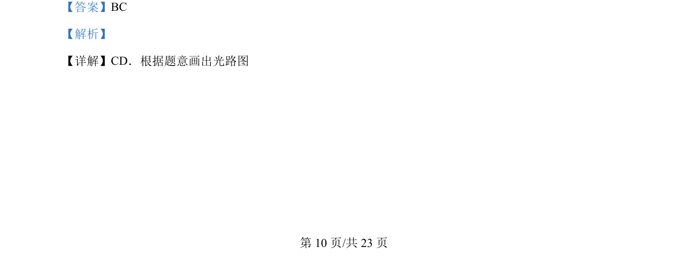
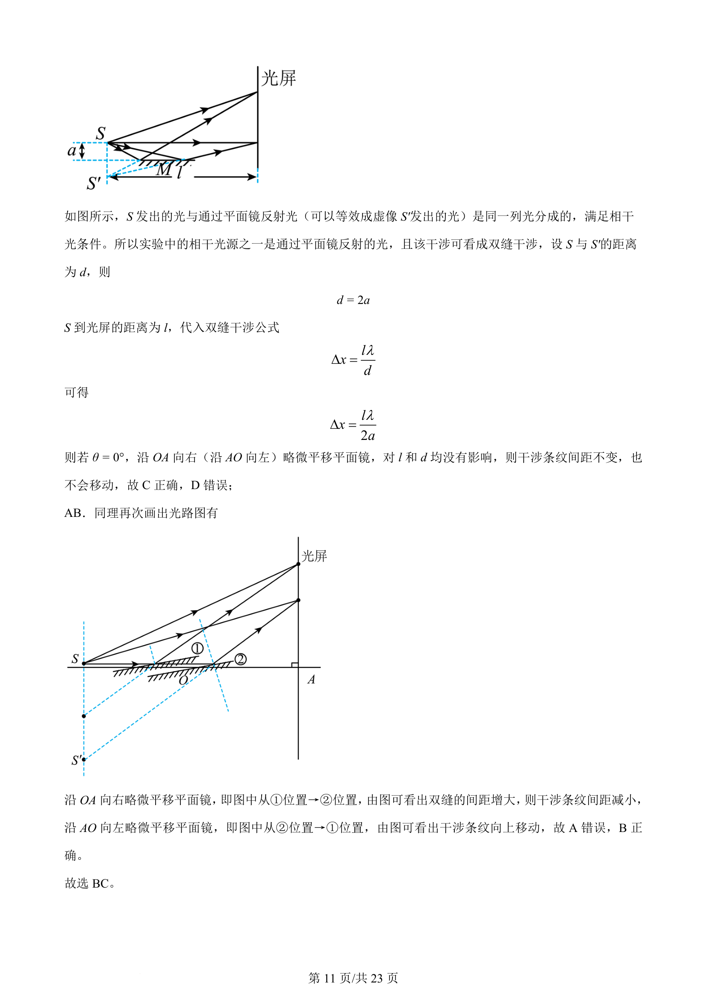

## 题面

## 摘要

该题通过平面镜反射光等效为虚像光源，分析干涉条纹间距及移动与平面镜平移的位置关系。

## 关联考点

- [[340-光的干涉|光的干涉]]
- [[等效双缝]]
- [[766-条纹间距公式|条纹间距公式]]
- [[光路分析]]

## 答案与解析

> 📄 原 PDF 第 10 页：`素材/真题/湖南/2008-2024·（湖南）物理高考真题/2024年高考物理试卷（湖南）（解析卷）.pdf`

<!-- 题干文本-start -->
## 题干文本
9. 1834 年，洛埃利用平面镜得到杨氏双缝干涉的结果（称洛埃镜实验） ，平面镜沿OA放置，靠近并垂直
于光屏。某同学重复此实验时，平面镜意外倾斜了某微小角度q，如图所示。S 为单色点光源。下列说法
正确的是（　　）
A. 沿AO向左略微平移平面镜，干涉条纹不移动
B. 沿OA向右略微平移平面镜，干涉条纹间距减小
C. 若0q= °，沿OA向右略微平移平面镜，干涉条纹间距不变
D. 若0q= °，沿AO向左略微平移平面镜，干涉条纹向 A处移动
<!-- 题干文本-end -->

<!-- 解析文本-start -->
## 解析文本
【答案】BC
【解析】
【详解】CD．根据题意画出光路图
<!-- 解析文本-end -->
