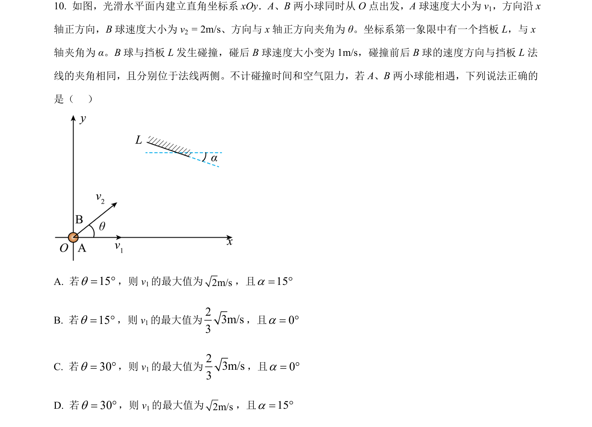
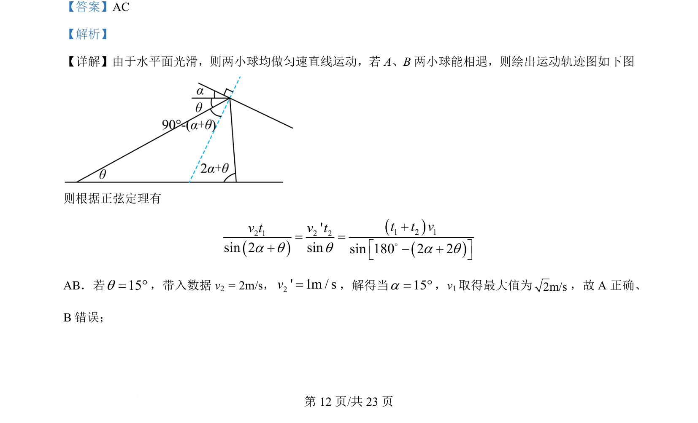
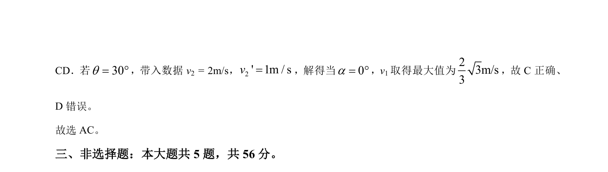

## 题面

## 摘要

两小球在光滑水平面上匀速运动，利用正弦定理分析相遇条件并求解速度极值。

## 关联考点

- [[010-匀速直线运动|匀速直线运动]]
- [[相遇条件]]
- [[126-定理|正弦定理]]
- [[609-三角函数极值|极值问题]]

## 答案与解析

> 📄 原 PDF 第 12 页：`素材/真题/湖南/2008-2024·（湖南）物理高考真题/2024年高考物理试卷（湖南）（解析卷）.pdf`
