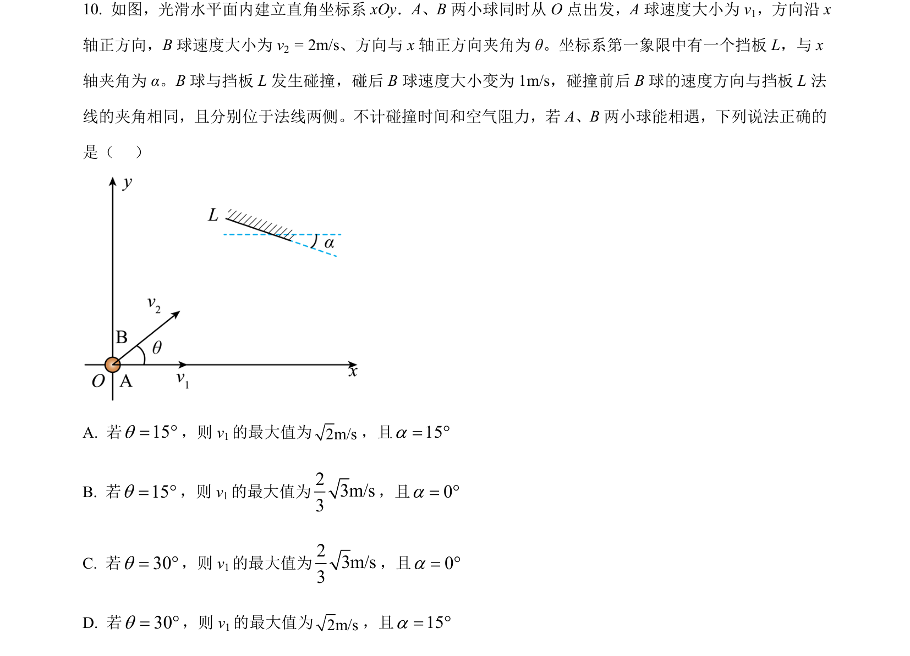
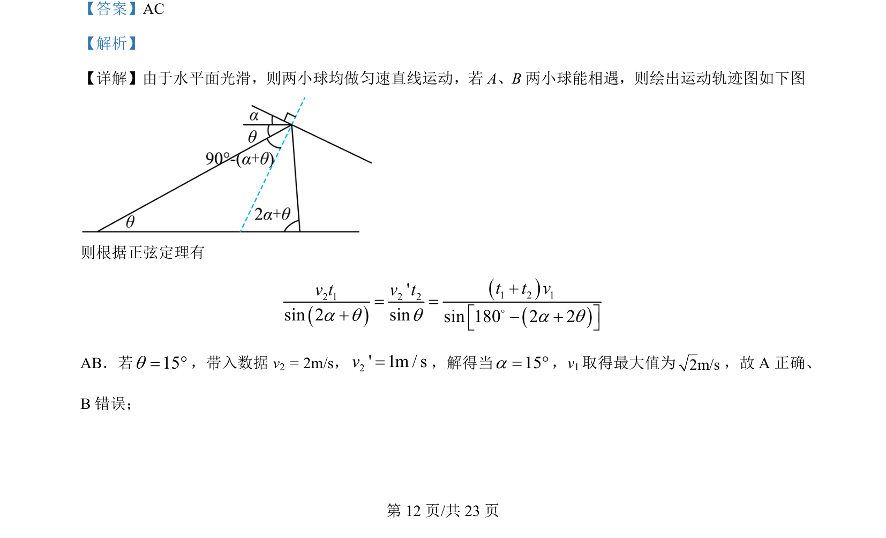
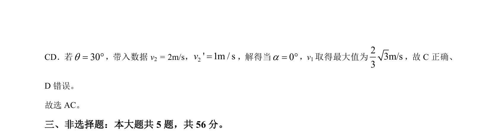

## 题面

## 摘要

两小球在光滑水平面上匀速运动，利用正弦定理分析相遇条件并求解速度极值。

## 关联考点

- [[010-匀速直线运动|匀速直线运动]]
- [[相遇条件]]
- [[126-定理|正弦定理]]
- [[609-三角函数极值|极值问题]]

## 答案与解析

> 📄 原 PDF 第 12 页：`素材/真题/湖南/2008-2024·（湖南）物理高考真题/2024年高考物理试卷（湖南）（解析卷）.pdf`

<!-- 题干文本-start -->
## 题干文本
10. 如图，光滑水平面内建立直角坐标系 xOy．A、B两小球同时从 O 点出发，A球速度大小为 v1，方向沿 x
轴正方向，B球速度大小为 v2 = 2m/s、方向与 x轴正方向夹角为 θ。坐标系第一象限中有一个挡板 L，与 x
轴夹角为 α。B 球与挡板 L 发生碰撞，碰后 B 球速度大小变为 1m/s，碰撞前后 B 球的速度方向与挡板 L 法
线的夹角相同，且分别位于法线两侧。不计碰撞时间和空气阻力，若A、B两小球能相遇，下列说法正确的
是（   ）
A. 若15q= °，则 v1的最大值为2m/s，且15a= °
B. 若15q= °，则 v1的最大值为23m/s3
，且0a= °
C. 若30q= °，则 v1的最大值为23m/s3
，且0a= °
D. 若30q= °，则 v1的最大值为2m/s，且15a= °
<!-- 题干文本-end -->

<!-- 解析文本-start -->
## 解析文本
【答案】AC
【解析】
【详解】由于水平面光滑，则两小球均做匀速直线运动，若A、B两小球能相遇，则绘出运动轨迹图如下图
则根据正弦定理有
()()()1 2 12 1 2 2'sin 2 sinsin 180 2 2t t vv t v ta q qa q+= =+é ù- +ë ûo
AB．若15q= °，带入数据 v2 = 2m/s，2' 1m / sv=，解得当15a= °，v1取得最大值为2m/s，故 A 正确、
B错误；
<!-- 解析文本-end -->
