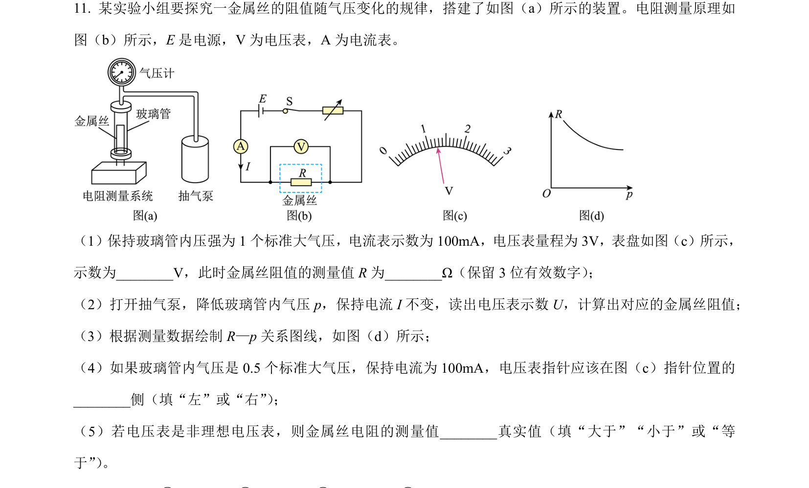
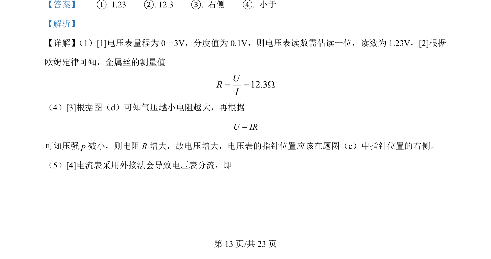

## 题面

## 摘要

实验测量金属丝电阻，涉及电压表读数、欧姆定律及外接法误差分析。

## 关联考点

- [[电压表读数]]
- [[141-欧姆定律-初中|欧姆定律]]
- [[772-电阻测量|电阻测量]]
- [[724-误差分析|误差分析]]

## 答案与解析

> 📄 原 PDF 第 13 页：`素材/真题/湖南/2008-2024·（湖南）物理高考真题/2024年高考物理试卷（湖南）（解析卷）.pdf`
