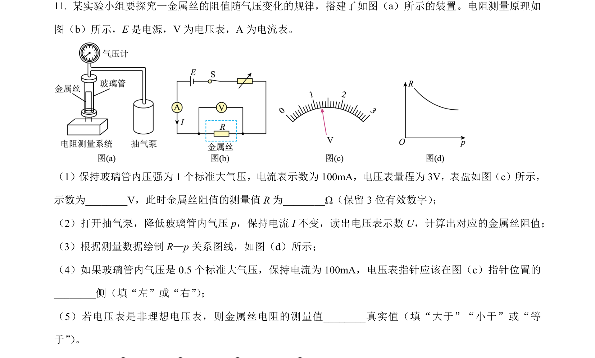
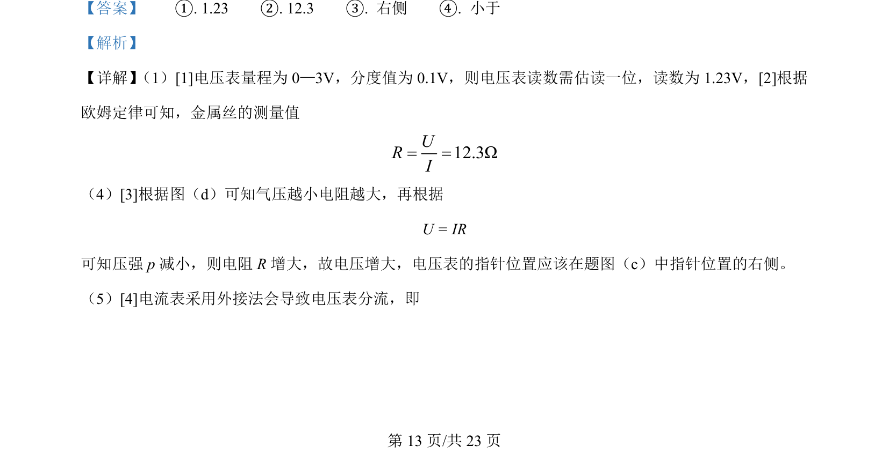

## 题面

## 摘要

实验测量金属丝电阻，涉及电压表读数、欧姆定律及外接法误差分析。

## 关联考点

- [[电压表读数]]
- [[141-欧姆定律-初中|欧姆定律]]
- [[772-电阻测量|电阻测量]]
- [[724-误差分析|误差分析]]

## 答案与解析

> 📄 原 PDF 第 13 页：`素材/真题/湖南/2008-2024·（湖南）物理高考真题/2024年高考物理试卷（湖南）（解析卷）.pdf`

<!-- 题干文本-start -->
## 题干文本
11. 某实验小组要探究一金属丝的阻值随气压变化的规律，搭建了如图（ a）所示的装置。电阻测量原理如
图（b）所示，E是电源，V 为电压表，A 为电流表。
（1）保持玻璃管内压强为1 个标准大气压，电流表示数为100mA，电压表量程为3V，表盘如图（c）所示，
示数为________V，此时金属丝阻值的测量值 R为________Ω（保留 3 位有效数字） ；
（2）打开抽气泵，降低玻璃管内气压 p，保持电流 I 不变，读出电压表示数 U，计算出对应的金属丝阻值；
（3）根据测量数据绘制 R—p 关系图线，如图（d）所示；
（4）如果玻璃管内气压是 0.5 个标准大气压，保持电流为 100mA，电压表指针应该在图（c）指针位置的
________侧（填“左”或“右”） ；
（5）若电压表是非理想电压表，则金属丝电阻的测量值 ________真实值（填“大于”“小于”或“等
于”） 。
<!-- 题干文本-end -->

<!-- 解析文本-start -->
## 解析文本
【答案】    ①. 1.23    ②. 12.3    ③. 右侧    ④. 小于
【解析】
【详解】 （1）[1]电压表量程为 0—3V，分度值为 0.1V，则电压表读数需估读一位，读数为 1.23V，[2]根据
欧姆定律可知，金属丝的测量值
<!-- 解析文本-end -->
