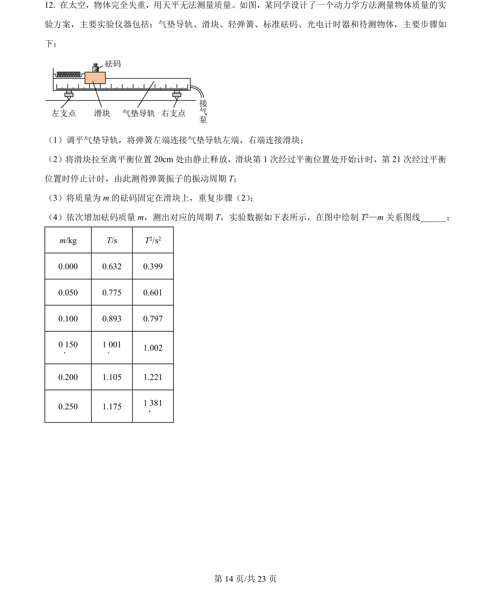
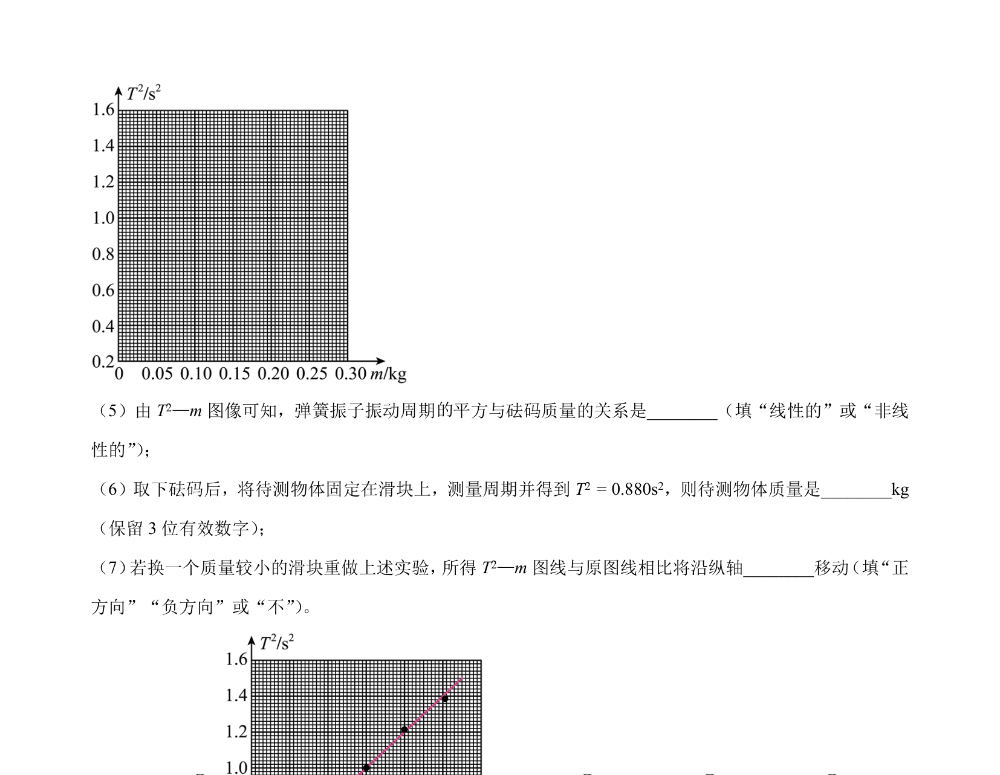
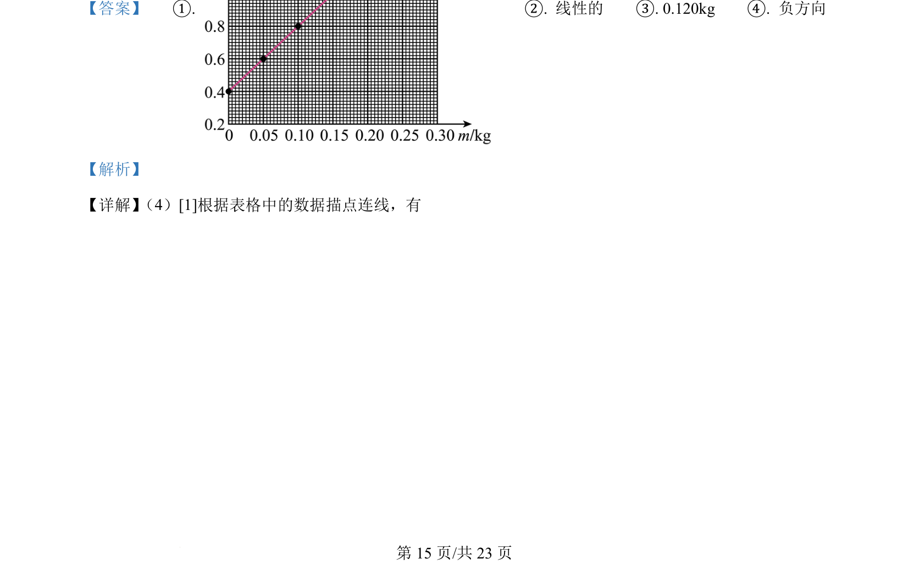
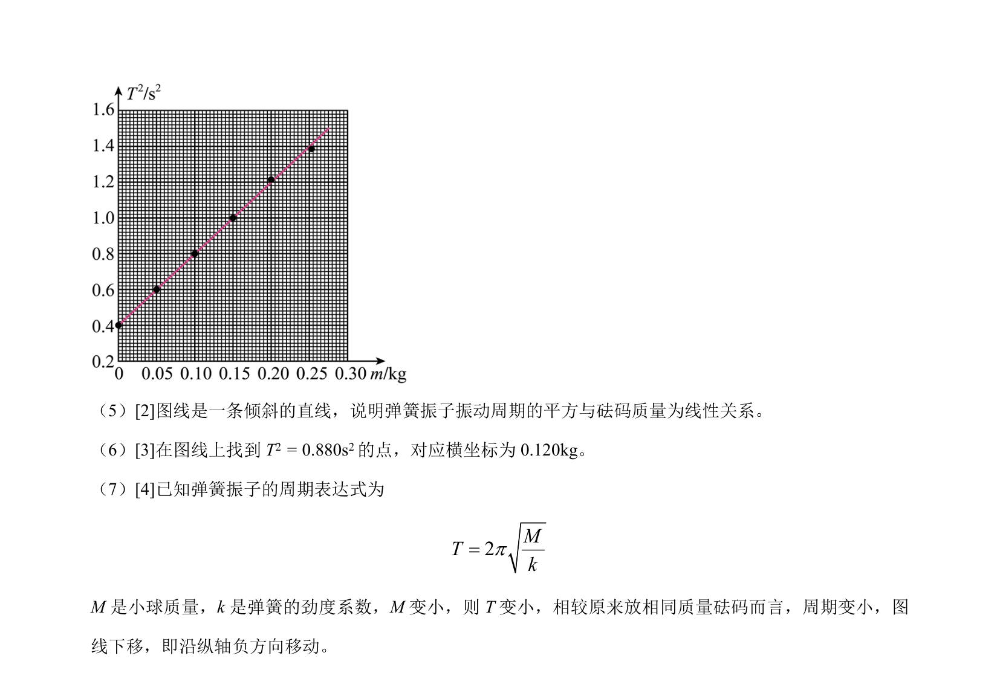

## 题面

## 摘要

探究弹簧振子周期平方与质量的关系实验，涉及描点作图、图像分析与周期公式的运用。

## 关联考点

- [[802-弹簧振子|弹簧振子]]
- [[759-周期公式|周期公式]]
- [[图像法处理数据]]
- [[线性关系]]

## 答案与解析

> 📄 原 PDF 第 14 页：`素材/真题/湖南/2008-2024·（湖南）物理高考真题/2024年高考物理试卷（湖南）（解析卷）.pdf`
