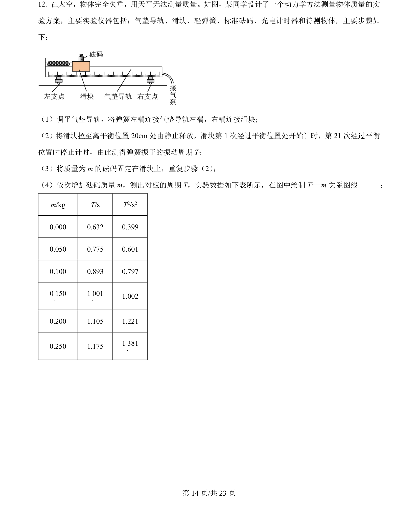
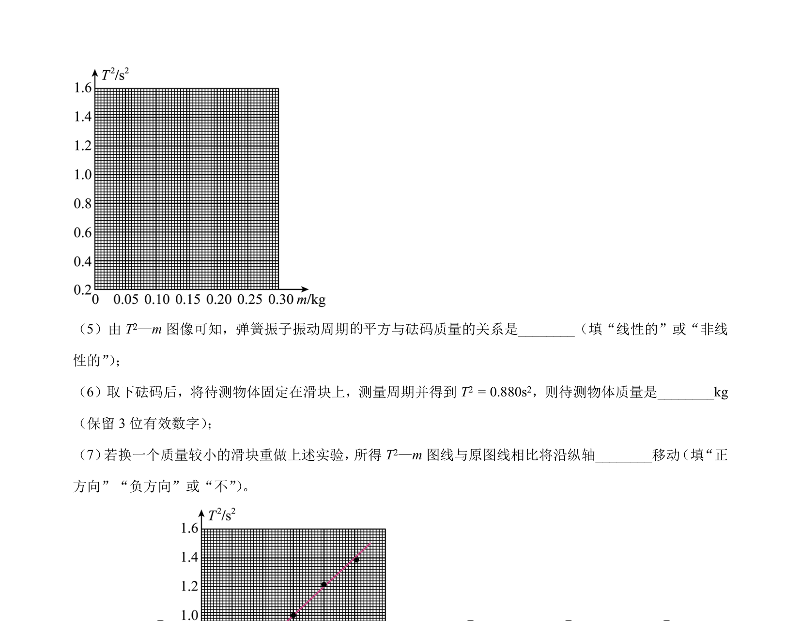
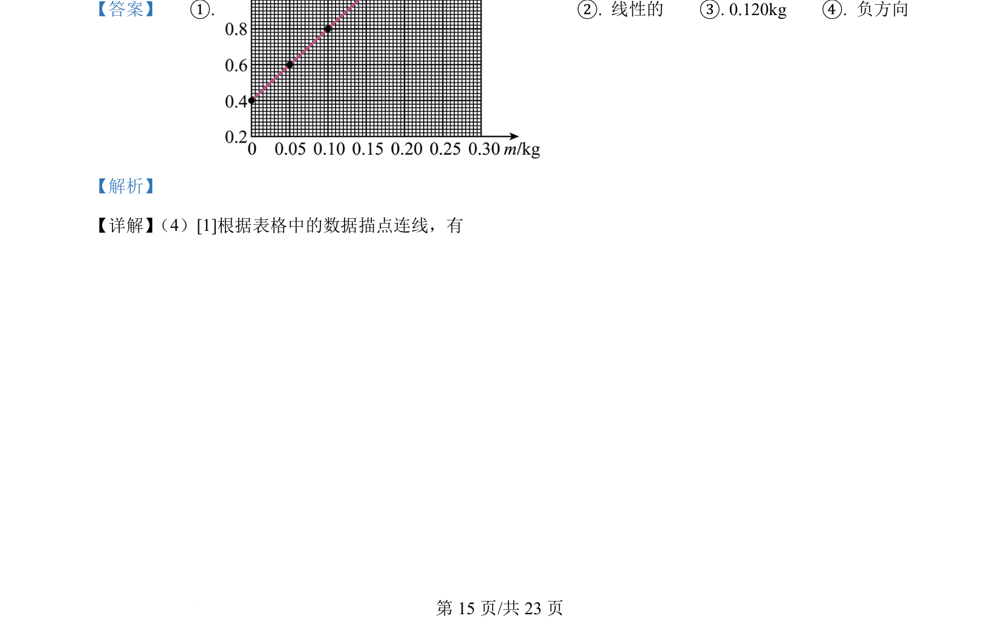
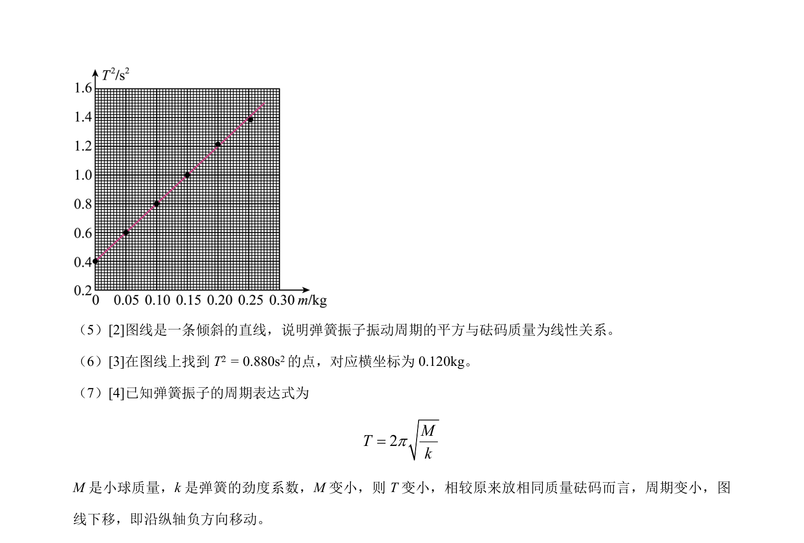

## 题面

## 摘要

探究弹簧振子周期平方与质量的关系实验，涉及描点作图、图像分析与周期公式的运用。

## 关联考点

- [[802-弹簧振子|弹簧振子]]
- [[759-周期公式|周期公式]]
- [[861-图像法处理数据|图像法处理数据]]
- [[线性关系]]

## 答案与解析

> 📄 原 PDF 第 14 页：`素材/真题/湖南/2008-2024·（湖南）物理高考真题/2024年高考物理试卷（湖南）（解析卷）.pdf`

<!-- 题干文本-start -->
## 题干文本
12. 在太空，物体完全失重，用天平无法测量质量。如图，某同学设计了一个动力学方法测量物体质量的实
验方案，主要实验仪器包括：气垫导轨、滑块、轻弹簧、标准砝码、光电计时器和待测物体，主要步骤如
下：
（1）调平气垫导轨，将弹簧左端连接气垫导轨左端，右端连接滑块；
（2）将滑块拉至离平衡位置 20cm处由静止释放，滑块第 1 次经过平衡位置处开始计时，第 21 次经过平衡
位置时停止计时，由此测得弹簧振子的振动周期 T；
（3）将质量为 m 的砝码固定在滑块上，重复步骤（2） ；
（4）依次增加砝码质量 m，测出对应的周期 T，实验数据如下表所示，在图中绘制 T2—m 关系图线______；
m/kg T/s T2/s2
0.000 0.632 0.399
0.050 0.775 0.601
0.100 0.893 0.797
0 150 1 001 1.002
0.200 1.105 1.221
0.250 1.175 1 381
...
<!-- 题干文本-end -->

<!-- 解析文本-start -->
## 解析文本

<!-- 解析文本-end -->
