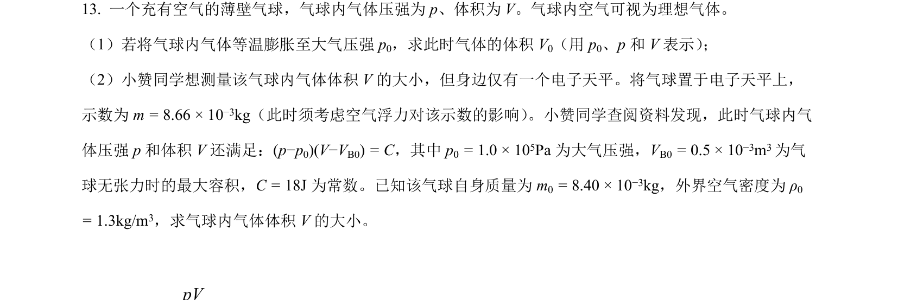
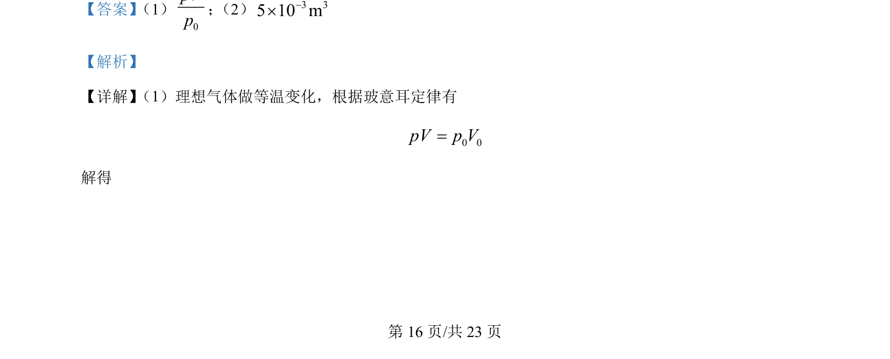
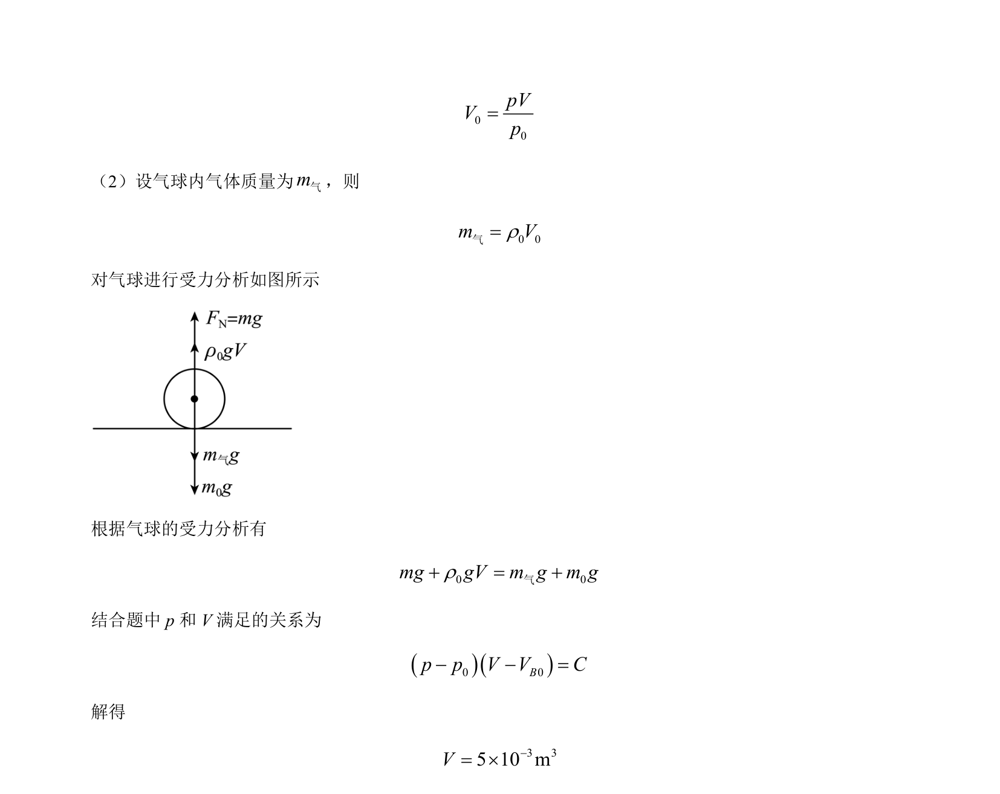

## 题面

## 摘要

理想气体等温变化与浮力平衡综合计算

## 关联考点

- [[444-玻意耳定律|玻意耳定律]]
- [[446-理想气体状态方程|气体状态方程]]
- [[460-受力分析|受力分析]]
- [[092-浮力|浮力]]

## 答案与解析

> 📄 原 PDF 第 16 页：`素材/真题/湖南/2008-2024·（湖南）物理高考真题/2024年高考物理试卷（湖南）（解析卷）.pdf`
