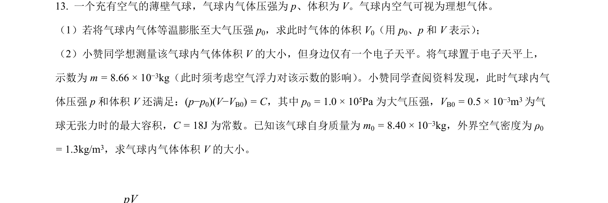
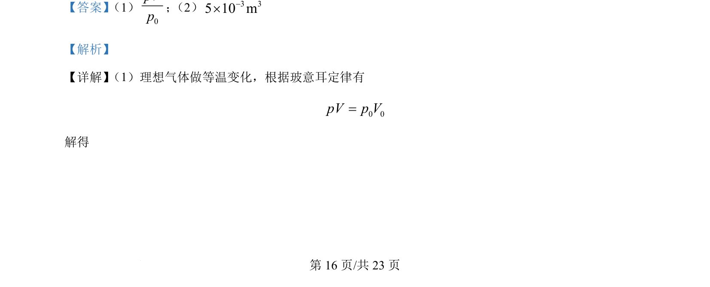
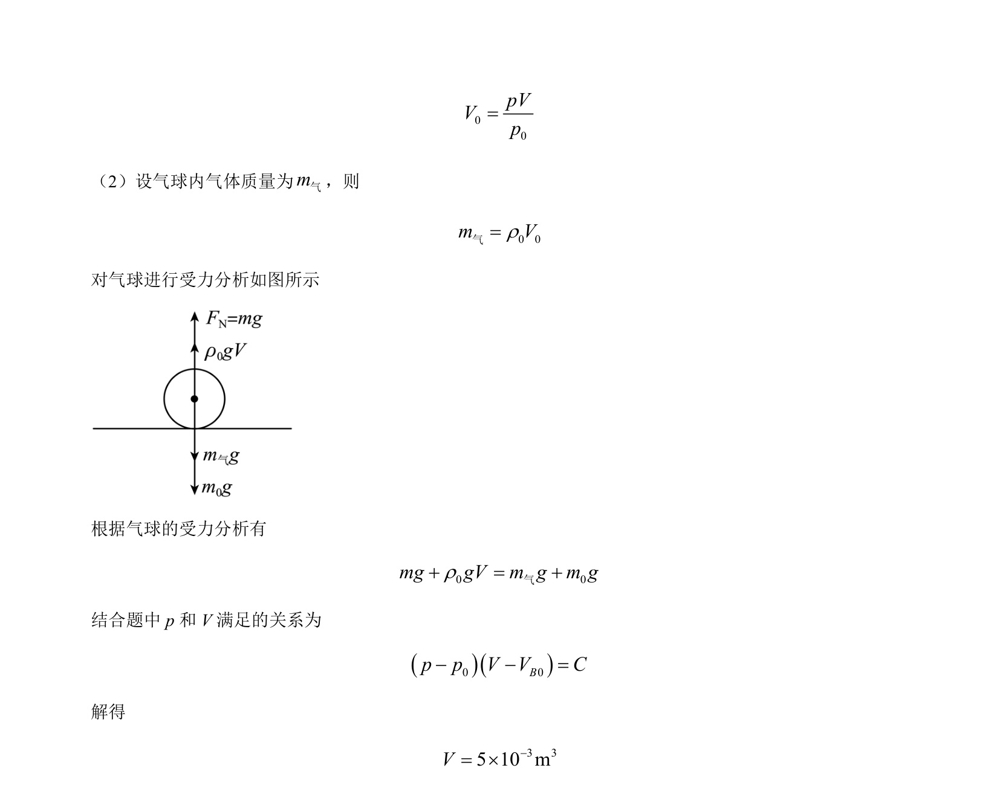

## 题面

## 摘要

理想气体等温变化与浮力平衡综合计算

## 关联考点

- [[444-玻意耳定律|玻意耳定律]]
- [[446-理想气体状态方程|气体状态方程]]
- [[460-受力分析|受力分析]]
- [[092-浮力|浮力]]

## 答案与解析

> 📄 原 PDF 第 16 页：`素材/真题/湖南/2008-2024·（湖南）物理高考真题/2024年高考物理试卷（湖南）（解析卷）.pdf`

<!-- 题干文本-start -->
## 题干文本
13. 一个充有空气的薄壁气球，气球内气体压强为 p、体积为 V。气球内空气可视为理想气体。
（1）若将气球内气体等温膨胀至大气压强 p0，求此时气体的体积 V0（用 p0、p 和 V表示） ；
（2）小赞同学想测量该气球内气体体积 V的大小，但身边仅有一个电子天平。将气球置于电子天平上，
示数为 m = 8.66 × 10−3kg（此时须考虑空气浮力对该示数的影响） 。小赞同学查阅资料发现，此时气球内气
体压强 p 和体积 V还满足：(p−p0)(V−VB0) = C，其中 p0 = 1.0 × 105Pa 为大气压强，VB0 = 0.5 × 10−3m3为气
球无张力时的最大容积，C = 18J为常数。已知该气球自身质量为 m0 = 8.40 × 10−3kg，外界空气密度为 ρ0 
= 1.3kg/m3，求气球内气体体积 V的大小。
<!-- 题干文本-end -->

<!-- 解析文本-start -->
## 解析文本
【答案】 （1）
0pVp； （2） 3 35 10 m-´
【解析】
【详解】 （1）理想气体做等温变化，根据玻意耳定律有
0 0pV p V=
解得
<!-- 解析文本-end -->
