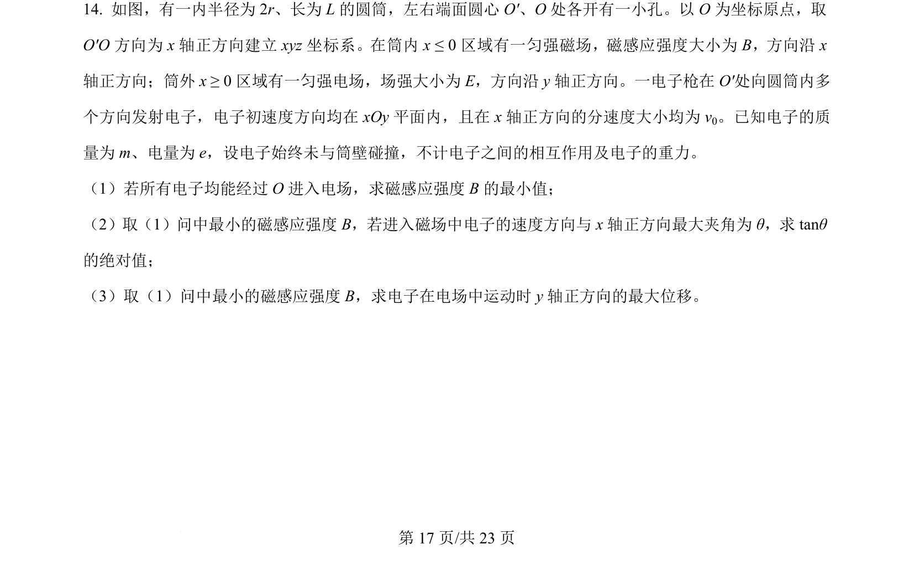
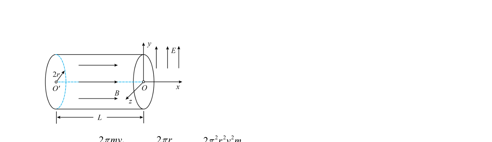
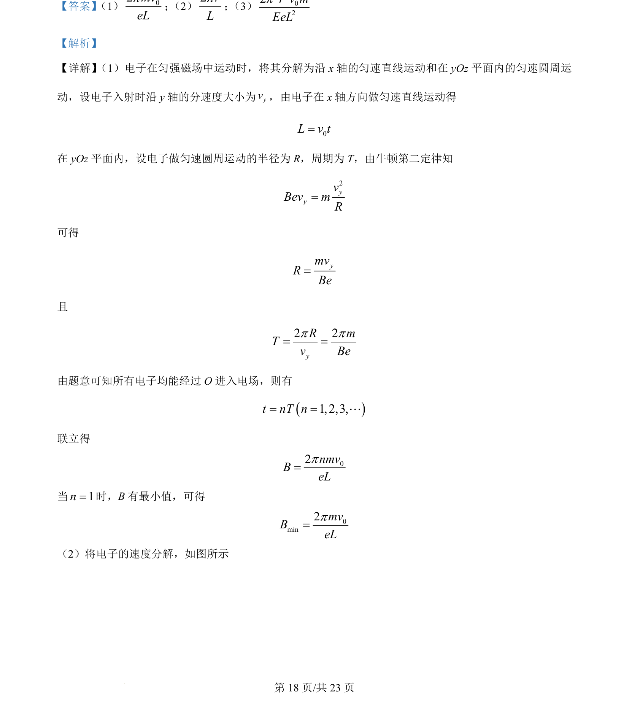
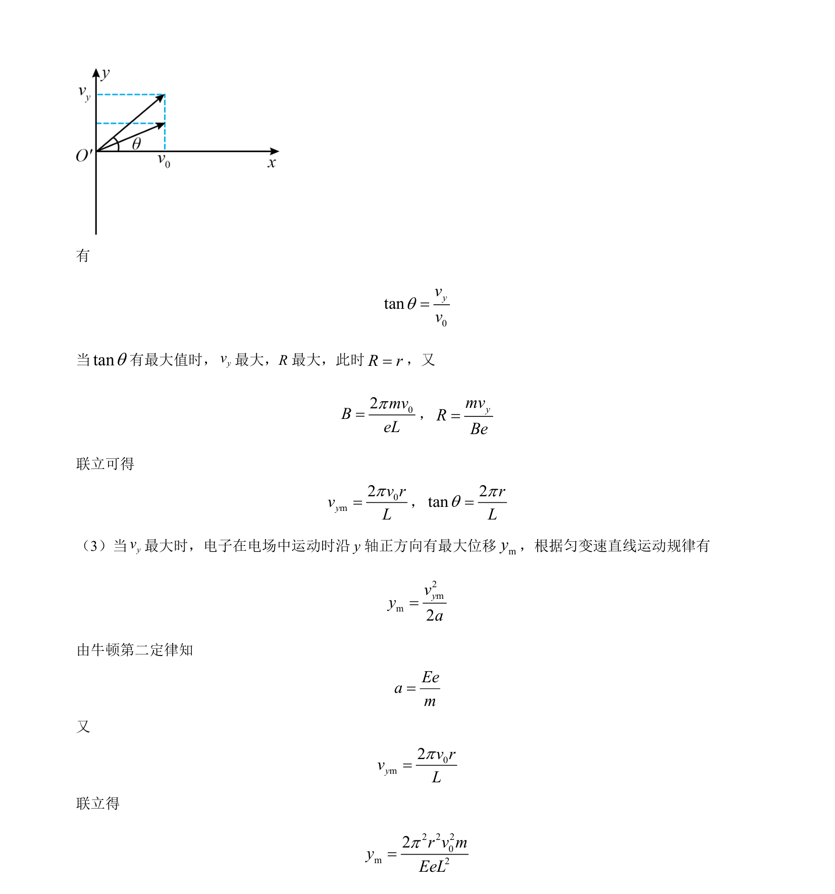

## 题面

## 摘要

电子在匀强磁场中做螺旋运动，通过运动分解求最小磁感应强度，并分析电场中最大位移。

## 关联考点

- [[595-带电粒子在匀强磁场中的运动|带电粒子在匀强磁场中的运动]]
- [[288-运动的合成与分解|运动的合成与分解]]
- [[229-牛顿第二定律|牛顿第二定律]]
- [[215-匀变速直线运动|匀变速直线运动]]

## 答案与解析

> 📄 原 PDF 第 17 页：`素材/真题/湖南/2008-2024·（湖南）物理高考真题/2024年高考物理试卷（湖南）（解析卷）.pdf`
