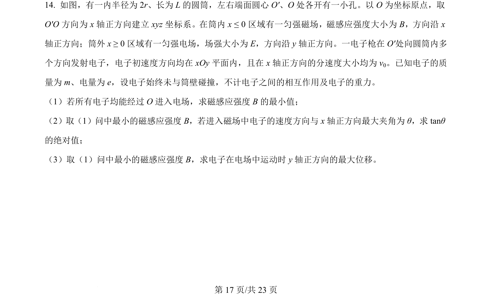
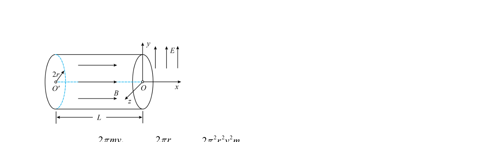
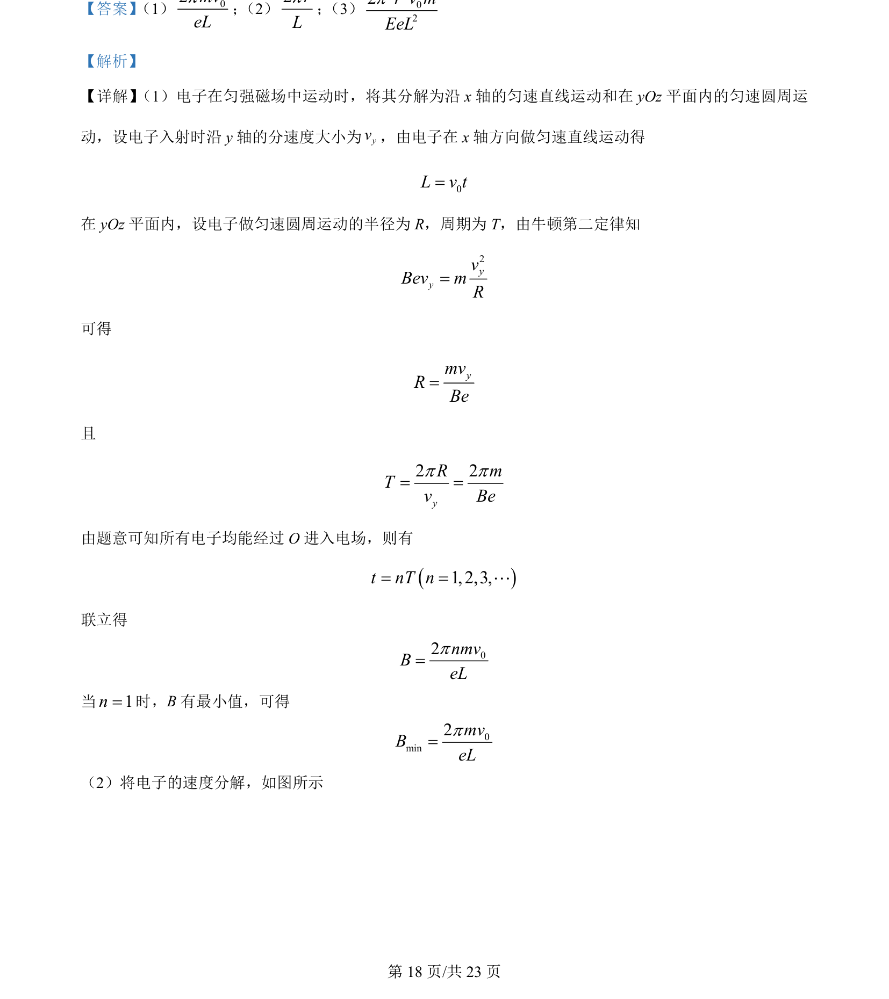
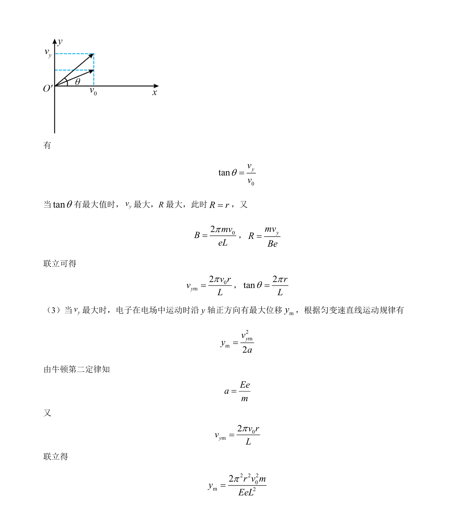

## 题面

## 摘要

电子在匀强磁场中做螺旋运动，通过运动分解求最小磁感应强度，并分析电场中最大位移。

## 关联考点

- [[595-带电粒子在匀强磁场中的运动|带电粒子在匀强磁场中的运动]]
- [[288-运动的合成与分解|运动的合成与分解]]
- [[229-牛顿第二定律|牛顿第二定律]]
- [[215-匀变速直线运动|匀变速直线运动]]

## 答案与解析

> 📄 原 PDF 第 17 页：`素材/真题/湖南/2008-2024·（湖南）物理高考真题/2024年高考物理试卷（湖南）（解析卷）.pdf`

<!-- 题干文本-start -->
## 题干文本
14. 如图，有一内半径为 2r、长为 L 的圆筒，左右端面圆心 O′、O 处各开有一小孔。以 O 为坐标原点，取
O′O 方向为 x 轴正方向建立 xyz 坐标系。在筒内 x ≤ 0 区域有一匀强磁场，磁感应强度大小为 B，方向沿 x
轴正方向；筒外 x ≥ 0区域有一匀强电场，场强大小为 E，方向沿 y轴正方向。一电子枪在 O′处向圆筒内多
个方向发射电子，电子初速度方向均在 xOy 平面内，且在 x 轴正方向的分速度大小均为 v0。已知电子的质
量为 m、电量为 e，设电子始终未与筒壁碰撞，不计电子之间的相互作用及电子的重力。
（1）若所有电子均能经过 O 进入电场，求磁感应强度 B的最小值；
（2）取（1）问中最小的磁感应强度 B，若进入磁场中电子的速度方向与 x轴正方向最大夹角为 θ，求 tanθ
的绝对值；
（3）取（1）问中最小的磁感应强度 B，求电子在电场中运动时 y轴正方向的最大位移。
<!-- 题干文本-end -->

<!-- 解析文本-start -->
## 解析文本

<!-- 解析文本-end -->
