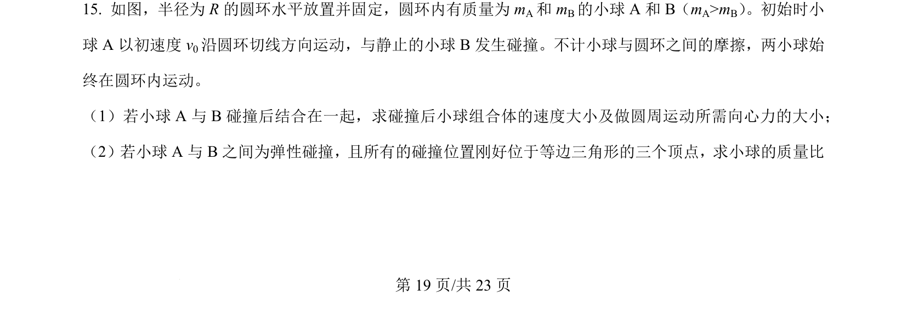
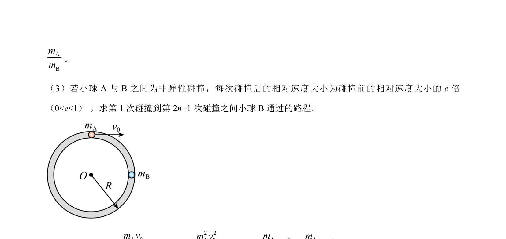
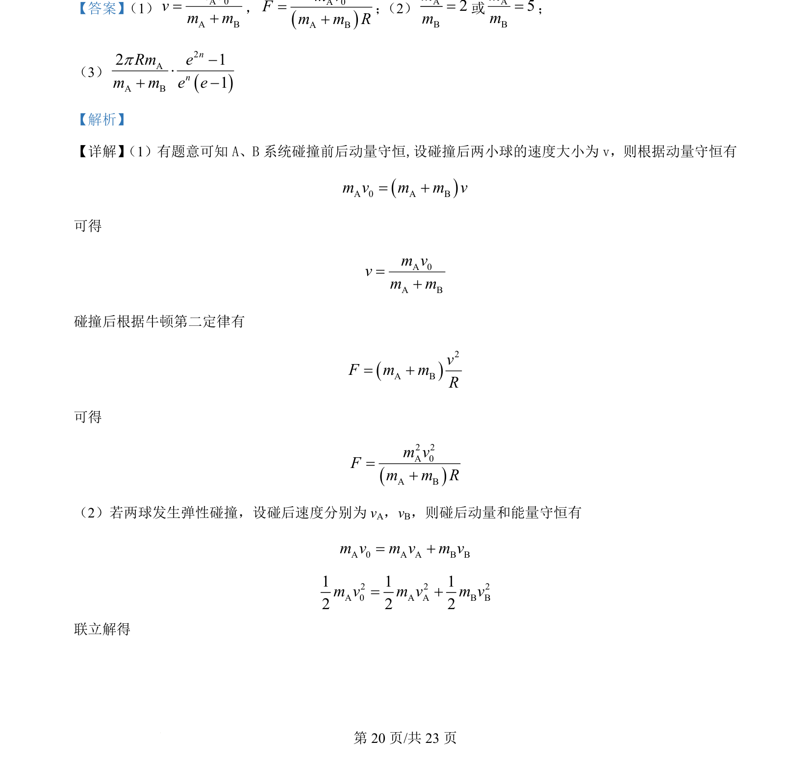
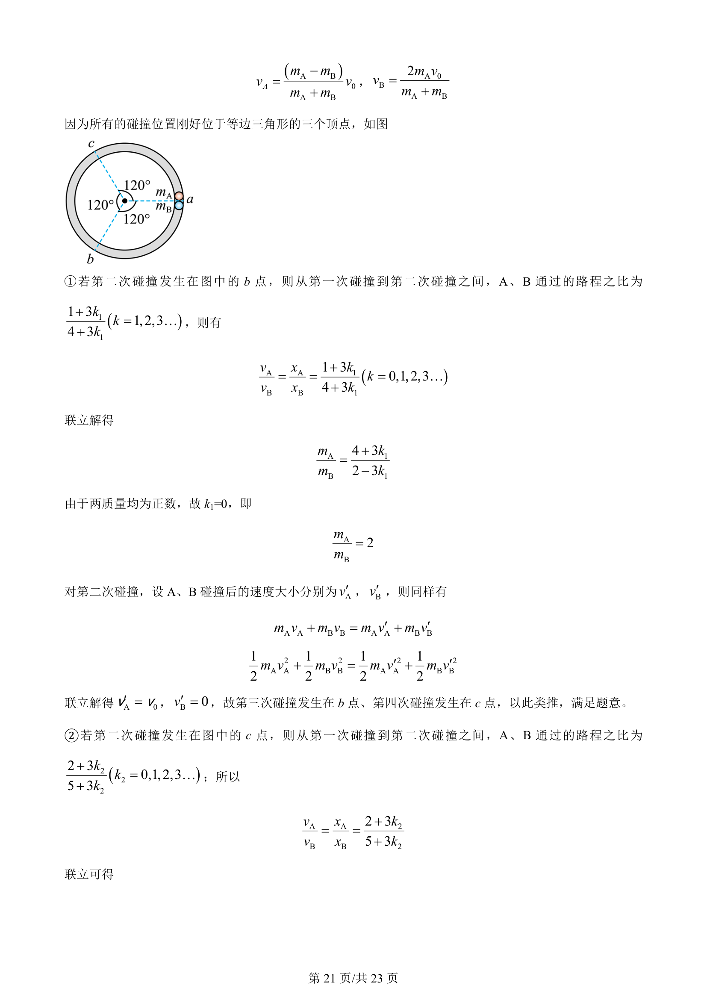
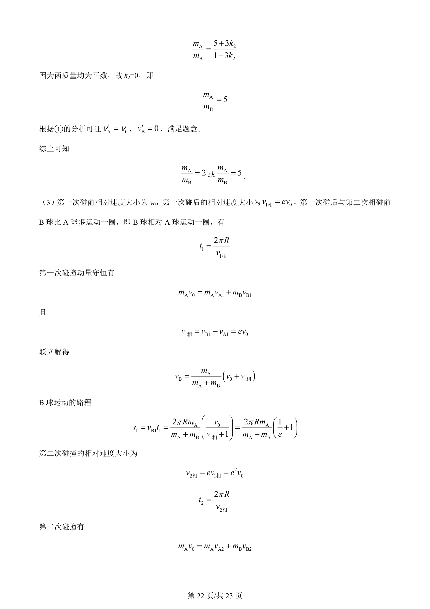
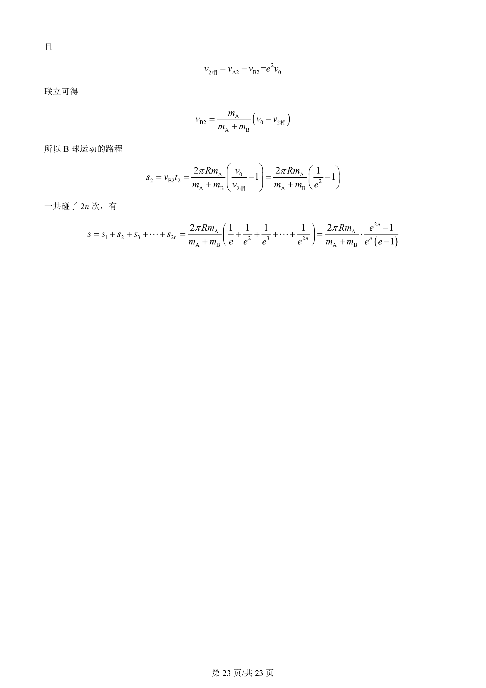

## 题面

## 摘要

两小球碰撞动量守恒与弹性碰撞分析，结合圆周运动与等边三角形顶点多次碰撞的几何约束。

## 关联考点

- [[539-动量守恒|动量守恒]]
- [[359-弹性碰撞|弹性碰撞]]
- [[229-牛顿第二定律|牛顿第二定律]]
- [[572-圆周运动向心力|圆周运动向心力]]

## 答案与解析

> 📄 原 PDF 第 19 页：`素材/真题/湖南/2008-2024·（湖南）物理高考真题/2024年高考物理试卷（湖南）（解析卷）.pdf`
