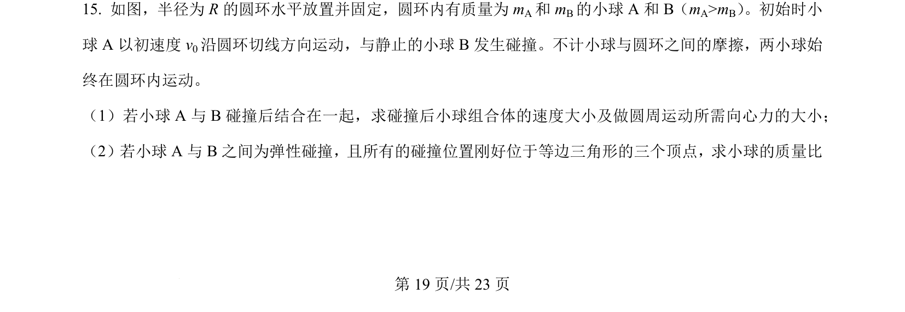
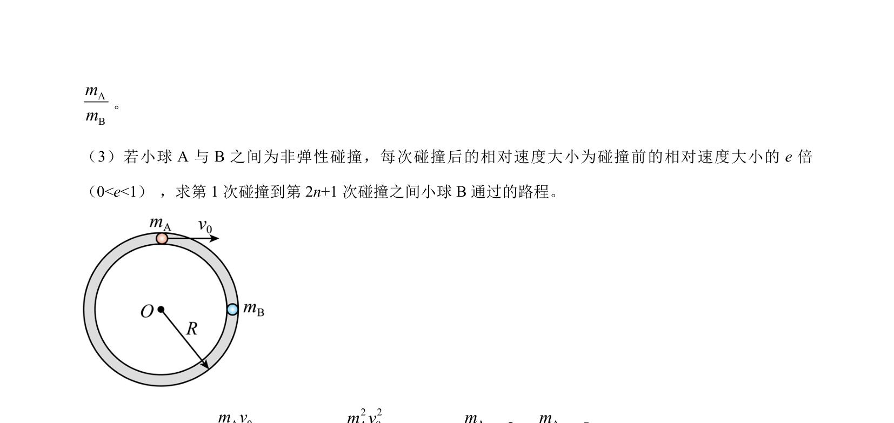
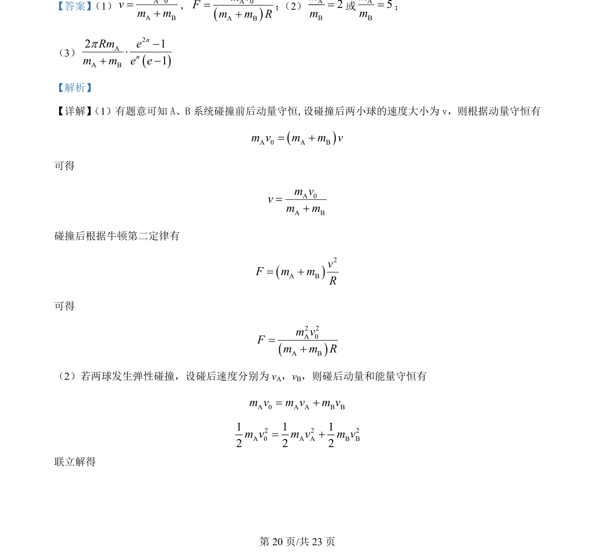
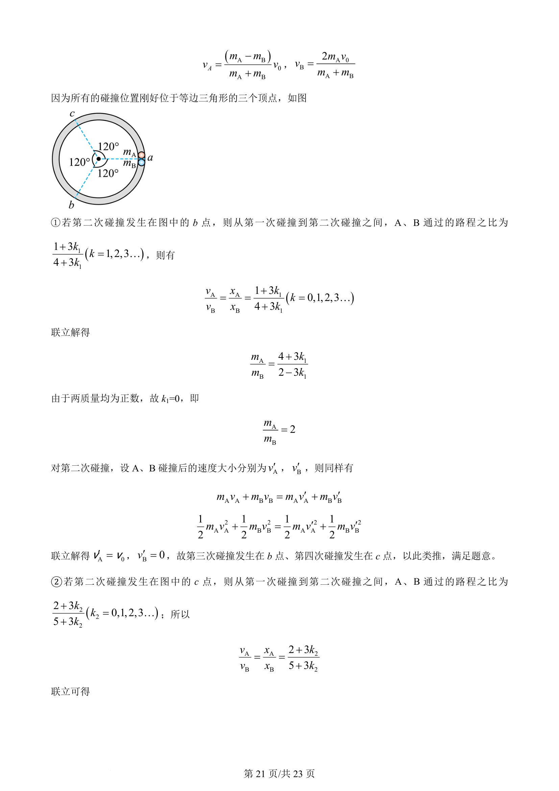
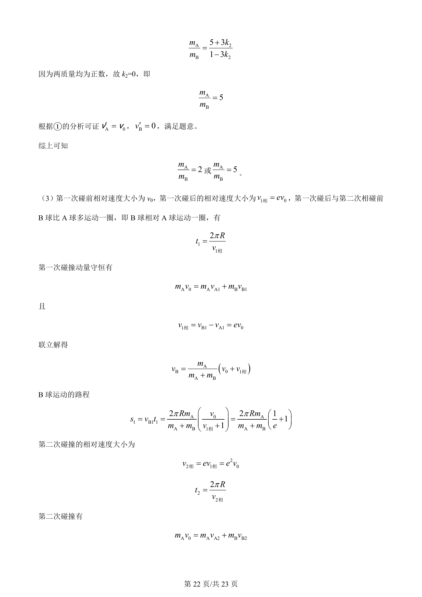
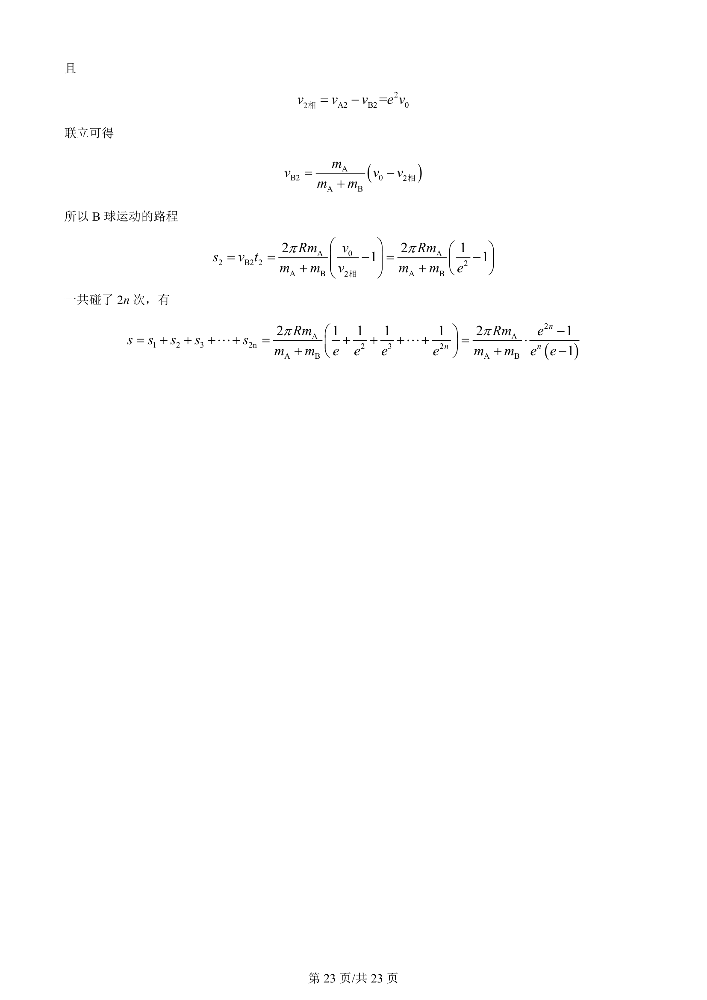

## 题面

## 摘要

两小球碰撞动量守恒与弹性碰撞分析，结合圆周运动与等边三角形顶点多次碰撞的几何约束。

## 关联考点

- [[539-动量守恒|动量守恒]]
- [[359-弹性碰撞|弹性碰撞]]
- [[229-牛顿第二定律|牛顿第二定律]]
- [[572-圆周运动向心力|圆周运动向心力]]

## 答案与解析

> 📄 原 PDF 第 19 页：`素材/真题/湖南/2008-2024·（湖南）物理高考真题/2024年高考物理试卷（湖南）（解析卷）.pdf`

<!-- 题干文本-start -->
## 题干文本
15. 如图，半径为 R的圆环水平放置并固定，圆环内有质量为 mA和 mB的小球 A 和 B（mA>mB） 。初始时小
球 A 以初速度 v0沿圆环切线方向运动，与静止的小球 B发生碰撞。不计小球与圆环之间的摩擦，两小球始
终在圆环内运动。
（1）若小球 A 与 B 碰撞后结合在一起，求碰撞后小球组合体的速度大小及做圆周运动所需向心力的大小；
（2）若小球A 与 B之间为弹性碰撞，且所有的碰撞位置刚好位于等边三角形的三个顶点，求小球的质量比
<!-- 题干文本-end -->

<!-- 解析文本-start -->
## 解析文本

<!-- 解析文本-end -->
