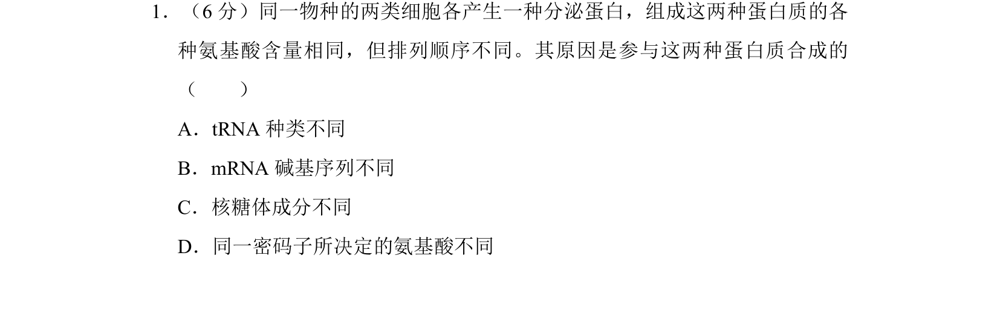

## 题面

## 摘要

本题通过比较同一物种两类细胞分泌蛋白差异，考查蛋白质合成与多样性直接原因。

## 关联考点

- [[699-蛋白质结构多样性|蛋白质结构多样性]]
- [[遗传信息转录和翻译]]
- [[749-mRNA模板|mRNA模板]]

## 答案与解析

> 📄 原 PDF 第 1 页：`素材/真题/湖南/2008-2024·（湖南）生物高考真题/2012年高考生物试卷（新课标）（解析卷）.pdf`
