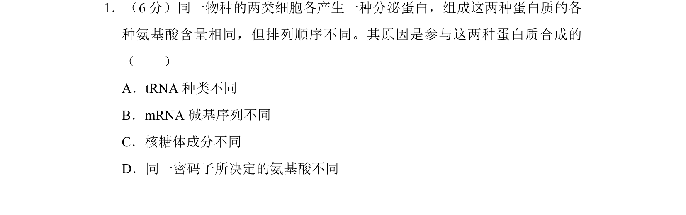
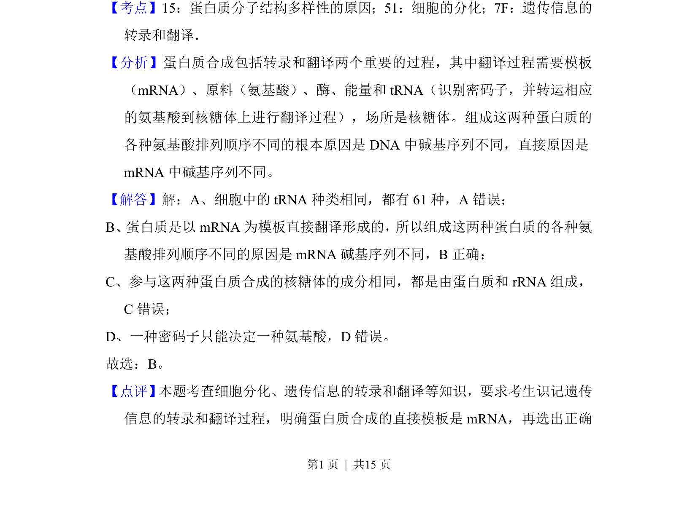

## 题面

## 摘要

本题通过比较同一物种两类细胞分泌蛋白差异，考查蛋白质合成与多样性直接原因。

## 关联考点

- [[699-蛋白质结构多样性|蛋白质结构多样性]]
- [[遗传信息转录和翻译]]
- [[749-mRNA模板|mRNA模板]]

## 答案与解析

> 📄 原 PDF 第 1 页：`素材/真题/湖南/2008-2024·（湖南）生物高考真题/2012年高考生物试卷（新课标）（解析卷）.pdf`

<!-- 题干文本-start -->
## 题干文本
1．（6分）同一物种的两类细胞各产生一种分泌蛋白，组成这两种蛋白质的各
种氨基酸含量相同，但排列顺序不同。其原因是参与这两种蛋白质合成的
（　　）
A．tRNA种类不同
B．mRNA碱基序列不同
C．核糖体成分不同
D．同一密码子所决定的氨基酸不同
<!-- 题干文本-end -->

<!-- 解析文本-start -->
## 解析文本
【考点】15：蛋白质分子结构多样性的原因；51：细胞的分化；7F：遗传信息的
转录和翻译．菁优网版权所有
【分析】蛋白质合成包括转录和翻译两个重要的过程，其中翻译过程需要模板
（mRNA）、原料（氨基酸）、酶、能量和tRNA（识别密码子，并转运相应
的氨基酸到核糖体上进行翻译过程），场所是核糖体。组成这两种蛋白质的
各种氨基酸排列顺序不同的根本原因是DNA中碱基序列不同，直接原因是
mRNA中碱基序列不同。
【解答】解：A、细胞中的tRNA种类相同，都有61种，A错误；
B、蛋白质是以mRNA为模板直接翻译形成的，所以组成这两种蛋白质的各种氨
基酸排列顺序不同的原因是mRNA碱基序列不同，B正确；
C、参与这两种蛋白质合成的核糖体的成分相同，都是由蛋白质和rRNA组成，
C错误；
D、一种密码子只能决定一种氨基酸，D错误。
故选：B。
【点评】 本题考查细胞分化、遗传信息的转录和翻译等知识，要求考生识记遗传
信息的转录和翻译过程，明确蛋白质合成的直接模板是mRNA，再选出正确
<!-- 解析文本-end -->
