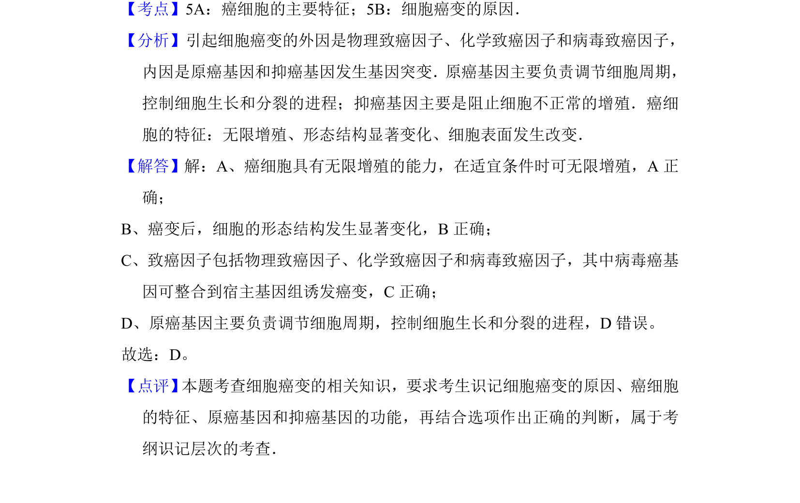

## 题面

## 摘要

本题考查细胞癌变的原因和特征，需辨析原癌基因与抑癌基因的功能。

## 关联考点

- [[癌细胞的主要特征]]
- [[细胞癌变的原因]]
- [[563-原癌基因功能|原癌基因功能]]
- [[抑癌基因功能]]

## 答案与解析

> 📄 原 PDF 第 2 页：`素材/真题/湖南/2008-2024·（湖南）生物高考真题/2012年高考生物试卷（新课标）（解析卷）.pdf`
