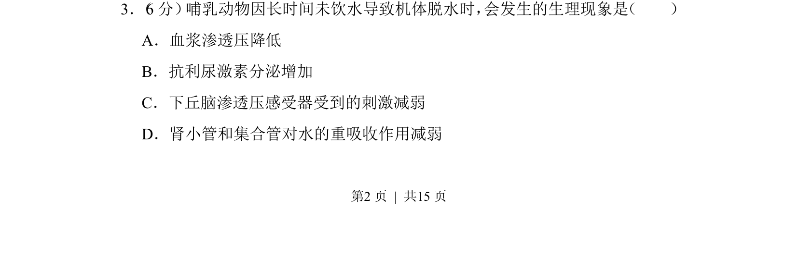
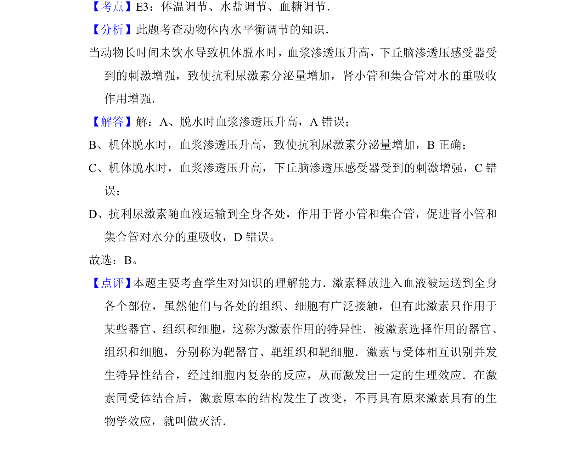

## 题面

## 摘要

本题考查哺乳动物脱水时的水盐平衡调节，正确选项为抗利尿激素分泌增加。

## 关联考点

- [[094-激素|抗利尿激素]]
- [[渗透压感受器]]
- [[624-水盐平衡调节|水盐平衡调节]]
- [[921-肾小管重吸收|肾小管重吸收]]

## 答案与解析

> 📄 原 PDF 第 2 页：`素材/真题/湖南/2008-2024·（湖南）生物高考真题/2012年高考生物试卷（新课标）（解析卷）.pdf`
