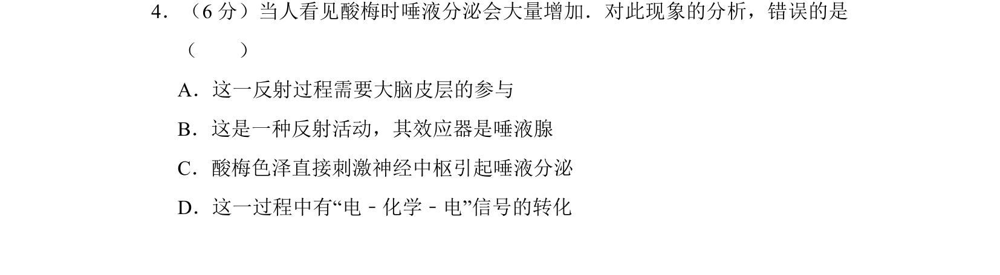
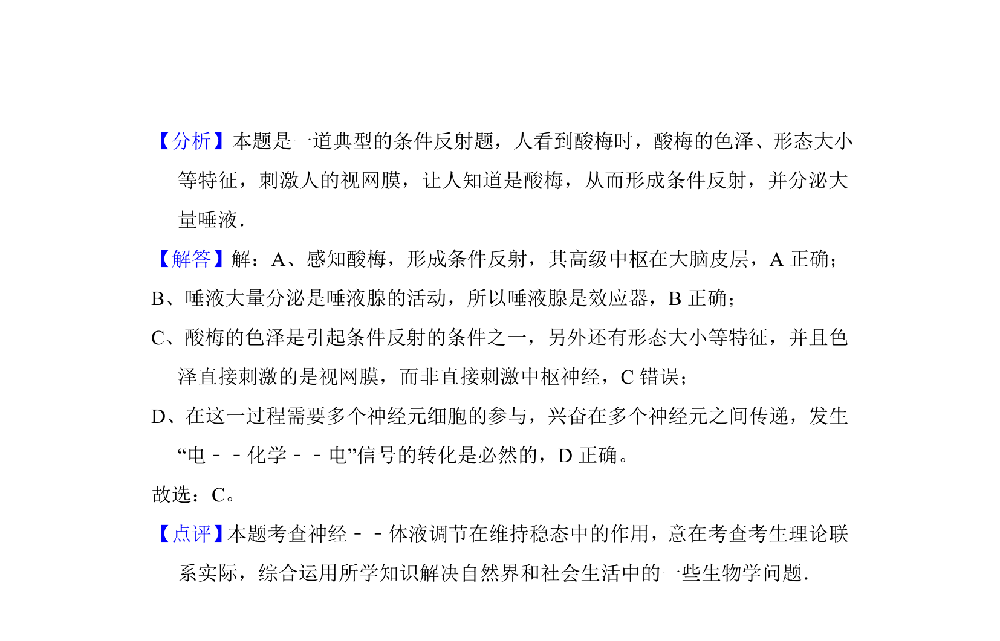

## 题面

## 摘要

该题考查人看见酸梅分泌唾液的反射活动及其神经调节机制。

## 关联考点

- [[324-神经调节|神经调节]]
- [[085-反射弧（初中）|反射弧]]
- [[779-条件反射|条件反射]]
- [[信号转化]]

## 答案与解析

> 📄 原 PDF 第 3 页：`素材/真题/湖南/2008-2024·（湖南）生物高考真题/2012年高考生物试卷（新课标）（解析卷）.pdf`
