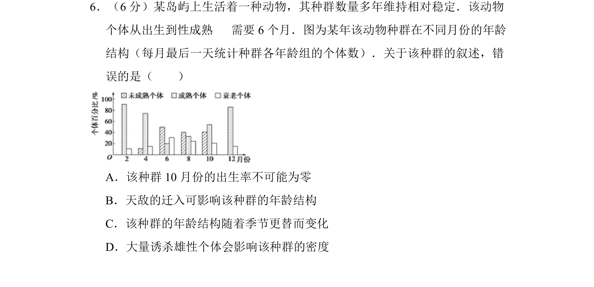
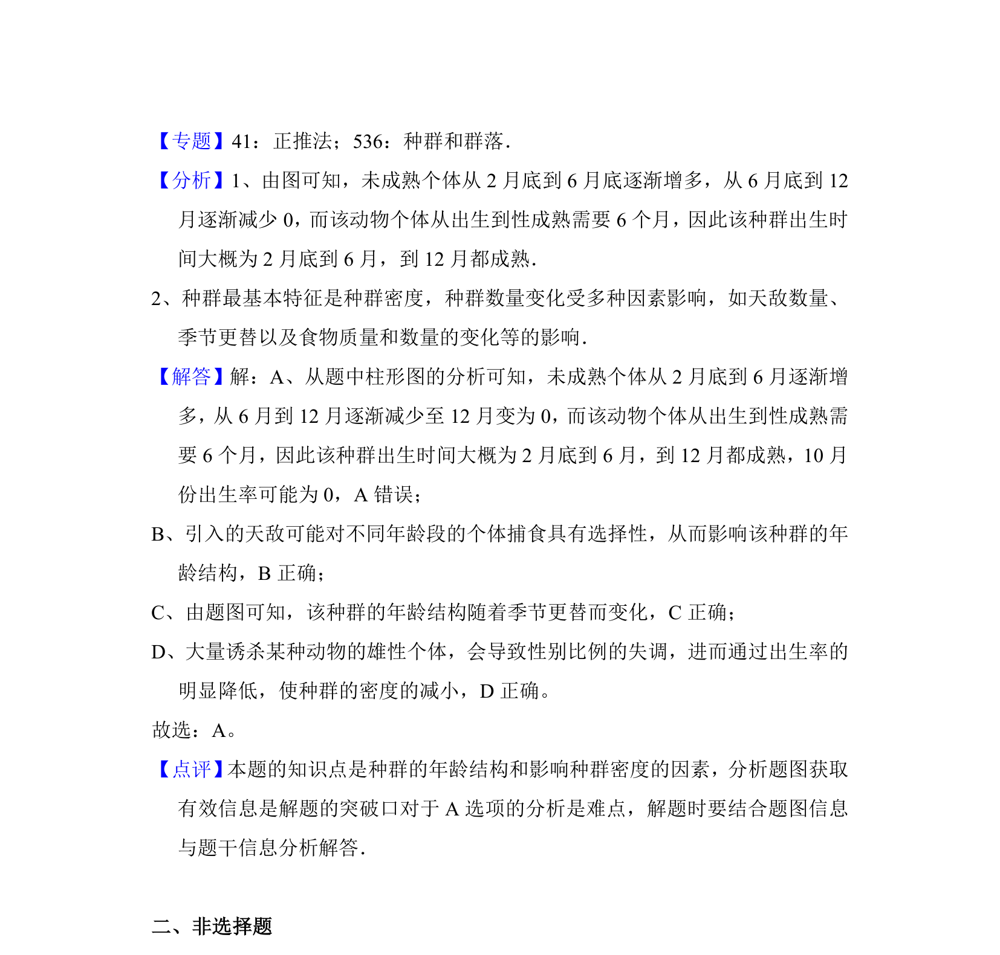

## 题面

## 摘要

结合年龄结构图分析种群数量变动，判断出生率、迁入及性别比例对种群的影响

## 关联考点

- [[862-种群的特征|种群特征]]
- [[780-年龄结构|年龄结构]]
- [[471-出生率|出生率]]
- [[916-性别比例|性别比例]]

## 答案与解析

> 📄 原 PDF 第 5 页：`素材/真题/湖南/2008-2024·（湖南）生物高考真题/2012年高考生物试卷（新课标）（解析卷）.pdf`

<!-- 题干文本-start -->
## 题干文本
6．（6分）某岛屿上生活着一种动物，其种群数量多年维持相对稳定．该动物
个体从出生到性成熟   需要6个月．图为某年该动物种群在不同月份的年龄
结构（每月最后一天统计种群各年龄组的个体数）．关于该种群的叙述，错
误的是（　　）
A．该种群10月份的出生率不可能为零
B．天敌的迁入可影响该种群的年龄结构
C．该种群的年龄结构随着季节更替而变化
D．大量诱杀雄性个体会影响该种群的密度
<!-- 题干文本-end -->

<!-- 解析文本-start -->
## 解析文本
【考点】F1：种群的特征．菁优网版权所有
<!-- 解析文本-end -->
